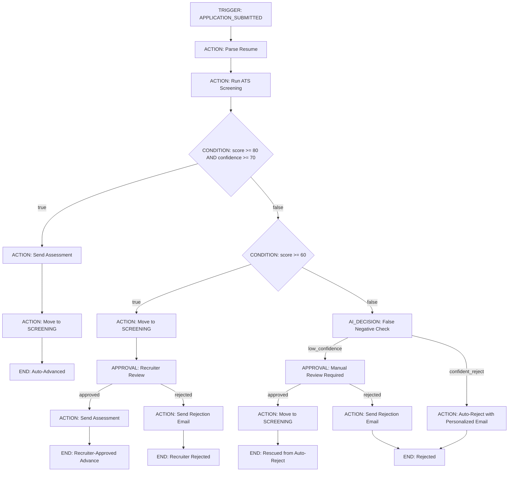
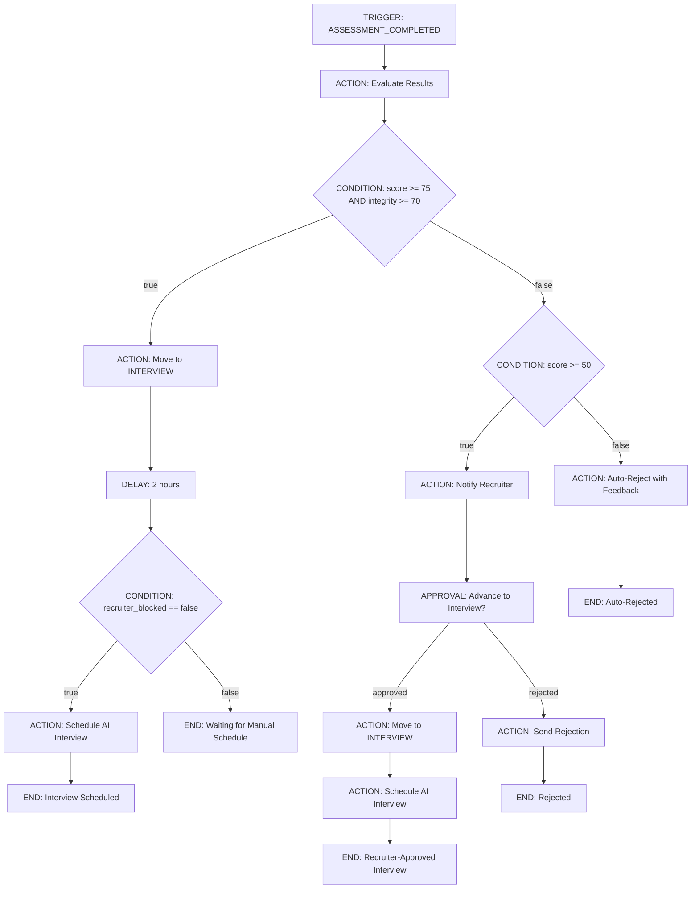
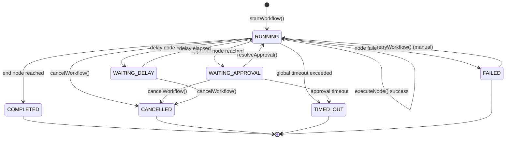
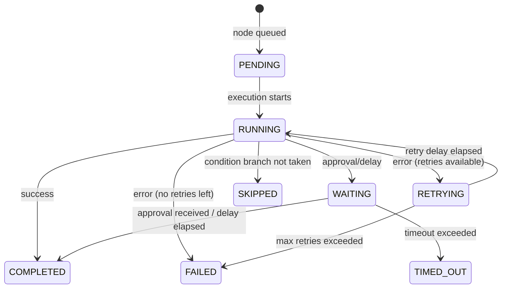
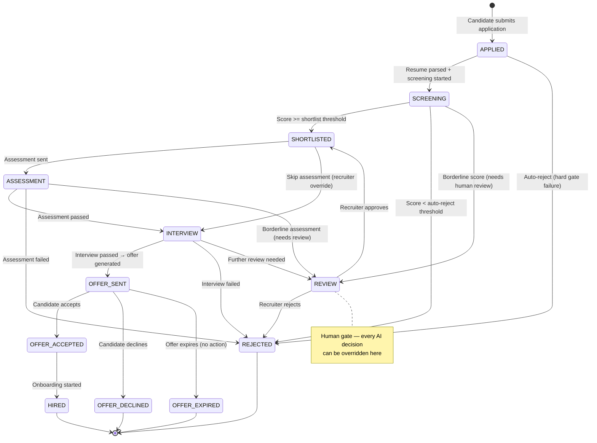
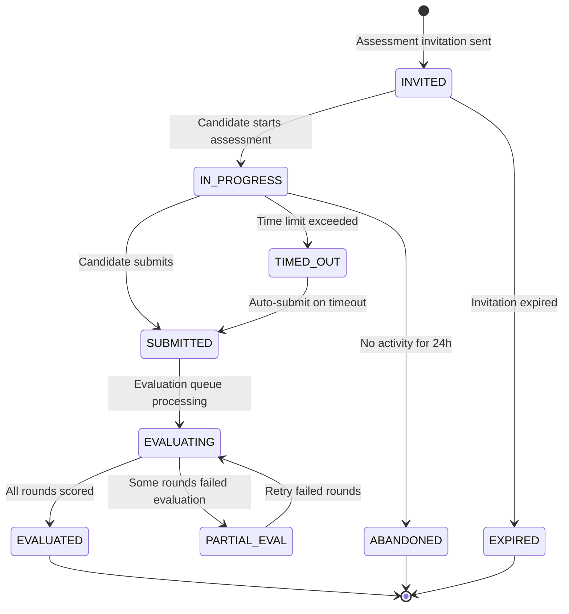
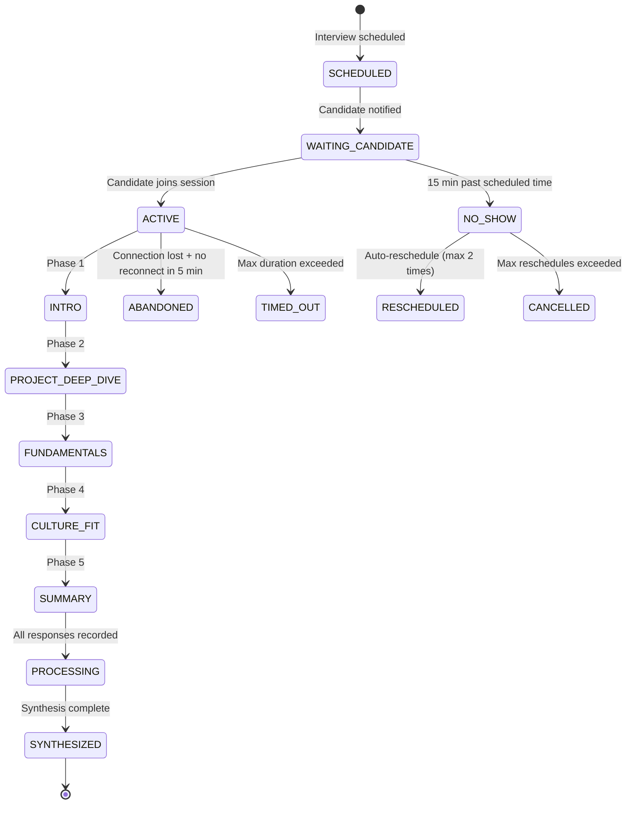
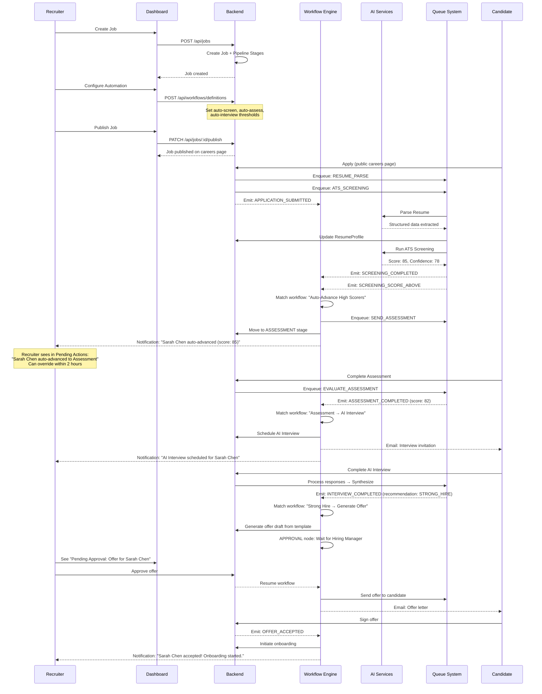
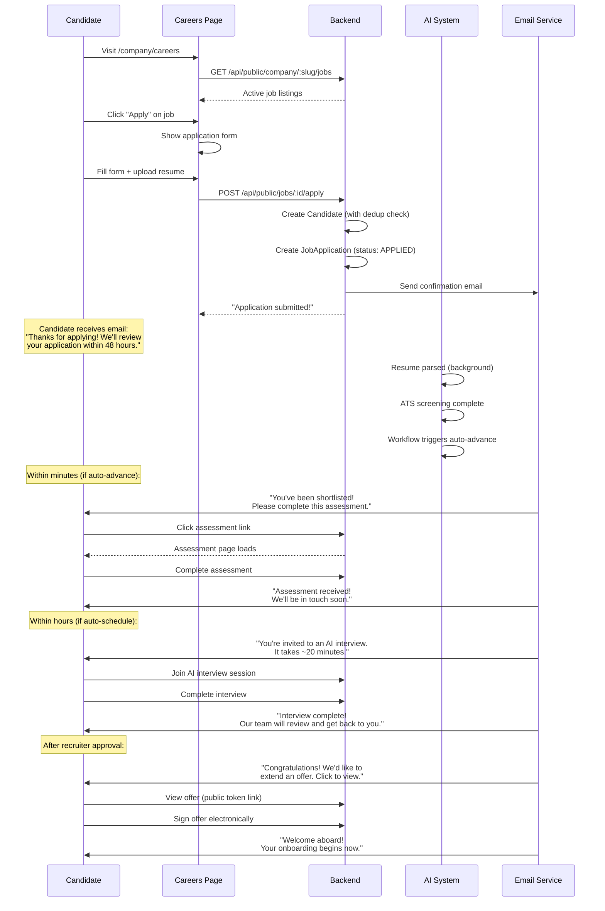
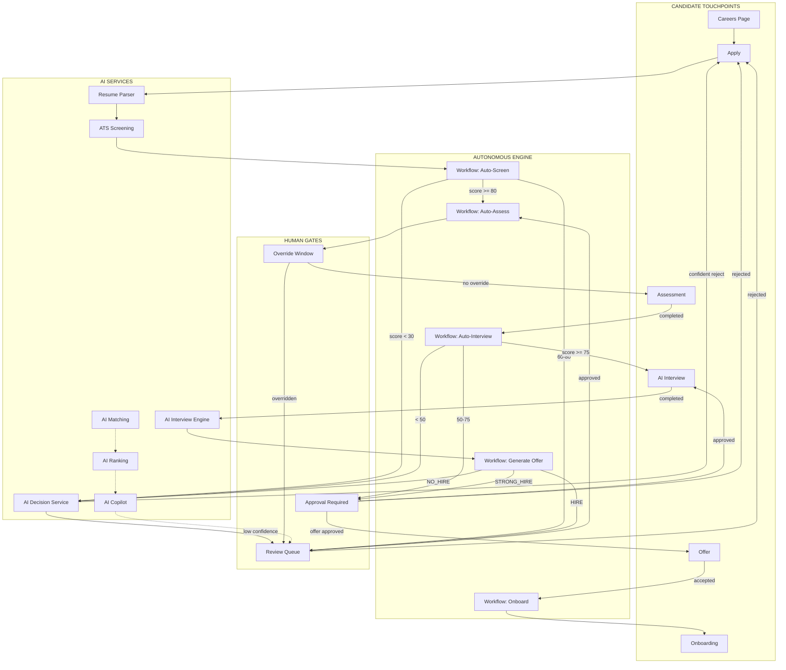

# Fluxberry AI — Autonomous Hiring Operating System

**Principal Product Engineer · AI Systems Architect · Workflow Automation Architect · Staff Backend Engineer**
**Date:** 2026-05-14
**Status:** Production Implementation Blueprint
**Scope:** Transform connected hiring modules into deeply orchestrated autonomous hiring workflows

---

## Table of Contents

1. [Existing Infrastructure Audit](#1-existing-infrastructure-audit)
2. [Core Workflow Engine](#2-core-workflow-engine)
3. [Workflow Execution Runtime](#3-workflow-execution-runtime)
4. [Candidate State Machines](#4-candidate-state-machines)
5. [AI Candidate Intelligence](#5-ai-candidate-intelligence)
6. [AI Ranking Engine](#6-ai-ranking-engine)
7. [Candidate Deduplication System](#7-candidate-deduplication-system)
8. [AI Recruiter Copilot](#8-ai-recruiter-copilot)
9. [Event Architecture](#9-event-architecture)
10. [AI Cost Infrastructure](#10-ai-cost-infrastructure)
11. [Human Override Systems](#11-human-override-systems)
12. [Failure Recovery Flows](#12-failure-recovery-flows)
13. [End-to-End Recruiter Workflows](#13-end-to-end-recruiter-workflows)
14. [End-to-End Candidate Workflows](#14-end-to-end-candidate-workflows)
15. [Frontend UX Flows](#15-frontend-ux-flows)
16. [API Contracts](#16-api-contracts)
17. [Database Schema Changes](#17-database-schema-changes)
18. [Async Orchestration Logic](#18-async-orchestration-logic)
19. [AI Explainability Systems](#19-ai-explainability-systems)
20. [End-to-End Autonomous Hiring Flows](#20-end-to-end-autonomous-hiring-flows)

---

## 1. Existing Infrastructure Audit

### What Already Exists (and what we're building ON TOP OF)

The codebase is NOT a prototype. It has real infrastructure:

**Backend Infrastructure:**
| System | Detail | Maturity |
|--------|--------|----------|
| BullMQ Queues | 10 queues: evaluation, notification, ai-interview, resume-parsing, email, analytics, workflow, ats-screening, ats-rescoring, offer-expiry | Production-ready |
| Workflow Engine V1 | `WorkflowRule` model: trigger → conditions → actions. Supports SEND_EMAIL, MOVE_STAGE, ADD_TAG, ASSIGN_RECRUITER | Basic but functional |
| Workflow Engine V2 | `WorkflowDefinition` DAG model with nodes/edges. `WorkflowExecution` tracks runtime state. `WorkflowEngineV2` class executes DAGs recursively | Partial — delays are TODO, no approval nodes |
| Event System | `FluxEvents` extends EventEmitter. `eventBus` singleton. Emits: APPLICATION_SUBMITTED, STAGE_CHANGED, SCREENING_COMPLETED, SCREENING_SCORE_ABOVE/BELOW, etc. | In-process only, no persistence |
| ATS Screening | Full pipeline: resume parse → embedding → scoring engine v2 → hard gate check → copilot pre-warm. Idempotent upserts. 5-retry exponential backoff. Domain events on completion | Production-quality |
| AI Copilot | `copilotService`: deterministic classification (strong/high_potential/borderline/at_risk) + GPT-4o-mini explanations for top-5. Redis-cached 5 min. Chat interface | Production-quality |
| AI Matching | Embedding-based bidirectional matching (candidate→jobs, job→candidates). Cosine similarity + skill overlap blend. Deterministic fallback | Solid |
| AI Ranking | Embedding similarity × screening score blend (60/40). Materialized to AIRankingResult. 30-min TTL | Solid |
| Resume Analysis | Deterministic skill gap analysis (matched/partial/missing). Optional GPT-4o-mini fit explanation | Solid |
| Pipeline Analysis | Deterministic bottleneck detection, stale application alerts, hiring timeline forecasting | Solid |
| AI Interview | Full orchestrator: 5 phases (INTRO, PROJECT_DEEP_DIVE, FUNDAMENTALS, CULTURE_FIT, SUMMARY). Per-turn evaluation with 4 metrics (correctness, depth, communication, relevance). STT + analysis pipeline. Synthesis aggregation | Production-quality |
| Offer System | OfferTemplate → Offer (with PDF, signature, expiry, audit log). Token-based public access | Solid |
| Onboarding | Form templates, document management, status tracking | Basic |

**What's Missing for Autonomous OS:**

```
EXISTING                          NEEDED FOR AUTONOMOUS OS
─────────                         ─────────────────────────
WorkflowRule (flat trigger→action)  → DAG workflow engine with approvals, delays, AI decisions
FluxEvents (in-process emitter)    → Persistent event log with replay capability
ATS Screening (score candidates)   → Auto-advance based on score thresholds
Copilot (recommend candidates)     → Auto-execute recommendations with human gates
AI Interview (run interview)       → Auto-schedule based on assessment completion
Offer System (create offers)       → Auto-generate offers for top candidates
Dedup: NOTHING                     → Full candidate identity graph
Cost Tracking: NOTHING             → Per-org AI usage metering
Override: NOTHING                  → Universal human override on every AI action
Retry: Queue-level only            → Workflow-level recovery with partial replay
```

---

## 2. Core Workflow Engine

### 2.1 Architecture Overview

The workflow engine is a DAG-based execution runtime that replaces both `WorkflowRule` (V1) and the partial `WorkflowEngineV2`.

```
┌─────────────────────────────────────────────────────────────────┐
│                    WORKFLOW ENGINE ARCHITECTURE                   │
├─────────────────────────────────────────────────────────────────┤
│                                                                   │
│  ┌─────────────┐     ┌──────────────────┐     ┌──────────────┐  │
│  │   TRIGGERS   │────▶│  WORKFLOW ROUTER  │────▶│  EXECUTOR    │  │
│  │              │     │                  │     │              │  │
│  │ DomainEvents │     │ Match trigger to │     │ Walk the DAG │  │
│  │ Schedules    │     │ active defs      │     │ node by node │  │
│  │ Webhooks     │     │ Org-scoped       │     │              │  │
│  │ Manual       │     │ Dedup by entity  │     │ Persist each │  │
│  └─────────────┘     └──────────────────┘     │ step result  │  │
│                                                │              │  │
│  ┌─────────────────────────────────────────────┴──────────────┐  │
│  │                      NODE TYPES                             │  │
│  ├─────────────────────────────────────────────────────────────┤  │
│  │                                                             │  │
│  │  TRIGGER ──▶ First node, receives event payload             │  │
│  │  CONDITION ──▶ Evaluate expression, pick branch             │  │
│  │  AI_DECISION ──▶ Call AI for classification, emit reasoning │  │
│  │  ACTION ──▶ Execute side effect (email, stage move, etc.)   │  │
│  │  DELAY ──▶ Schedule future continuation via BullMQ          │  │
│  │  APPROVAL ──▶ Pause workflow, wait for human decision       │  │
│  │  PARALLEL ──▶ Fork into multiple paths, join on completion  │  │
│  │  LOOP ──▶ Re-execute subgraph until condition met           │  │
│  │  END ──▶ Terminal node, mark workflow completed              │  │
│  │                                                             │  │
│  └─────────────────────────────────────────────────────────────┘  │
│                                                                   │
│  ┌─────────────────────────────────────────────────────────────┐  │
│  │                    EXECUTION STATE                           │  │
│  │                                                             │  │
│  │  WorkflowExecution {                                        │  │
│  │    status: RUNNING | PAUSED | WAITING_APPROVAL |            │  │
│  │            WAITING_DELAY | COMPLETED | FAILED |             │  │
│  │            CANCELLED | TIMED_OUT                            │  │
│  │    nodeStates: Map<nodeId, NodeState>                       │  │
│  │    context: { ...triggerData, ...accumulatedResults }        │  │
│  │    retryCount per node                                      │  │
│  │    idempotencyKey: definitionId + entityId + version        │  │
│  │  }                                                          │  │
│  └─────────────────────────────────────────────────────────────┘  │
└─────────────────────────────────────────────────────────────────┘
```

### 2.2 Node Type Specifications

#### TRIGGER Node
```typescript
// Activates workflow when a domain event fires
{
  type: 'trigger',
  config: {
    event: 'APPLICATION_SUBMITTED',       // Which domain event
    filters: {                             // Optional pre-filters
      'jobId': { $eq: 'specific-job-id' }, // Only for this job
      'source': { $in: ['CAREERS_PAGE', 'REFERRAL'] }
    }
  }
}
```

#### CONDITION Node
```typescript
// Evaluates an expression against the workflow context
{
  type: 'condition',
  config: {
    expression: {
      operator: 'AND',
      conditions: [
        { field: 'screeningResult.finalScore', operator: 'gte', value: 75 },
        { field: 'screeningResult.confidenceScore', operator: 'gte', value: 60 },
        { field: 'screeningResult.status', operator: 'eq', value: 'PASSED' }
      ]
    },
    branches: {
      'true': 'node-send-assessment',   // Edge to follow if true
      'false': 'node-manual-review'     // Edge to follow if false
    }
  }
}
```

#### AI_DECISION Node
```typescript
// Uses AI to make a classification decision with explainability
{
  type: 'ai_decision',
  config: {
    decisionType: 'CANDIDATE_FIT_CHECK',
    model: 'gpt-4o-mini',               // Can be overridden per org
    maxTokens: 200,
    temperature: 0.1,                     // Low temp for consistency
    inputFields: ['candidate.parsedResumeData', 'job.requiredSkills', 'job.description'],
    outputSchema: {
      decision: { type: 'enum', values: ['ADVANCE', 'REVIEW', 'REJECT'] },
      confidence: { type: 'number', min: 0, max: 100 },
      reasoning: { type: 'string' }
    },
    fallbackDecision: 'REVIEW',          // If AI fails, default to human review
    costBudgetCents: 5,                   // Max cost for this node (abort if exceeded)
    requireApprovalAbove: 'REJECT',       // Auto-advance for ADVANCE, require approval for REJECT
  }
}
```

#### ACTION Node
```typescript
// Execute a side effect
{
  type: 'action',
  config: {
    actionType: 'SEND_ASSESSMENT',
    params: {
      assessmentId: '{{workflow.assessmentId}}',     // Template variable
      candidateEmail: '{{candidate.email}}',
      candidateName: '{{candidate.firstName}}',
      expiresInHours: 72,
      emailTemplate: 'assessment-invitation'
    },
    retryPolicy: {
      maxAttempts: 3,
      backoff: 'exponential',
      initialDelayMs: 2000
    },
    timeout: 30000   // 30 seconds
  }
}
```

#### APPROVAL Node
```typescript
// Pause workflow and wait for human decision
{
  type: 'approval',
  config: {
    approvers: ['{{job.hiringManagerId}}', '{{job.recruiterId}}'],
    approvalPolicy: 'ANY',               // ANY = one approver, ALL = unanimous
    timeoutHours: 48,                     // Auto-escalate after timeout
    escalateTo: '{{org.adminId}}',
    notifyChannel: 'email',              // email | slack | in-app | all
    context: {                            // Data shown to approver
      showFields: ['candidate.name', 'screeningResult.finalScore', 'aiDecision.reasoning'],
      title: 'Review AI rejection for {{candidate.firstName}} {{candidate.lastName}}'
    },
    branches: {
      'approved': 'node-next-step',
      'rejected': 'node-send-rejection',
      'timeout': 'node-escalate'
    }
  }
}
```

#### DELAY Node
```typescript
// Schedule future continuation
{
  type: 'delay',
  config: {
    delayType: 'fixed',                   // fixed | until_time | until_event
    delayMinutes: 1440,                   // 24 hours
    // OR: untilTime: '{{candidate.interviewScheduledAt}}'
    // OR: untilEvent: 'ASSESSMENT_COMPLETED'
    resumeNodeId: 'node-after-delay'
  }
}
```

#### PARALLEL Node
```typescript
// Fork into multiple parallel paths
{
  type: 'parallel',
  config: {
    paths: ['path-send-email', 'path-update-crm', 'path-notify-team'],
    joinPolicy: 'ALL',                    // ALL = wait for all, ANY = continue after first
    timeoutMinutes: 60
  }
}
```

### 2.3 Workflow Definition Examples

**Example 1: Auto-Screen and Advance**
```
WHEN: candidate.applied
  → PARSE resume (async, wait for completion)
  → RUN ATS screening
  → IF score >= 80 AND confidence >= 70:
      → AUTO-SEND assessment
      → MOVE to SCREENING stage
  → ELSE IF score >= 60:
      → MOVE to SCREENING stage
      → REQUEST recruiter review (approval node)
  → ELSE:
      → AI_DECISION: Is this a false negative?
        → IF confidence < 50: REQUEST recruiter review
        → ELSE: AUTO-REJECT with personalized email
```



**Example 2: Assessment Completion → AI Interview Scheduling**
```
WHEN: assessment.completed
  → EVALUATE assessment results
  → IF assessment_score >= 75 AND integrity_score >= 70:
      → MOVE to INTERVIEW stage
      → DELAY 2 hours (allow recruiter override)
      → CHECK if recruiter blocked auto-schedule
        → IF not blocked: AUTO-SCHEDULE AI interview
        → IF blocked: WAIT for manual scheduling
  → ELSE IF assessment_score >= 50:
      → NOTIFY recruiter "Borderline assessment result"
      → APPROVAL: Advance to interview?
  → ELSE:
      → AUTO-REJECT with detailed feedback
```



**Example 3: AI Interview → Offer Generation**
```
WHEN: ai_interview.completed
  → SYNTHESIZE interview results
  → AI_DECISION: Hire recommendation
    → IF recommendation == STRONG_HIRE:
        → PARALLEL:
            → NOTIFY hiring manager
            → GENERATE offer draft from template
        → APPROVAL: Hiring manager approve offer?
          → IF approved: SEND offer to candidate
          → IF rejected: MOVE to rejected pool
    → IF recommendation == HIRE:
        → NOTIFY recruiter for human interview scheduling
    → IF recommendation == NO_HIRE:
        → AUTO-REJECT with AI-generated feedback
```

### 2.4 Workflow Engine Implementation

```typescript
// src/modules/workflow-engine/workflow-runtime.ts

import { WorkflowDefinitionV3, WorkflowExecutionV3 } from './models'
import { NodeExecutor } from './node-executor'
import { workflowQueue } from '../../jobs/queues/index'

export class WorkflowRuntime {
  private nodeExecutor: NodeExecutor

  constructor() {
    this.nodeExecutor = new NodeExecutor()
  }

  /**
   * Start a new workflow execution.
   * Idempotent: won't create duplicate executions for the same entity+definition.
   */
  async startWorkflow(
    definitionId: string,
    triggerData: Record<string, any>,
    options: { entityId: string; entityType: string; organizationId: string }
  ): Promise<string> {
    const definition = await WorkflowDefinitionV3.findById(definitionId).lean()
    if (!definition || !definition.isActive) return ''

    // Idempotency check: prevent duplicate executions for same entity
    const idempotencyKey = `${definitionId}:${options.entityId}:${definition.version}`
    const existing = await WorkflowExecutionV3.findOne({ idempotencyKey, status: { $nin: ['COMPLETED', 'FAILED', 'CANCELLED'] } })
    if (existing) {
      console.log(`[WorkflowRuntime] Duplicate execution prevented: ${idempotencyKey}`)
      return existing._id.toString()
    }

    const execution = await WorkflowExecutionV3.create({
      definitionId,
      definitionVersion: definition.version,
      organizationId: options.organizationId,
      entityId: options.entityId,
      entityType: options.entityType,
      status: 'RUNNING',
      idempotencyKey,
      context: { ...triggerData },
      nodeStates: {},
      startedAt: new Date(),
    })

    // Find trigger node and begin execution
    const triggerNode = definition.nodes.find(n => n.type === 'trigger')
    if (!triggerNode) {
      execution.status = 'FAILED'
      execution.error = 'No trigger node in definition'
      await execution.save()
      return execution._id.toString()
    }

    // Enqueue first node execution (non-blocking)
    await workflowQueue.add('EXECUTE_NODE', {
      executionId: execution._id.toString(),
      nodeId: triggerNode.id,
      depth: 0,
    }, {
      jobId: `wf-${execution._id}-${triggerNode.id}`,
      attempts: 1, // Node-level retries are handled by the engine, not BullMQ
    })

    return execution._id.toString()
  }

  /**
   * Execute a single node in a workflow.
   * Called by the workflow queue processor.
   */
  async executeNode(executionId: string, nodeId: string, depth: number): Promise<void> {
    if (depth > 50) {
      await this.failExecution(executionId, 'Max execution depth exceeded (possible infinite loop)')
      return
    }

    const execution = await WorkflowExecutionV3.findById(executionId)
    if (!execution || !['RUNNING', 'WAITING_DELAY'].includes(execution.status)) return

    const definition = await WorkflowDefinitionV3.findById(execution.definitionId).lean()
    if (!definition) {
      await this.failExecution(executionId, 'Workflow definition not found')
      return
    }

    const node = definition.nodes.find(n => n.id === nodeId)
    if (!node) {
      await this.failExecution(executionId, `Node ${nodeId} not found in definition`)
      return
    }

    // Record node start
    const nodeState = {
      nodeId,
      status: 'running' as const,
      startedAt: new Date(),
      attempt: (execution.nodeStates?.[nodeId]?.attempt || 0) + 1,
    }
    execution.nodeStates = execution.nodeStates || {}
    execution.nodeStates[nodeId] = nodeState
    execution.currentNodeId = nodeId
    await execution.save()

    try {
      const result = await this.nodeExecutor.execute(node, execution.context, {
        executionId,
        organizationId: execution.organizationId.toString(),
        entityId: execution.entityId,
      })

      // Handle special node outcomes
      if (result.outcome === 'WAITING_APPROVAL') {
        execution.status = 'WAITING_APPROVAL'
        execution.nodeStates[nodeId] = { ...nodeState, status: 'waiting', result }
        await execution.save()
        return // Workflow paused — will resume when approval arrives
      }

      if (result.outcome === 'WAITING_DELAY') {
        execution.status = 'WAITING_DELAY'
        execution.nodeStates[nodeId] = { ...nodeState, status: 'waiting', result }
        await execution.save()
        // Schedule delayed continuation
        await workflowQueue.add('EXECUTE_NODE', {
          executionId,
          nodeId: result.resumeNodeId,
          depth: depth + 1,
        }, {
          delay: result.delayMs,
          jobId: `wf-${executionId}-delay-${nodeId}-${Date.now()}`,
        })
        return
      }

      // Mark node completed
      execution.nodeStates[nodeId] = {
        ...nodeState,
        status: 'completed',
        completedAt: new Date(),
        result: result.data,
      }

      // Merge result into execution context
      execution.context = { ...execution.context, ...result.data }
      execution.status = 'RUNNING'
      await execution.save()

      // Determine next nodes via edges
      const outEdges = definition.edges.filter(e => e.source === nodeId)

      if (outEdges.length === 0) {
        // No outgoing edges → workflow complete
        execution.status = 'COMPLETED'
        execution.completedAt = new Date()
        await execution.save()
        return
      }

      // For condition/branch nodes, pick the matching edge
      if (node.type === 'condition' || node.type === 'ai_decision') {
        const branch = result.branch || 'default'
        const matchingEdge = outEdges.find(e => e.label === branch)
          || outEdges.find(e => e.label === 'default')
          || outEdges[outEdges.length - 1]

        if (matchingEdge) {
          await workflowQueue.add('EXECUTE_NODE', {
            executionId,
            nodeId: matchingEdge.target,
            depth: depth + 1,
          }, {
            jobId: `wf-${executionId}-${matchingEdge.target}`,
          })
        }
      } else if (node.type === 'parallel') {
        // Fork: enqueue all paths
        for (const edge of outEdges) {
          await workflowQueue.add('EXECUTE_NODE', {
            executionId,
            nodeId: edge.target,
            depth: depth + 1,
          }, {
            jobId: `wf-${executionId}-${edge.target}`,
          })
        }
      } else {
        // Sequential: follow the single outgoing edge
        const nextEdge = outEdges[0]
        if (nextEdge) {
          await workflowQueue.add('EXECUTE_NODE', {
            executionId,
            nodeId: nextEdge.target,
            depth: depth + 1,
          }, {
            jobId: `wf-${executionId}-${nextEdge.target}`,
          })
        }
      }

    } catch (error: any) {
      const retryPolicy = node.config?.retryPolicy
      const attempt = nodeState.attempt

      if (retryPolicy && attempt < (retryPolicy.maxAttempts || 3)) {
        // Schedule retry with backoff
        const delay = retryPolicy.backoff === 'exponential'
          ? (retryPolicy.initialDelayMs || 1000) * Math.pow(2, attempt - 1)
          : (retryPolicy.initialDelayMs || 1000)

        execution.nodeStates[nodeId] = { ...nodeState, status: 'retrying', error: error.message }
        await execution.save()

        await workflowQueue.add('EXECUTE_NODE', {
          executionId,
          nodeId,
          depth,
        }, {
          delay,
          jobId: `wf-${executionId}-${nodeId}-retry-${attempt}`,
        })
      } else {
        // Max retries exhausted
        execution.nodeStates[nodeId] = { ...nodeState, status: 'failed', error: error.message }
        execution.status = 'FAILED'
        execution.error = `Node ${nodeId} failed after ${attempt} attempts: ${error.message}`
        await execution.save()
      }
    }
  }

  /**
   * Resume a workflow that's waiting for approval.
   */
  async resolveApproval(
    executionId: string,
    decision: 'approved' | 'rejected',
    approvedBy: string,
    notes?: string
  ): Promise<void> {
    const execution = await WorkflowExecutionV3.findById(executionId)
    if (!execution || execution.status !== 'WAITING_APPROVAL') return

    const currentNodeId = execution.currentNodeId
    if (!currentNodeId) return

    const definition = await WorkflowDefinitionV3.findById(execution.definitionId).lean()
    if (!definition) return

    const node = definition.nodes.find(n => n.id === currentNodeId)
    if (!node || node.type !== 'approval') return

    // Record approval result
    execution.nodeStates[currentNodeId] = {
      ...execution.nodeStates[currentNodeId],
      status: 'completed',
      completedAt: new Date(),
      result: { decision, approvedBy, notes },
    }
    execution.context.approvalDecision = decision
    execution.context.approvedBy = approvedBy
    execution.status = 'RUNNING'
    await execution.save()

    // Follow the branch for this decision
    const branchTarget = node.config.branches?.[decision]
    if (branchTarget) {
      const targetNode = definition.nodes.find(n => n.id === branchTarget)
      if (targetNode) {
        await workflowQueue.add('EXECUTE_NODE', {
          executionId,
          nodeId: branchTarget,
          depth: (execution.nodeStates[currentNodeId]?.attempt || 0) + 1,
        })
      }
    }
  }

  /**
   * Cancel a running workflow.
   */
  async cancelWorkflow(executionId: string, cancelledBy: string, reason: string): Promise<void> {
    await WorkflowExecutionV3.findByIdAndUpdate(executionId, {
      $set: {
        status: 'CANCELLED',
        completedAt: new Date(),
        error: `Cancelled by ${cancelledBy}: ${reason}`,
      }
    })
  }

  private async failExecution(executionId: string, error: string): Promise<void> {
    await WorkflowExecutionV3.findByIdAndUpdate(executionId, {
      $set: { status: 'FAILED', error, completedAt: new Date() }
    })
  }
}

export const workflowRuntime = new WorkflowRuntime()
```

### 2.5 Node Executor Implementation

```typescript
// src/modules/workflow-engine/node-executor.ts

import { IWorkflowNode } from './models'
import { enqueueEmailJob, enqueueAtsScreeningJob } from '../../jobs/queues/index'
import { JobApplication, Candidate, ApplicationStatus } from '../../database/models/index'
import { aiDecisionService } from './ai-decision.service'

export interface NodeResult {
  outcome: 'COMPLETED' | 'WAITING_APPROVAL' | 'WAITING_DELAY'
  data?: Record<string, any>
  branch?: string           // For condition nodes
  resumeNodeId?: string     // For delay nodes
  delayMs?: number          // For delay nodes
}

export class NodeExecutor {
  async execute(
    node: IWorkflowNode,
    context: Record<string, any>,
    meta: { executionId: string; organizationId: string; entityId: string }
  ): Promise<NodeResult> {
    switch (node.type) {
      case 'trigger':
        return { outcome: 'COMPLETED', data: { triggered: true } }

      case 'condition':
        return this.executeCondition(node, context)

      case 'ai_decision':
        return this.executeAIDecision(node, context, meta)

      case 'action':
        return this.executeAction(node, context, meta)

      case 'delay':
        return this.executeDelay(node, context)

      case 'approval':
        return this.executeApproval(node, context, meta)

      case 'end':
        return { outcome: 'COMPLETED', data: { ended: true } }

      default:
        return { outcome: 'COMPLETED', data: { skipped: true, reason: `Unknown node type: ${node.type}` } }
    }
  }

  private executeCondition(node: IWorkflowNode, context: Record<string, any>): NodeResult {
    const expr = node.config.expression
    const match = this.evaluateExpression(expr, context)
    return {
      outcome: 'COMPLETED',
      branch: match ? 'true' : 'false',
      data: { conditionResult: match },
    }
  }

  private async executeAIDecision(
    node: IWorkflowNode,
    context: Record<string, any>,
    meta: { organizationId: string }
  ): Promise<NodeResult> {
    const result = await aiDecisionService.decide({
      decisionType: node.config.decisionType,
      model: node.config.model || 'gpt-4o-mini',
      maxTokens: node.config.maxTokens || 200,
      temperature: node.config.temperature || 0.1,
      inputData: this.extractFields(context, node.config.inputFields || []),
      outputSchema: node.config.outputSchema,
      fallbackDecision: node.config.fallbackDecision || 'REVIEW',
      costBudgetCents: node.config.costBudgetCents || 10,
      organizationId: meta.organizationId,
    })

    return {
      outcome: 'COMPLETED',
      branch: result.decision.toLowerCase(),
      data: {
        aiDecision: {
          decision: result.decision,
          confidence: result.confidence,
          reasoning: result.reasoning,
          model: result.model,
          tokensUsed: result.tokensUsed,
          costCents: result.costCents,
          isAIGenerated: true,
        }
      }
    }
  }

  private async executeAction(
    node: IWorkflowNode,
    context: Record<string, any>,
    meta: { organizationId: string; entityId: string }
  ): Promise<NodeResult> {
    const actionType = node.config.actionType
    const params = this.resolveTemplateVars(node.config.params || {}, context)

    switch (actionType) {
      case 'SEND_EMAIL':
        await enqueueEmailJob({
          to: params.to || context.candidateEmail,
          subject: params.subject,
          template: params.template,
          variables: { ...context, ...params },
          organizationId: meta.organizationId,
          metadata: { workflowExecutionId: meta.entityId },
        })
        return { outcome: 'COMPLETED', data: { emailSent: true } }

      case 'MOVE_STAGE':
        await JobApplication.findByIdAndUpdate(meta.entityId, {
          $set: { status: params.targetStatus, lastActivityAt: new Date() }
        })
        return { outcome: 'COMPLETED', data: { movedTo: params.targetStatus } }

      case 'SEND_ASSESSMENT':
        // Enqueue assessment invitation
        return { outcome: 'COMPLETED', data: { assessmentSent: true, assessmentId: params.assessmentId } }

      case 'SCHEDULE_AI_INTERVIEW':
        return { outcome: 'COMPLETED', data: { interviewScheduled: true } }

      case 'GENERATE_OFFER':
        return { outcome: 'COMPLETED', data: { offerGenerated: true } }

      case 'ADD_TAG':
        await Candidate.findByIdAndUpdate(context.candidateId, {
          $addToSet: { tags: params.tag }
        })
        return { outcome: 'COMPLETED', data: { tagAdded: params.tag } }

      case 'NOTIFY_TEAM':
        return { outcome: 'COMPLETED', data: { notificationSent: true } }

      default:
        return { outcome: 'COMPLETED', data: { action: actionType, executed: true } }
    }
  }

  private executeDelay(node: IWorkflowNode, context: Record<string, any>): NodeResult {
    const delayMinutes = node.config.delayMinutes || 60
    return {
      outcome: 'WAITING_DELAY',
      resumeNodeId: node.config.resumeNodeId,
      delayMs: delayMinutes * 60 * 1000,
      data: { delayMinutes, resumeAt: new Date(Date.now() + delayMinutes * 60 * 1000).toISOString() }
    }
  }

  private executeApproval(
    node: IWorkflowNode,
    context: Record<string, any>,
    meta: { organizationId: string; executionId: string }
  ): NodeResult {
    // Create approval request in DB
    // Send notification to approvers
    // Return WAITING_APPROVAL — workflow pauses here
    return {
      outcome: 'WAITING_APPROVAL',
      data: {
        approvers: node.config.approvers,
        approvalPolicy: node.config.approvalPolicy || 'ANY',
        timeoutHours: node.config.timeoutHours || 48,
      }
    }
  }

  private evaluateExpression(expr: any, context: Record<string, any>): boolean {
    if (!expr) return true

    if (expr.operator === 'AND') {
      return (expr.conditions || []).every((c: any) => this.evaluateSingleCondition(c, context))
    }
    if (expr.operator === 'OR') {
      return (expr.conditions || []).some((c: any) => this.evaluateSingleCondition(c, context))
    }

    return this.evaluateSingleCondition(expr, context)
  }

  private evaluateSingleCondition(cond: { field: string; operator: string; value: any }, context: Record<string, any>): boolean {
    const actual = this.resolveFieldPath(cond.field, context)

    switch (cond.operator) {
      case 'eq': return actual == cond.value
      case 'neq': return actual != cond.value
      case 'gt': return Number(actual) > Number(cond.value)
      case 'gte': return Number(actual) >= Number(cond.value)
      case 'lt': return Number(actual) < Number(cond.value)
      case 'lte': return Number(actual) <= Number(cond.value)
      case 'in': return Array.isArray(cond.value) && cond.value.includes(actual)
      case 'exists': return actual != null && actual !== undefined
      case 'contains': return String(actual).toLowerCase().includes(String(cond.value).toLowerCase())
      default: return false
    }
  }

  private resolveFieldPath(path: string, obj: Record<string, any>): any {
    return path.split('.').reduce((acc, key) => acc?.[key], obj)
  }

  private resolveTemplateVars(params: Record<string, any>, context: Record<string, any>): Record<string, any> {
    const resolved: Record<string, any> = {}
    for (const [key, value] of Object.entries(params)) {
      if (typeof value === 'string' && value.startsWith('{{') && value.endsWith('}}')) {
        const path = value.slice(2, -2).trim()
        resolved[key] = this.resolveFieldPath(path, context)
      } else {
        resolved[key] = value
      }
    }
    return resolved
  }

  private extractFields(context: Record<string, any>, fields: string[]): Record<string, any> {
    const extracted: Record<string, any> = {}
    for (const field of fields) {
      extracted[field] = this.resolveFieldPath(field, context)
    }
    return extracted
  }
}
```

---

## 3. Workflow Execution Runtime

### 3.1 Execution State Machine

Every workflow execution follows this state machine:



### 3.2 Per-Node State Machine



### 3.3 Execution Logging

Every node execution is logged with full traceability:

```typescript
interface WorkflowExecutionLog {
  executionId: string
  nodeId: string
  nodeType: string
  attempt: number
  status: 'started' | 'completed' | 'failed' | 'retrying' | 'skipped'
  startedAt: Date
  completedAt?: Date
  durationMs?: number
  input: Record<string, any>    // Context snapshot before node
  output?: Record<string, any>  // Node result
  error?: string
  branch?: string               // Which branch was taken (condition nodes)
  aiMetrics?: {                 // For AI_DECISION nodes
    model: string
    tokensUsed: number
    costCents: number
    confidence: number
    reasoning: string
  }
}
```

### 3.4 Idempotency Guarantees

Every workflow operation is idempotent:

| Operation | Idempotency Key | Behavior on Duplicate |
|-----------|-----------------|----------------------|
| Start workflow | `definitionId:entityId:version` | Return existing execution ID |
| Execute node | `executionId:nodeId:attempt` | Skip if already completed |
| Send email | `executionId:nodeId:recipient` | Dedup at email queue level |
| Move stage | `applicationId:targetStatus` | No-op if already in target stage |
| AI decision | `executionId:nodeId` | Return cached decision |

### 3.5 Dead Letter Queue

Failed workflow executions that exhaust retries are moved to a dead letter collection:

```typescript
// Workflow Dead Letter
{
  executionId: string
  definitionId: string
  organizationId: string
  entityId: string
  failedNodeId: string
  failedAt: Date
  error: string
  context: Record<string, any>  // Full context at time of failure
  attempts: number
  resolved: boolean             // Set to true when manually resolved
  resolvedBy?: string
  resolvedAt?: Date
  resolution?: 'retry' | 'skip' | 'manual' | 'abort'
}
```

---

## 4. Candidate State Machines

### 4.1 Application Lifecycle State Machine



### 4.2 Transition Table

| From | To | Trigger | Automated? | Requires Approval? |
|------|-----|---------|------------|-------------------|
| APPLIED | SCREENING | Resume parse completed | Yes | No |
| APPLIED | REJECTED | Hard gate failure (missing required skills/experience) | Yes | No (but overridable) |
| SCREENING | SHORTLISTED | Score ≥ shortlist threshold | Yes | No |
| SCREENING | REJECTED | Score ≤ auto-reject threshold AND confidence ≥ 70 | Yes | Configurable |
| SCREENING | REVIEW | Score between thresholds OR confidence < 70 | Yes | — (IS the human gate) |
| REVIEW | SHORTLISTED | Recruiter clicks "Advance" | No | — |
| REVIEW | REJECTED | Recruiter clicks "Reject" | No | — |
| SHORTLISTED | ASSESSMENT | Workflow sends assessment | Yes | Configurable (2hr override window) |
| ASSESSMENT | INTERVIEW | Assessment score ≥ pass threshold | Yes | Configurable |
| ASSESSMENT | REJECTED | Assessment score < fail threshold | Yes | Configurable |
| INTERVIEW | OFFER_SENT | AI interview score ≥ hire threshold | No (always requires approval) | Yes — hiring manager |
| INTERVIEW | REJECTED | AI interview score < threshold | Configurable | Configurable |
| OFFER_SENT | OFFER_ACCEPTED | Candidate signs offer | Yes (candidate action) | No |
| OFFER_SENT | OFFER_DECLINED | Candidate declines | Yes (candidate action) | No |
| OFFER_SENT | OFFER_EXPIRED | Expiry date reached | Yes (cron) | No |
| OFFER_ACCEPTED | HIRED | Onboarding flow initiated | Yes | No |

### 4.3 Invalid Transition Handling

```typescript
const VALID_TRANSITIONS: Record<string, string[]> = {
  'APPLIED':          ['SCREENING', 'REJECTED', 'REVIEW'],
  'SCREENING':        ['SHORTLISTED', 'REJECTED', 'REVIEW'],
  'REVIEW':           ['SHORTLISTED', 'REJECTED', 'SCREENING'], // Can re-screen
  'SHORTLISTED':      ['ASSESSMENT', 'INTERVIEW', 'REJECTED'],
  'ASSESSMENT':       ['INTERVIEW', 'REJECTED', 'REVIEW'],
  'INTERVIEW':        ['OFFER_SENT', 'REJECTED', 'REVIEW'],
  'OFFER_SENT':       ['OFFER_ACCEPTED', 'OFFER_DECLINED', 'OFFER_EXPIRED', 'REJECTED'],
  'OFFER_ACCEPTED':   ['HIRED'],
  'OFFER_DECLINED':   [],  // Terminal
  'OFFER_EXPIRED':    [],  // Terminal
  'HIRED':            [],  // Terminal
  'REJECTED':         ['APPLIED'], // Can be un-rejected (re-applied)
}

function validateTransition(from: string, to: string): { valid: boolean; reason?: string } {
  const allowed = VALID_TRANSITIONS[from]
  if (!allowed) return { valid: false, reason: `Unknown status: ${from}` }
  if (!allowed.includes(to)) {
    return {
      valid: false,
      reason: `Cannot transition from ${from} to ${to}. Allowed: ${allowed.join(', ')}`
    }
  }
  return { valid: true }
}
```

### 4.4 Assessment State Machine



### 4.5 AI Interview State Machine



---

## 5. AI Candidate Intelligence

### 5.1 Intelligence Pipeline Architecture

```
┌──────────────────────────────────────────────────────────────────────┐
│                   AI CANDIDATE INTELLIGENCE PIPELINE                  │
├──────────────────────────────────────────────────────────────────────┤
│                                                                        │
│  RESUME UPLOAD                                                         │
│       │                                                                │
│       ▼                                                                │
│  ┌─────────────────────┐                                              │
│  │  1. TEXT EXTRACTION  │  PDF/DOCX → raw text                        │
│  │     resumeService    │  (existing: resume-parsing.processor.ts)     │
│  └──────────┬──────────┘                                              │
│             ▼                                                          │
│  ┌─────────────────────┐                                              │
│  │  2. STRUCTURED       │  GPT-4o-mini → { skills[], experience[],    │
│  │     EXTRACTION       │    education[], projects[], summary }        │
│  │     resumeExtraction │  (existing: resume-extraction.service.ts)    │
│  └──────────┬──────────┘                                              │
│             ▼                                                          │
│  ┌─────────────────────┐                                              │
│  │  3. EMBEDDING        │  text-embedding-3-small → 1536-dim vector   │
│  │     GENERATION       │  Stored in ResumeProfile.embedding           │
│  │     embeddingService │  (existing: embedding.service.ts)            │
│  └──────────┬──────────┘                                              │
│             ▼                                                          │
│  ┌─────────────────────┐     ┌──────────────────────┐                │
│  │  4. SKILL GRAPH      │────▶│  CandidateSkillGraph  │  NEW          │
│  │     EXTRACTION       │     │  { skill, level,      │                │
│  │                      │     │    evidence, source }  │                │
│  └──────────┬──────────┘     └──────────────────────┘                │
│             ▼                                                          │
│  ┌─────────────────────┐     ┌──────────────────────┐                │
│  │  5. RISK SCORING     │────▶│  CandidateRiskProfile │  NEW          │
│  │     (deterministic)  │     │  { flags[], score,    │                │
│  │                      │     │    explanation }       │                │
│  └──────────┬──────────┘     └──────────────────────┘                │
│             ▼                                                          │
│  ┌─────────────────────┐     ┌──────────────────────┐                │
│  │  6. CANDIDATE        │────▶│  CandidateIntelligence│  NEW          │
│  │     INTELLIGENCE     │     │  { summary, strengths, │               │
│  │     SYNTHESIS        │     │    weaknesses, flags,  │               │
│  │                      │     │    fitScores[] }       │               │
│  └──────────────────────┘     └──────────────────────┘                │
│                                                                        │
└──────────────────────────────────────────────────────────────────────┘
```

### 5.2 Skill Graph Extraction

```typescript
// NEW: src/ai/intelligence/skill-graph.service.ts

interface SkillNode {
  skill: string               // Normalized skill name (e.g., "React", "TypeScript")
  category: 'language' | 'framework' | 'tool' | 'methodology' | 'soft_skill' | 'domain'
  level: 'beginner' | 'intermediate' | 'advanced' | 'expert'
  yearsOfExperience: number   // Derived from resume timeline
  evidence: string[]          // Where in the resume this skill appears
  lastUsed?: string           // Most recent role where used
  source: 'resume' | 'assessment' | 'interview' | 'recruiter'  // How we know about this skill
  confidence: number          // 0-100: how sure are we about the level
}

interface SkillGraph {
  candidateId: string
  skills: SkillNode[]
  primaryDomain: string       // e.g., "Full-Stack Web Development"
  secondaryDomains: string[]  // e.g., ["DevOps", "Mobile"]
  seniorityEstimate: 'junior' | 'mid' | 'senior' | 'staff' | 'principal'
  updatedAt: Date
}
```

**Extraction Logic (deterministic + AI-enhanced):**

```typescript
async function buildSkillGraph(candidateId: string, parsedData: IResumeParsedData): Promise<SkillGraph> {
  // Step 1: Deterministic extraction from parsed resume
  const resumeSkills = parsedData.skills.map(skill => ({
    skill: normalizeSkillName(skill),
    category: categorizeSkill(skill),     // Uses a static lookup table (800+ skills)
    level: 'intermediate' as const,       // Default, refined below
    yearsOfExperience: 0,
    evidence: [`Listed in resume skills section`],
    source: 'resume' as const,
    confidence: 60,
  }))

  // Step 2: Cross-reference with experience timeline
  for (const exp of parsedData.experience) {
    const durationYears = calculateDuration(exp.startDate, exp.endDate)
    for (const skill of resumeSkills) {
      if (mentionsSkill(exp.description, skill.skill)) {
        skill.yearsOfExperience += durationYears
        skill.evidence.push(`Used at ${exp.company} (${exp.title})`)
        skill.confidence = Math.min(95, skill.confidence + 15)
        skill.lastUsed = exp.endDate || 'Present'
      }
    }
  }

  // Step 3: Derive skill levels from years
  for (const skill of resumeSkills) {
    if (skill.yearsOfExperience >= 5) skill.level = 'expert'
    else if (skill.yearsOfExperience >= 3) skill.level = 'advanced'
    else if (skill.yearsOfExperience >= 1) skill.level = 'intermediate'
    else skill.level = 'beginner'
  }

  // Step 4: Cross-reference with projects
  for (const project of parsedData.projects || []) {
    for (const skill of resumeSkills) {
      if (mentionsSkill(project.description, skill.skill)) {
        skill.evidence.push(`Used in project: ${project.name}`)
        skill.confidence = Math.min(95, skill.confidence + 10)
      }
    }
  }

  // Step 5: Estimate seniority
  const totalYears = parsedData.experience.reduce((sum, exp) => sum + calculateDuration(exp.startDate, exp.endDate), 0)
  const seniorityEstimate = totalYears >= 10 ? 'staff'
    : totalYears >= 6 ? 'senior'
    : totalYears >= 3 ? 'mid'
    : 'junior'

  return {
    candidateId,
    skills: resumeSkills,
    primaryDomain: derivePrimaryDomain(resumeSkills),
    secondaryDomains: deriveSecondaryDomains(resumeSkills),
    seniorityEstimate,
    updatedAt: new Date(),
  }
}
```

### 5.3 Risk Scoring (100% Deterministic)

```typescript
interface RiskFlag {
  flag: string
  severity: 'low' | 'medium' | 'high' | 'critical'
  evidence: string
  recommendation: string
}

interface RiskProfile {
  candidateId: string
  overallRiskScore: number   // 0-100, higher = riskier
  flags: RiskFlag[]
  lastUpdated: Date
}

function computeRiskProfile(candidate: any, parsedData: IResumeParsedData): RiskProfile {
  const flags: RiskFlag[] = []

  // 1. Job hopping detection
  const avgTenure = computeAverageTenure(parsedData.experience)
  if (avgTenure < 12) {
    flags.push({
      flag: 'FREQUENT_JOB_CHANGES',
      severity: avgTenure < 6 ? 'high' : 'medium',
      evidence: `Average tenure: ${avgTenure} months across ${parsedData.experience.length} roles`,
      recommendation: 'Ask about reasons for transitions and long-term career goals'
    })
  }

  // 2. Career gaps
  const gaps = detectCareerGaps(parsedData.experience)
  for (const gap of gaps) {
    if (gap.months > 6) {
      flags.push({
        flag: 'CAREER_GAP',
        severity: gap.months > 12 ? 'medium' : 'low',
        evidence: `${gap.months}-month gap between ${gap.from} and ${gap.to}`,
        recommendation: 'Understand the reason — could be personal development, family, or difficulty finding work'
      })
    }
  }

  // 3. Overqualification
  // Detected if candidate's seniority significantly exceeds job requirements
  // (checked at matching time, not here — but flag is computed)

  // 4. Missing critical skills (computed at job-matching time)

  // 5. Education verification concerns
  if (!parsedData.education || parsedData.education.length === 0) {
    flags.push({
      flag: 'NO_EDUCATION_DATA',
      severity: 'low',
      evidence: 'No education information found in resume',
      recommendation: 'May indicate non-traditional background — evaluate based on experience and projects'
    })
  }

  // 6. Inconsistent timeline
  const timelineIssues = detectTimelineInconsistencies(parsedData.experience)
  if (timelineIssues.length > 0) {
    flags.push({
      flag: 'TIMELINE_INCONSISTENCY',
      severity: 'medium',
      evidence: timelineIssues.join('; '),
      recommendation: 'Verify employment history during reference checks'
    })
  }

  const overallRiskScore = computeOverallRisk(flags)

  return {
    candidateId: candidate._id.toString(),
    overallRiskScore,
    flags,
    lastUpdated: new Date(),
  }
}
```

### 5.4 Candidate Intelligence Synthesis

```typescript
interface CandidateIntelligence {
  candidateId: string
  summary: string                    // 2-3 sentence AI-generated summary
  strengths: string[]                // Top 3-5 strengths
  weaknesses: string[]               // Top 3-5 weaknesses
  redFlags: RiskFlag[]               // From risk scoring
  fitScores: {                       // Per-job fit scores
    jobId: string
    jobTitle: string
    fitScore: number
    fitExplanation: string
  }[]
  skillGraph: SkillGraph
  riskProfile: RiskProfile
  isAIGenerated: boolean
  generatedAt: Date
  expiresAt: Date                    // TTL for re-generation
}
```

---

## 6. AI Ranking Engine

### 6.1 Composite Scoring Architecture

The existing ranking uses 60% embedding similarity + 40% screening score. We extend this to a multi-signal weighted ranking:

```
┌─────────────────────────────────────────────────────────────────┐
│                     AI RANKING ENGINE                            │
├─────────────────────────────────────────────────────────────────┤
│                                                                   │
│  SIGNAL INPUTS:                                                   │
│  ┌─────────────┐ ┌──────────────┐ ┌────────────────┐            │
│  │ Resume Score │ │  Assessment  │ │  AI Interview  │            │
│  │ (ATS Screen) │ │   Results    │ │   Synthesis    │            │
│  │  weight: 25% │ │  weight: 25% │ │  weight: 30%   │            │
│  └──────┬──────┘ └──────┬───────┘ └───────┬────────┘            │
│         │               │                  │                      │
│  ┌──────┴──────┐ ┌──────┴───────┐ ┌───────┴────────┐            │
│  │ Embedding   │ │ Recruiter    │ │  Integrity     │            │
│  │ Similarity  │ │ Feedback     │ │  Score         │            │
│  │  weight: 10% │ │  weight: 5%  │ │  weight: 5%    │            │
│  └──────┬──────┘ └──────┬───────┘ └───────┬────────┘            │
│         │               │                  │                      │
│         └───────────────┼──────────────────┘                      │
│                         │                                         │
│                    ┌────▼─────┐                                   │
│                    │ WEIGHTED │                                   │
│                    │  BLEND   │                                   │
│                    └────┬─────┘                                   │
│                         │                                         │
│                    ┌────▼──────────┐                              │
│                    │ NORMALIZATION │  0-100 scale                 │
│                    └────┬─────────┘                              │
│                         │                                         │
│                    ┌────▼──────────┐                              │
│                    │ CONFIDENCE    │  How reliable is this rank   │
│                    │ ADJUSTMENT    │  (based on signal count)     │
│                    └────┬─────────┘                              │
│                         │                                         │
│                    ┌────▼──────────┐                              │
│                    │  FINAL RANK   │  With explainability        │
│                    └──────────────┘                              │
│                                                                   │
└─────────────────────────────────────────────────────────────────┘
```

### 6.2 Weighted Ranking Implementation

```typescript
interface RankingSignal {
  source: 'screening' | 'assessment' | 'interview' | 'embedding' | 'recruiter_feedback' | 'integrity'
  score: number        // 0-100 normalized
  weight: number       // 0-1 (sums to 1 across all signals)
  confidence: number   // 0-100 how reliable this signal is
  available: boolean   // Whether this signal has data
}

interface RankingResult {
  candidateId: string
  name: string
  compositeScore: number           // 0-100 weighted blend
  confidence: number               // 0-100 overall confidence
  rank: number
  signals: RankingSignal[]
  explanation: string              // Human-readable ranking explanation
  recommendation: 'STRONG_ADVANCE' | 'ADVANCE' | 'REVIEW' | 'REJECT'
  reasoning: string[]              // Bullet points for recruiter
}

function computeCompositeRank(signals: RankingSignal[]): { score: number; confidence: number } {
  const availableSignals = signals.filter(s => s.available)
  if (availableSignals.length === 0) return { score: 0, confidence: 0 }

  // Re-normalize weights to only count available signals
  const totalWeight = availableSignals.reduce((sum, s) => sum + s.weight, 0)
  const normalizedSignals = availableSignals.map(s => ({
    ...s,
    normalizedWeight: s.weight / totalWeight
  }))

  // Weighted score
  const score = normalizedSignals.reduce((sum, s) => sum + s.score * s.normalizedWeight, 0)

  // Confidence = weighted average of signal confidences × coverage penalty
  const signalConfidence = normalizedSignals.reduce((sum, s) => sum + s.confidence * s.normalizedWeight, 0)
  const coveragePenalty = availableSignals.length / signals.length  // Penalize for missing signals
  const confidence = Math.round(signalConfidence * coveragePenalty)

  return { score: Math.round(score * 10) / 10, confidence }
}
```

### 6.3 Recruiter-Customizable Weights

```typescript
// Stored per job in Job.rankingConfig
interface JobRankingConfig {
  weights: {
    screening: number      // Default: 0.25
    assessment: number     // Default: 0.25
    interview: number      // Default: 0.30
    embedding: number      // Default: 0.10
    recruiterFeedback: number  // Default: 0.05
    integrity: number      // Default: 0.05
  }
  minimumSignals: number   // Default: 1. Require at least N signals to rank
  autoAdvanceThreshold: number  // Default: 80. Score above this = auto-advance
  reviewThreshold: number       // Default: 60. Score between this and auto-advance = review
}
```

---

## 7. Candidate Deduplication System

### 7.1 Architecture

```
┌─────────────────────────────────────────────────────────────────┐
│                CANDIDATE DEDUPLICATION SYSTEM                     │
├─────────────────────────────────────────────────────────────────┤
│                                                                   │
│  WHEN: New candidate created OR application submitted            │
│                                                                   │
│  ┌─────────────────────────────────────────────────────────────┐ │
│  │  TIER 1: Exact Match (synchronous, blocking)                │ │
│  │  ─ Email exact match (case-insensitive)                     │ │
│  │  ─ Phone exact match (normalized)                           │ │
│  │  ─ If match found → merge immediately, link application     │ │
│  └────────────┬────────────────────────────────────────────────┘ │
│               ▼                                                   │
│  ┌─────────────────────────────────────────────────────────────┐ │
│  │  TIER 2: Fuzzy Match (async, background)                    │ │
│  │  ─ Name similarity (Jaro-Winkler ≥ 0.85)                   │ │
│  │  ─ Resume fingerprint (SimHash of parsed text)              │ │
│  │  ─ LinkedIn URL match                                       │ │
│  │  ─ If match found → create DuplicateCandidate record        │ │
│  │  ─ Surface to recruiter for manual resolution               │ │
│  └────────────┬────────────────────────────────────────────────┘ │
│               ▼                                                   │
│  ┌─────────────────────────────────────────────────────────────┐ │
│  │  CANDIDATE IDENTITY GRAPH                                   │ │
│  │  ─ Maps multiple identifiers to a single canonical record   │ │
│  │  ─ Tracks: emails[], phones[], linkedInUrl, resumeHash      │ │
│  │  ─ Cross-job application history                            │ │
│  │  ─ Unified timeline across all interactions                 │ │
│  └─────────────────────────────────────────────────────────────┘ │
│                                                                   │
└─────────────────────────────────────────────────────────────────┘
```

### 7.2 Deduplication Service

```typescript
// src/modules/candidates/dedup.service.ts

interface DedupResult {
  isDuplicate: boolean
  matchType: 'exact_email' | 'exact_phone' | 'fuzzy_name' | 'resume_fingerprint' | 'linkedin' | null
  existingCandidateId: string | null
  confidence: number  // 0-100
  action: 'MERGED' | 'FLAGGED_FOR_REVIEW' | 'NEW_CANDIDATE'
}

class CandidateDeduplicationService {
  /**
   * Check for duplicates before creating a new candidate.
   * Called synchronously during candidate creation.
   */
  async checkDuplicate(
    email: string,
    phone: string | undefined,
    firstName: string,
    lastName: string,
    organizationId: string,
    resumeText?: string
  ): Promise<DedupResult> {

    // TIER 1: Exact email match (most common case)
    if (email) {
      const emailMatch = await Candidate.findOne({
        email: email.toLowerCase().trim(),
        organizationId,
        isDeleted: false,
      })
      if (emailMatch) {
        return {
          isDuplicate: true,
          matchType: 'exact_email',
          existingCandidateId: emailMatch._id.toString(),
          confidence: 100,
          action: 'MERGED',
        }
      }
    }

    // TIER 1: Exact phone match (normalized)
    if (phone) {
      const normalizedPhone = normalizePhone(phone)
      const phoneMatch = await Candidate.findOne({
        phone: normalizedPhone,
        organizationId,
        isDeleted: false,
      })
      if (phoneMatch) {
        return {
          isDuplicate: true,
          matchType: 'exact_phone',
          existingCandidateId: phoneMatch._id.toString(),
          confidence: 95,
          action: 'MERGED',
        }
      }
    }

    // TIER 2: Fuzzy name match (async — queue for background processing)
    // This returns immediately as NEW_CANDIDATE, but enqueues a background check
    if (firstName && lastName) {
      await dedupQueue.add('FUZZY_CHECK', {
        firstName, lastName, email, organizationId, resumeText
      })
    }

    return {
      isDuplicate: false,
      matchType: null,
      existingCandidateId: null,
      confidence: 0,
      action: 'NEW_CANDIDATE',
    }
  }

  /**
   * Merge two candidate records.
   * Keeps the canonical record, transfers all applications/assessments/interviews.
   */
  async mergeCandidates(
    canonicalId: string,
    duplicateId: string,
    organizationId: string,
    mergedBy: string
  ): Promise<void> {
    const canonical = await Candidate.findById(canonicalId)
    const duplicate = await Candidate.findById(duplicateId)
    if (!canonical || !duplicate) throw new Error('Candidate not found')

    // Transfer applications
    await JobApplication.updateMany(
      { candidateId: duplicateId, organizationId },
      { $set: { candidateId: canonicalId } }
    )

    // Transfer assessments
    await AssessmentAttempt.updateMany(
      { candidateId: duplicateId },
      { $set: { candidateId: canonicalId } }
    )

    // Merge tags
    const mergedTags = [...new Set([...(canonical.tags || []), ...(duplicate.tags || [])])]
    canonical.tags = mergedTags

    // Merge alternate emails
    if (duplicate.email && duplicate.email !== canonical.email) {
      canonical.alternateEmails = canonical.alternateEmails || []
      canonical.alternateEmails.push(duplicate.email)
    }

    // Update identity graph
    await CandidateIdentityGraph.findOneAndUpdate(
      { canonicalCandidateId: canonicalId, organizationId },
      {
        $addToSet: {
          emails: duplicate.email,
          phones: duplicate.phone,
          mergedCandidateIds: duplicateId,
        },
        $set: { updatedAt: new Date() }
      },
      { upsert: true }
    )

    // Soft-delete the duplicate
    duplicate.isDeleted = true
    duplicate.deletedAt = new Date()
    duplicate.mergedInto = canonicalId
    await duplicate.save()
    await canonical.save()

    // Audit log
    await AuditLog.create({
      organizationId,
      entityType: 'CANDIDATE',
      entityId: canonicalId,
      action: 'CANDIDATE_MERGED',
      performedBy: mergedBy,
      newValue: { mergedFrom: duplicateId, mergedFields: ['applications', 'tags', 'emails'] },
    })
  }
}
```

---

## 8. AI Recruiter Copilot

### 8.1 Copilot Architecture (extends existing copilotService)

```
┌─────────────────────────────────────────────────────────────────┐
│                    AI RECRUITER COPILOT                           │
├─────────────────────────────────────────────────────────────────┤
│                                                                   │
│  ┌────────────────────────────────────────────────────────────┐  │
│  │  EXISTING (copilot.service.ts)                             │  │
│  │  ✅ Top-5 candidate recommendations with LLM summaries    │  │
│  │  ✅ Pool-level insights (deterministic)                    │  │
│  │  ✅ Suggested actions                                      │  │
│  │  ✅ Per-candidate summary                                  │  │
│  │  ✅ Tailored interview question generation                 │  │
│  │  ✅ Interactive chat (chatWithCopilot)                     │  │
│  └────────────────────────────────────────────────────────────┘  │
│                                                                   │
│  ┌────────────────────────────────────────────────────────────┐  │
│  │  NEW CAPABILITIES                                          │  │
│  │                                                            │  │
│  │  📊 Compare Candidates                                     │  │
│  │     Input: [candidateId1, candidateId2, ...]               │  │
│  │     Output: Side-by-side comparison table with winner      │  │
│  │                                                            │  │
│  │  📝 Generate Recruiter Notes                               │  │
│  │     Input: candidateId, context                            │  │
│  │     Output: Draft notes based on screening + interview     │  │
│  │                                                            │  │
│  │  ⚡ Suggest Next Actions                                   │  │
│  │     Input: candidateId, currentStage                       │  │
│  │     Output: Recommended next steps with confidence         │  │
│  │                                                            │  │
│  │  🚫 Explain Rejections                                     │  │
│  │     Input: candidateId, jobId                              │  │
│  │     Output: Detailed rejection rationale (for internal use) │  │
│  │                                                            │  │
│  │  ⚠️ Identify Hiring Risks                                  │  │
│  │     Input: jobId                                           │  │
│  │     Output: Pipeline health, bottleneck warnings           │  │
│  │                                                            │  │
│  │  ❓ Ask AI About This Candidate                            │  │
│  │     Input: candidateId, question (free text)               │  │
│  │     Output: Answer grounded in candidate data              │  │
│  │                                                            │  │
│  └────────────────────────────────────────────────────────────┘  │
│                                                                   │
└─────────────────────────────────────────────────────────────────┘
```

### 8.2 Candidate Comparison

```typescript
interface CandidateComparison {
  candidates: {
    candidateId: string
    name: string
    scores: {
      screening: number
      assessment: number | null
      interview: number | null
      composite: number
    }
    strengths: string[]
    weaknesses: string[]
    riskFlags: string[]
  }[]
  winner: {
    candidateId: string
    reasoning: string
  }
  comparisonMatrix: {
    dimension: string
    scores: { candidateId: string; score: number; verdict: 'better' | 'worse' | 'equal' }[]
  }[]
}

async function compareCandidates(
  candidateIds: string[],
  jobId: string,
  orgId: string
): Promise<CandidateComparison> {
  // Load all screening results
  const results = await ScreeningResult.find({
    candidateId: { $in: candidateIds },
    jobId,
    organizationId: orgId,
  }).lean()

  // Load candidate data
  const candidates = await Candidate.find({ _id: { $in: candidateIds } }).lean()

  // Load assessment and interview data if available
  const applications = await JobApplication.find({
    candidateId: { $in: candidateIds },
    jobId,
    organizationId: orgId,
  }).lean()

  // Build comparison matrix (deterministic)
  const dimensions = ['Technical Skills', 'Experience', 'Projects', 'Education', 'Culture Fit']
  const comparisonMatrix = dimensions.map(dim => {
    const dimKey = {
      'Technical Skills': 'skillScore',
      'Experience': 'experienceScore',
      'Projects': 'projectScore',
      'Education': 'educationScore',
      'Culture Fit': 'signalBoostScore',
    }[dim]

    return {
      dimension: dim,
      scores: candidateIds.map(id => {
        const result = results.find(r => r.candidateId.toString() === id)
        const score = (result?.scoreBreakdown as any)?.[dimKey] || 0
        return { candidateId: id, score: Math.round(score), verdict: 'equal' as const }
      })
    }
  })

  // Mark winners per dimension
  for (const row of comparisonMatrix) {
    const maxScore = Math.max(...row.scores.map(s => s.score))
    const minScore = Math.min(...row.scores.map(s => s.score))
    if (maxScore > minScore) {
      for (const s of row.scores) {
        s.verdict = s.score === maxScore ? 'better' : 'worse'
      }
    }
  }

  // Determine overall winner
  const compositeScores = candidateIds.map(id => {
    const result = results.find(r => r.candidateId.toString() === id)
    return { candidateId: id, score: result?.finalScore || 0 }
  })
  compositeScores.sort((a, b) => b.score - a.score)

  return {
    candidates: candidateIds.map(id => {
      const result = results.find(r => r.candidateId.toString() === id)
      const cand = candidates.find(c => c._id.toString() === id)
      const breakdown = (result?.scoreBreakdown as any) || {}
      return {
        candidateId: id,
        name: `${(cand as any)?.firstName || ''} ${(cand as any)?.lastName || ''}`.trim(),
        scores: {
          screening: Math.round(result?.finalScore || 0),
          assessment: null, // Filled from assessment data if available
          interview: null,
          composite: Math.round(result?.finalScore || 0),
        },
        strengths: deriveStrengths(breakdown),
        weaknesses: deriveWeaknesses(breakdown),
        riskFlags: deriveRiskFlags(result?.finalScore || 0, result?.confidenceScore || 0, breakdown, false).map(f => f),
      }
    }),
    winner: {
      candidateId: compositeScores[0]?.candidateId || '',
      reasoning: `Highest composite score (${compositeScores[0]?.score || 0}) across all evaluation signals.`,
    },
    comparisonMatrix,
  }
}
```

---

## 9. Event Architecture

### 9.1 Event Schema

Every domain event follows this schema:

```typescript
interface DomainEvent {
  id: string                    // UUID v4
  type: string                  // e.g., 'CANDIDATE_APPLIED'
  version: string               // '1.0'
  timestamp: Date
  organizationId: string
  correlationId: string         // Links related events across workflows
  causationId: string           // ID of the event that caused this one
  actor: {
    type: 'system' | 'user' | 'workflow' | 'ai'
    id: string
  }
  payload: Record<string, any>
  metadata: {
    source: string              // Which service emitted this
    workflowExecutionId?: string
    nodeId?: string
  }
}
```

### 9.2 Event Catalog

| Event | Payload | Emitted By | Consumed By |
|-------|---------|-----------|-------------|
| `CANDIDATE_CREATED` | `{ candidateId, email, source }` | Candidate creation endpoint | Dedup service, Workflow engine |
| `APPLICATION_SUBMITTED` | `{ applicationId, candidateId, jobId }` | Public apply endpoint | ATS screening queue, Workflow engine |
| `RESUME_PARSED` | `{ candidateId, skillCount, experienceCount }` | Resume parsing processor | ATS screening queue, Intelligence pipeline |
| `RESUME_PARSE_FAILED` | `{ candidateId, reason }` | Resume parsing processor | Notification queue, Workflow engine |
| `SCREENING_COMPLETED` | `{ candidateId, jobId, finalScore, status }` | ATS screening processor | Copilot, Workflow engine, Analytics |
| `SCREENING_SCORE_ABOVE` | `{ candidateId, jobId, finalScore, threshold }` | ATS screening processor | Auto-advance workflow |
| `SCREENING_SCORE_BELOW` | `{ candidateId, jobId, finalScore, threshold }` | ATS screening processor | Auto-reject workflow |
| `CANDIDATE_SHORTLISTED` | `{ candidateId, jobId, method: 'auto' \| 'manual' }` | Stage transition service | Notification, Analytics |
| `ASSESSMENT_SENT` | `{ candidateId, assessmentId, expiresAt }` | Assessment service | Analytics, Email |
| `ASSESSMENT_STARTED` | `{ attemptId, candidateId }` | Assessment attempt service | Analytics |
| `ASSESSMENT_COMPLETED` | `{ attemptId, candidateId, score, maxScore }` | Evaluation processor | Workflow engine, Analytics |
| `INTERVIEW_SCHEDULED` | `{ sessionId, candidateId, scheduledAt }` | Interview scheduler | Calendar, Email, Analytics |
| `INTERVIEW_COMPLETED` | `{ sessionId, candidateId, overallScore, recommendation }` | AI interview synthesis | Workflow engine, Analytics |
| `OFFER_GENERATED` | `{ offerId, candidateId, templateId }` | Offer service | Notification |
| `OFFER_SENT` | `{ offerId, candidateId, expiresAt }` | Offer service | Workflow engine, Analytics |
| `OFFER_VIEWED` | `{ offerId, candidateId, viewedAt }` | Offer public endpoint | Analytics |
| `OFFER_ACCEPTED` | `{ offerId, candidateId, signedAt }` | Offer signature endpoint | Workflow engine, Onboarding, Analytics |
| `OFFER_DECLINED` | `{ offerId, candidateId, reason }` | Offer public endpoint | Workflow engine, Analytics |
| `CANDIDATE_REJECTED` | `{ candidateId, jobId, stage, reason, method }` | Stage transition / workflow | Email, Analytics |
| `CANDIDATE_HIRED` | `{ candidateId, jobId, startDate }` | Onboarding initiation | Analytics, CRM |
| `WORKFLOW_STARTED` | `{ executionId, definitionId, trigger }` | Workflow runtime | Audit log |
| `WORKFLOW_COMPLETED` | `{ executionId, duration, nodesExecuted }` | Workflow runtime | Audit log, Analytics |
| `WORKFLOW_FAILED` | `{ executionId, failedNode, error }` | Workflow runtime | Alert system, DLQ |
| `AI_DECISION_MADE` | `{ executionId, nodeId, decision, confidence, reasoning, cost }` | AI decision service | Audit log, Cost tracking |

### 9.3 Persistent Event Log

```typescript
// NEW: src/database/models/event-log.model.ts

const EventLogSchema = new Schema({
  eventId: { type: String, required: true, unique: true },  // UUID
  type: { type: String, required: true, index: true },
  version: { type: String, default: '1.0' },
  organizationId: { type: Schema.Types.ObjectId, ref: 'Organization', required: true, index: true },
  correlationId: { type: String, index: true },
  causationId: { type: String },
  actor: {
    type: { type: String, enum: ['system', 'user', 'workflow', 'ai'], required: true },
    id: { type: String, required: true },
  },
  payload: { type: Schema.Types.Mixed, required: true },
  metadata: { type: Schema.Types.Mixed },
  processedBy: [{ type: String }],  // Which consumers have processed this event
  createdAt: { type: Date, default: Date.now },
}, { timestamps: false })

EventLogSchema.index({ type: 1, createdAt: -1 })
EventLogSchema.index({ organizationId: 1, type: 1, createdAt: -1 })
EventLogSchema.index({ correlationId: 1, createdAt: 1 })

// TTL index: auto-delete events older than 90 days
EventLogSchema.index({ createdAt: 1 }, { expireAfterSeconds: 90 * 24 * 60 * 60 })
```

### 9.4 Event Replay

```typescript
async function replayEvents(
  organizationId: string,
  fromTimestamp: Date,
  eventTypes?: string[],
  correlationId?: string,
): Promise<void> {
  const filter: any = { organizationId, createdAt: { $gte: fromTimestamp } }
  if (eventTypes) filter.type = { $in: eventTypes }
  if (correlationId) filter.correlationId = correlationId

  const events = await EventLog.find(filter).sort({ createdAt: 1 }).cursor()

  for await (const event of events) {
    console.log(`[Replay] Re-emitting ${event.type} from ${event.createdAt}`)
    fluxEvents.emitDomainEvent(event.type, {
      ...event.payload,
      _replayed: true,
      _originalTimestamp: event.createdAt,
    })
  }
}
```

---

## 10. AI Cost Infrastructure

### 10.1 Cost Tracking Architecture

```
┌─────────────────────────────────────────────────────────────────┐
│                    AI COST INFRASTRUCTURE                         │
├─────────────────────────────────────────────────────────────────┤
│                                                                   │
│  EVERY AI CALL:                                                   │
│  ┌───────────────────────────────────────────────────────────┐   │
│  │  AI Gateway (wraps all OpenAI calls)                       │   │
│  │                                                           │   │
│  │  ┌─────────────┐    ┌──────────────┐    ┌─────────────┐  │   │
│  │  │ Cost Check   │───▶│ Model Router │───▶│ Response    │  │   │
│  │  │ (budget ok?) │    │ (pick model) │    │ Cache Check │  │   │
│  │  └─────────────┘    └──────────────┘    └──────┬──────┘  │   │
│  │                                                │          │   │
│  │        ┌───────────────────────────────────────┤          │   │
│  │        │ Cache HIT                             │ Cache MISS│  │
│  │        ▼                                       ▼          │   │
│  │  ┌─────────────┐                        ┌─────────────┐  │   │
│  │  │ Return       │                        │ Call OpenAI  │  │   │
│  │  │ Cached       │                        │ API          │  │   │
│  │  │ Response     │                        └──────┬──────┘  │   │
│  │  └─────────────┘                               │          │   │
│  │                                                ▼          │   │
│  │                                          ┌─────────────┐  │   │
│  │                                          │ Log Usage    │  │   │
│  │                                          │ + Cost       │  │   │
│  │                                          └─────────────┘  │   │
│  └───────────────────────────────────────────────────────────┘   │
│                                                                   │
│  ┌───────────────────────────────────────────────────────────┐   │
│  │  AI Usage Tracking (per org, per feature)                  │   │
│  │                                                           │   │
│  │  AIUsageLog {                                             │   │
│  │    organizationId,                                        │   │
│  │    feature: 'copilot' | 'screening' | 'interview' |      │   │
│  │             'matching' | 'workflow_decision' | 'outreach',│   │
│  │    model: 'gpt-4o-mini' | 'gpt-4o' | 'text-embedding-3',│   │
│  │    inputTokens: number,                                   │   │
│  │    outputTokens: number,                                  │   │
│  │    costCents: number,                                     │   │
│  │    cached: boolean,                                       │   │
│  │    latencyMs: number,                                     │   │
│  │    timestamp: Date,                                       │   │
│  │  }                                                        │   │
│  └───────────────────────────────────────────────────────────┘   │
│                                                                   │
└─────────────────────────────────────────────────────────────────┘
```

### 10.2 AI Gateway Implementation

```typescript
// src/ai/gateway/ai-gateway.ts

interface AIGatewayOptions {
  model: string
  maxTokens: number
  temperature: number
  organizationId: string
  feature: string
  costBudgetCents?: number  // Max cost for this call
  cacheKey?: string          // If provided, check cache first
  cacheTTLSeconds?: number
  fallbackModel?: string    // Use this if primary fails or is over budget
}

class AIGateway {
  private openai: OpenAI

  constructor() {
    this.openai = new OpenAI({ apiKey: process.env.OPENAI_API_KEY })
  }

  async chat(
    messages: { role: string; content: string }[],
    options: AIGatewayOptions
  ): Promise<{ content: string; tokensUsed: number; costCents: number; model: string; cached: boolean }> {
    const startTime = Date.now()

    // Step 1: Check budget
    if (options.costBudgetCents) {
      const monthlyUsage = await this.getMonthlyUsage(options.organizationId)
      const orgBudget = await this.getOrgBudget(options.organizationId)
      if (monthlyUsage >= orgBudget) {
        // Switch to fallback or reject
        if (options.fallbackModel) {
          options.model = options.fallbackModel
        } else {
          throw new Error('AI budget exceeded for this organization')
        }
      }
    }

    // Step 2: Check cache
    if (options.cacheKey) {
      const cached = await redis.get(`ai-cache:${options.cacheKey}`)
      if (cached) {
        const parsed = JSON.parse(cached)
        await this.logUsage(options, 0, 0, 0, Date.now() - startTime, true)
        return { ...parsed, cached: true }
      }
    }

    // Step 3: Route to model
    const modelConfig = MODEL_CONFIGS[options.model] || MODEL_CONFIGS['gpt-4o-mini']

    // Step 4: Make API call
    const response = await this.openai.chat.completions.create({
      model: options.model,
      messages: messages as any,
      max_tokens: options.maxTokens,
      temperature: options.temperature,
    })

    const inputTokens = response.usage?.prompt_tokens || 0
    const outputTokens = response.usage?.completion_tokens || 0
    const costCents = this.calculateCost(options.model, inputTokens, outputTokens)
    const content = response.choices[0]?.message?.content?.trim() || ''

    // Step 5: Cache response
    if (options.cacheKey && options.cacheTTLSeconds) {
      await redis.set(`ai-cache:${options.cacheKey}`, JSON.stringify({ content, tokensUsed: inputTokens + outputTokens, costCents, model: options.model }), 'EX', options.cacheTTLSeconds)
    }

    // Step 6: Log usage
    await this.logUsage(options, inputTokens, outputTokens, costCents, Date.now() - startTime, false)

    return { content, tokensUsed: inputTokens + outputTokens, costCents, model: options.model, cached: false }
  }

  private calculateCost(model: string, inputTokens: number, outputTokens: number): number {
    // Pricing as of 2026 (cents per 1K tokens)
    const pricing: Record<string, { input: number; output: number }> = {
      'gpt-4o-mini': { input: 0.015, output: 0.06 },
      'gpt-4o': { input: 0.25, output: 1.0 },
      'text-embedding-3-small': { input: 0.002, output: 0 },
    }
    const p = pricing[model] || pricing['gpt-4o-mini']
    return Math.round((inputTokens / 1000 * p.input + outputTokens / 1000 * p.output) * 100) / 100
  }

  private async logUsage(options: AIGatewayOptions, inputTokens: number, outputTokens: number, costCents: number, latencyMs: number, cached: boolean) {
    await AIUsageLog.create({
      organizationId: options.organizationId,
      feature: options.feature,
      model: options.model,
      inputTokens,
      outputTokens,
      costCents,
      latencyMs,
      cached,
      timestamp: new Date(),
    })
  }

  private async getMonthlyUsage(orgId: string): Promise<number> {
    const startOfMonth = new Date()
    startOfMonth.setDate(1)
    startOfMonth.setHours(0, 0, 0, 0)

    const result = await AIUsageLog.aggregate([
      { $match: { organizationId: new Types.ObjectId(orgId), timestamp: { $gte: startOfMonth }, cached: false } },
      { $group: { _id: null, totalCost: { $sum: '$costCents' } } }
    ])
    return result[0]?.totalCost || 0
  }

  private async getOrgBudget(orgId: string): Promise<number> {
    const org = await Organization.findById(orgId).select('aiMonthlyBudgetCents').lean()
    return (org as any)?.aiMonthlyBudgetCents || 5000  // Default: $50/month
  }
}

export const aiGateway = new AIGateway()
```

---

## 11. Human Override Systems

### 11.1 Override Architecture

Every AI action in the system supports human override:

```
┌─────────────────────────────────────────────────────────────────┐
│                   HUMAN OVERRIDE SYSTEM                          │
├─────────────────────────────────────────────────────────────────┤
│                                                                   │
│  AI makes a decision ─────────┐                                  │
│                               ▼                                  │
│                    ┌──────────────────┐                          │
│                    │  OVERRIDE WINDOW │  (configurable per action)│
│                    │  Default: 2 hours│                          │
│                    └────────┬─────────┘                          │
│                             │                                    │
│              ┌──────────────┼──────────────┐                    │
│              ▼              ▼              ▼                    │
│       ┌──────────┐   ┌──────────┐   ┌──────────────┐           │
│       │  APPROVE  │   │  REJECT  │   │  NO ACTION   │           │
│       │ (explicit)│   │ (explicit│   │  (timeout →   │           │
│       │           │   │  override│   │   auto-apply) │           │
│       └──────────┘   └──────────┘   └──────────────┘           │
│                                                                   │
│  Every override is logged:                                       │
│  {                                                               │
│    aiActionId,                                                   │
│    aiDecision: 'ADVANCE',                                        │
│    humanDecision: 'REJECT',                                      │
│    overriddenBy: userId,                                         │
│    reason: "Candidate has red flag from reference check",        │
│    timestamp                                                     │
│  }                                                               │
└─────────────────────────────────────────────────────────────────┘
```

### 11.2 Override Points in the Pipeline

| AI Action | Override Window | Default If No Override | Escalation |
|-----------|----------------|----------------------|------------|
| Auto-shortlist (score ≥ 80) | 2 hours | Apply auto-shortlist | None |
| Auto-reject (score ≤ 30) | 4 hours | Apply auto-reject | Notify recruiter |
| Send assessment | 2 hours | Send assessment | None |
| Schedule AI interview | 4 hours | Schedule interview | Notify hiring manager |
| Generate offer | Always requires approval | N/A (blocked) | Hiring manager |
| Auto-reject after interview | 4 hours | Apply rejection | Notify recruiter |

### 11.3 Pending Action Queue (UX)

The recruiter dashboard shows a "Pending Actions" queue:

```typescript
interface PendingAction {
  id: string
  type: 'approval_required' | 'override_window' | 'review_needed'
  title: string                    // "AI recommends advancing John Doe"
  description: string              // "Score: 82/100. Strong skill match."
  aiDecision: string               // What AI decided
  aiConfidence: number             // How confident
  aiReasoning: string              // Why
  candidateId: string
  jobId: string
  workflowExecutionId?: string
  createdAt: Date
  expiresAt: Date                  // When override window closes
  actions: {
    approve: { label: string; endpoint: string }
    reject: { label: string; endpoint: string }
    defer: { label: string; endpoint: string }
  }
  priority: 'high' | 'medium' | 'low'
}
```

---

## 12. Failure Recovery Flows

### 12.1 Recovery Architecture

```
┌─────────────────────────────────────────────────────────────────┐
│                  FAILURE RECOVERY SYSTEM                          │
├─────────────────────────────────────────────────────────────────┤
│                                                                   │
│  LAYER 1: Node-Level Retry (per-node retryPolicy)                │
│  ─ Exponential backoff with configurable max attempts            │
│  ─ Each retry is a new BullMQ job with delay                     │
│  ─ Idempotent execution prevents double-processing               │
│                                                                   │
│  LAYER 2: Workflow-Level Recovery                                 │
│  ─ Failed workflows go to Dead Letter Collection                 │
│  ─ Dashboard shows failed workflows with context                 │
│  ─ Recruiter can: Retry from failed node | Skip node | Abort    │
│                                                                   │
│  LAYER 3: Stuck Workflow Detection (cron every 15 min)           │
│  ─ Detect RUNNING workflows with no node activity in 1 hour     │
│  ─ Detect WAITING_DELAY workflows past their resume time         │
│  ─ Detect WAITING_APPROVAL past timeout                          │
│  ─ Auto-escalate or auto-timeout                                 │
│                                                                   │
│  LAYER 4: Data Consistency Recovery                              │
│  ─ Candidate in SCREENING with no screening job → re-enqueue    │
│  ─ Assessment INVITED but no attempt after 7 days → expire      │
│  ─ Offer SENT but no response after expiry → mark expired       │
│  ─ AI Interview ACTIVE but no activity 30 min → mark abandoned  │
│                                                                   │
└─────────────────────────────────────────────────────────────────┘
```

### 12.2 Stuck Workflow Detector

```typescript
// src/jobs/cron/stuck-workflow-detector.ts

async function detectStuckWorkflows(): Promise<void> {
  const now = new Date()
  const oneHourAgo = new Date(now.getTime() - 60 * 60 * 1000)

  // 1. RUNNING workflows with no recent activity
  const stuckRunning = await WorkflowExecutionV3.find({
    status: 'RUNNING',
    updatedAt: { $lt: oneHourAgo },
  })
  for (const exec of stuckRunning) {
    console.warn(`[StuckDetector] Workflow ${exec._id} stuck in RUNNING for >1hr`)
    exec.status = 'FAILED'
    exec.error = 'Auto-detected: stuck in RUNNING state for >1 hour'
    await exec.save()
    // Move to DLQ
    await WorkflowDeadLetter.create({
      executionId: exec._id,
      definitionId: exec.definitionId,
      organizationId: exec.organizationId,
      entityId: exec.entityId,
      failedNodeId: exec.currentNodeId,
      failedAt: now,
      error: 'Stuck workflow — no progress for 1 hour',
      context: exec.context,
      attempts: 1,
      resolved: false,
    })
  }

  // 2. WAITING_DELAY past their resume time
  const overdueDelays = await WorkflowExecutionV3.find({
    status: 'WAITING_DELAY',
    updatedAt: { $lt: oneHourAgo }, // Should have resumed by now
  })
  for (const exec of overdueDelays) {
    // Re-enqueue the delayed node
    const currentNode = exec.currentNodeId
    if (currentNode) {
      await workflowQueue.add('EXECUTE_NODE', {
        executionId: exec._id.toString(),
        nodeId: currentNode,
        depth: 0,
      })
      console.log(`[StuckDetector] Re-enqueued delayed workflow ${exec._id}`)
    }
  }

  // 3. WAITING_APPROVAL past timeout
  const overdueApprovals = await WorkflowExecutionV3.find({
    status: 'WAITING_APPROVAL',
    updatedAt: { $lt: new Date(now.getTime() - 48 * 60 * 60 * 1000) }, // 48hr default
  })
  for (const exec of overdueApprovals) {
    // Auto-escalate or timeout
    await workflowRuntime.resolveApproval(
      exec._id.toString(),
      'timeout' as any,
      'system',
      'Auto-timed out after 48 hours'
    )
  }
}
```

---

## 13. End-to-End Recruiter Workflows

### 13.1 "Post Job to Hire" Flow



### 13.2 Recruiter Decision Points

At every stage, the recruiter sees exactly what the AI decided and why:

| Stage | What Recruiter Sees | Actions Available |
|-------|-------------------|------------------|
| Application received | "New application from Sarah Chen for Senior Frontend Engineer" | View resume, Override auto-screening |
| Screening complete | "AI Score: 85/100 (Strong). Skills: React 92%, TypeScript 88%. Red flags: None." | Advance, Reject, Request review |
| Assessment sent (auto) | "Assessment auto-sent based on screening score ≥ 80. Override window: 1h 45m remaining." | Cancel assessment, Let it proceed |
| Assessment complete | "Score: 82/100. MCQ: 90%, DSA: 75%. Integrity: 95%." | Advance to interview, Request re-take, Reject |
| Interview complete | "AI Recommendation: STRONG_HIRE. Communication: 9/10, Technical: 8/10. Full synthesis available." | Approve offer, Schedule human interview, Reject |
| Offer pending | "Offer generated from 'Full-Time Software Engineer' template. Salary: $150K. Signing bonus: $10K." | Edit, Approve & send, Delete |

---

## 14. End-to-End Candidate Workflows

### 14.1 Candidate Application Experience



### 14.2 Candidate States from Their Perspective

| Internal Status | What Candidate Sees | Email They Receive |
|----------------|--------------------|--------------------|
| APPLIED | "Application received" | "Thank you for applying" |
| SCREENING | "Under review" | None (invisible to candidate) |
| SHORTLISTED | "Under review" | None (same as screening from candidate's view) |
| ASSESSMENT | "Assessment pending" | "Complete your assessment" |
| INTERVIEW | "Interview scheduled" | "Join your AI interview" |
| OFFER_SENT | "Offer extended" | "View your offer letter" |
| OFFER_ACCEPTED | "Offer accepted" | "Welcome to the team!" |
| REJECTED | "Application closed" | "Update on your application" (with personalized feedback) |

---

## 15. Frontend UX Flows

### 15.1 Recruiter Dashboard Home

```
┌─────────────────────────────────────────────────────────────────┐
│  Fluxberry AI Dashboard                                          │
├─────────────────────────────────────────────────────────────────┤
│                                                                   │
│  ┌─── PENDING ACTIONS (attention required) ──────────────────┐  │
│  │                                                           │  │
│  │  ⚡ 3 candidates auto-advanced, awaiting assessment       │  │
│  │     Override window: 1h 45m remaining  [View] [Override]  │  │
│  │                                                           │  │
│  │  🎯 AI Interview completed for Sarah Chen                 │  │
│  │     Recommendation: STRONG_HIRE (confidence: 92%)         │  │
│  │     [View Synthesis] [Approve Offer] [Reject]             │  │
│  │                                                           │  │
│  │  ⏳ Offer approval needed: John Smith (Senior Backend)    │  │
│  │     Generated from template. Expires in 46h.              │  │
│  │     [Review Offer] [Approve] [Edit]                       │  │
│  │                                                           │  │
│  └───────────────────────────────────────────────────────────┘  │
│                                                                   │
│  ┌─── AI COPILOT INSIGHTS ──────────────────────────────────┐   │
│  │                                                           │   │
│  │  📊 Senior Frontend Engineer:                             │   │
│  │     "Strong pool — 4 candidates score above 80.           │   │
│  │      Top candidate: Sarah Chen (85). Schedule interviews  │   │
│  │      with top 3 candidates first."                        │   │
│  │     [Ask AI a Question] [View Full Rankings]              │   │
│  │                                                           │   │
│  └───────────────────────────────────────────────────────────┘   │
│                                                                   │
│  ┌─── KPI CARDS ────────────────────────────────────────────┐   │
│  │  Active Jobs: 5  │  Pipeline: 47  │  This Week: +12      │   │
│  │  Interviews: 3   │  Offers: 2     │  Avg Time-to-Hire: 18d│  │
│  └──────────────────────────────────────────────────────────┘   │
│                                                                   │
│  ┌─── WORKFLOW ACTIVITY FEED ───────────────────────────────┐   │
│  │  10:32 AM  🤖 Auto-screened 8 candidates for "Backend"   │   │
│  │  10:15 AM  📧 Assessment sent to Mike Johnson             │   │
│  │  09:45 AM  ✅ Sarah Chen completed AI interview           │   │
│  │  09:30 AM  🤖 Resume parsed for 3 new applicants         │   │
│  │  09:00 AM  ⚠️  Workflow failed: Email delivery error      │   │
│  │            [Retry] [View Details]                          │   │
│  └──────────────────────────────────────────────────────────┘   │
│                                                                   │
└─────────────────────────────────────────────────────────────────┘
```

### 15.2 ATS Pipeline View (Kanban)

```
┌─────────────────────────────────────────────────────────────────┐
│  ATS Pipeline: Senior Frontend Engineer                          │
│  [AI Copilot ✨] [Workflow Config ⚙️] [Export 📥]              │
├─────────────────────────────────────────────────────────────────┤
│                                                                   │
│  Applied (12)  │ Screening (8) │ Assessment(3)│ Interview(2)│ Offer(1)│
│  ──────────── │ ────────────  │ ────────────│ ──────────  │ ──────│
│                │               │              │             │       │
│  ┌──────────┐ │ ┌──────────┐ │ ┌──────────┐│ ┌─────────┐│       │
│  │ Jane K.  │ │ │ Sarah C. │ │ │ Mike J.  ││ │Alex T.  ││       │
│  │ ⏳ Parsing│ │ │ ⭐ 85/100│ │ │ In prog. ││ │Score:82 ││       │
│  │          │ │ │ ✅ Strong │ │ │ Due: 2d  ││ │🎤 Today ││       │
│  └──────────┘ │ └──────────┘ │ └──────────┘│ └─────────┘│       │
│  ┌──────────┐ │ ┌──────────┐ │              │             │       │
│  │ Tom R.   │ │ │ Lisa M.  │ │              │             │       │
│  │ ⏳ Parsing│ │ │ 🟡 72/100│ │              │             │       │
│  │          │ │ │ Review   │ │              │             │       │
│  └──────────┘ │ └──────────┘ │              │             │       │
│               │               │              │             │       │
│  🤖 8 auto-  │ 🤖 2 auto-   │              │             │       │
│  screening   │ advanced      │              │             │       │
│               │               │              │             │       │
└─────────────────────────────────────────────────────────────────┘
```

### 15.3 Candidate Detail View

```
┌─────────────────────────────────────────────────────────────────┐
│  Sarah Chen — Senior Frontend Engineer                           │
│  Applied: May 10, 2026 │ Stage: Screening │ Score: 85/100       │
├─────────────────────────────────────────────────────────────────┤
│                                                                   │
│  ┌─── AI ASSESSMENT ──────────────────────────────────────────┐ │
│  │                                                            │ │
│  │  Classification: ⭐ STRONG CANDIDATE                       │ │
│  │  "Strong React/TypeScript specialist with 4 years of      │ │
│  │   relevant experience. Excellent project portfolio         │ │
│  │   demonstrating system design capabilities."              │ │
│  │                                                            │ │
│  │  Strengths:                         Weaknesses:            │ │
│  │  ✅ Strong technical skill match    ⚠️ Limited backend     │ │
│  │  ✅ Solid relevant experience       ⚠️ No leadership exp   │ │
│  │  ✅ Highly relevant projects                               │ │
│  │                                                            │ │
│  │  Score Breakdown:                                          │ │
│  │  Skills ████████████░░ 88%                                │ │
│  │  Experience ██████████░░░ 76%                              │ │
│  │  Projects ████████████░░ 85%                               │ │
│  │  Education ████████░░░░░ 65%                               │ │
│  │                                                            │ │
│  │  Risk Flags: None identified                               │ │
│  │                                                            │ │
│  │  [Ask AI About This Candidate 💬]                          │ │
│  └────────────────────────────────────────────────────────────┘ │
│                                                                   │
│  ┌─── ACTIONS ────────────────────────────────────────────────┐ │
│  │  [Advance to Assessment ▶️] [Reject ✕] [Compare 🔄]      │ │
│  │  [Generate Interview Questions] [Add Note 📝]              │ │
│  └────────────────────────────────────────────────────────────┘ │
│                                                                   │
│  ┌─── TIMELINE ──────────────────────────────────────────────┐  │
│  │  May 10 15:32  Applied via careers page                    │  │
│  │  May 10 15:33  🤖 Resume parsed (14 skills, 3 roles)     │  │
│  │  May 10 15:35  🤖 ATS Screening: 85/100 (PASSED)         │  │
│  │  May 10 15:35  🤖 Auto-advanced to Screening              │  │
│  │  May 10 15:36  🤖 Copilot: "Strong candidate" ⭐         │  │
│  └────────────────────────────────────────────────────────────┘  │
│                                                                   │
└─────────────────────────────────────────────────────────────────┘
```

### 15.4 Loading, Async, and Recovery States

| State | What Recruiter Sees | UX Behavior |
|-------|-------------------|-------------|
| Resume parsing in progress | Shimmer skeleton on candidate card, "⏳ Parsing resume..." | Auto-refreshes via polling (5s) |
| ATS screening in progress | "🔄 Scoring..." badge on candidate | React Query invalidation on SCREENING_COMPLETED event |
| AI decision pending | "🤖 AI evaluating..." with spinner | WebSocket push updates the card when done |
| Workflow waiting for approval | "⏳ Awaiting your review" with action buttons | Persists until recruiter acts |
| Workflow failed | "⚠️ Automation error" with red badge | Shows error detail + retry button |
| Email delivery failed | "📧 Email failed" with retry | One-click retry from activity feed |
| AI interview processing | "🎤 Processing interview responses..." | Progress bar (3/5 responses processed) |

---

## 16. API Contracts

### 16.1 Workflow Engine APIs

```
POST   /api/workflows/definitions
GET    /api/workflows/definitions
GET    /api/workflows/definitions/:id
PATCH  /api/workflows/definitions/:id
DELETE /api/workflows/definitions/:id

GET    /api/workflows/executions
GET    /api/workflows/executions/:id
POST   /api/workflows/executions/:id/cancel
POST   /api/workflows/executions/:id/retry

POST   /api/workflows/approvals/:executionId/resolve
GET    /api/workflows/pending-actions
```

**POST /api/workflows/definitions**
```typescript
// Request
{
  name: "Auto-Screen and Advance",
  description: "Automatically screen candidates and advance high scorers",
  trigger: "APPLICATION_SUBMITTED",
  isActive: true,
  nodes: [
    { id: "trigger-1", type: "trigger", label: "Application Received", config: {} },
    { id: "condition-1", type: "condition", label: "High Score?", config: {
      expression: { operator: "AND", conditions: [
        { field: "screeningResult.finalScore", operator: "gte", value: 80 },
        { field: "screeningResult.confidenceScore", operator: "gte", value: 70 }
      ]}
    }},
    { id: "action-1", type: "action", label: "Send Assessment", config: {
      actionType: "SEND_ASSESSMENT", params: { assessmentId: "{{job.defaultAssessmentId}}" }
    }},
    { id: "end-1", type: "end", label: "Done", config: {} }
  ],
  edges: [
    { id: "e1", source: "trigger-1", target: "condition-1" },
    { id: "e2", source: "condition-1", target: "action-1", label: "true" },
    { id: "e3", source: "condition-1", target: "end-1", label: "false" },
    { id: "e4", source: "action-1", target: "end-1" }
  ]
}

// Response
{
  success: true,
  data: {
    _id: "wf_abc123",
    name: "Auto-Screen and Advance",
    version: 1,
    isActive: true,
    // ... full definition
  }
}
```

**POST /api/workflows/approvals/:executionId/resolve**
```typescript
// Request
{
  decision: "approved",    // "approved" | "rejected"
  notes: "Candidate looks good despite borderline score"
}

// Response
{
  success: true,
  data: {
    executionId: "exec_xyz789",
    status: "RUNNING",     // Resumed
    nextNode: "action-send-assessment"
  }
}
```

**GET /api/workflows/pending-actions**
```typescript
// Response
{
  success: true,
  data: [
    {
      id: "pa_001",
      type: "approval_required",
      title: "Approve offer for Sarah Chen",
      description: "AI recommended STRONG_HIRE. Score: 85.",
      candidateId: "cand_abc",
      jobTitle: "Senior Frontend Engineer",
      aiDecision: "STRONG_HIRE",
      aiConfidence: 92,
      aiReasoning: "Strong React/TypeScript skills...",
      createdAt: "2026-05-14T10:30:00Z",
      expiresAt: "2026-05-16T10:30:00Z",
      priority: "high"
    }
  ],
  total: 3
}
```

### 16.2 AI Copilot APIs

```
GET    /api/copilot/jobs/:jobId/insights
GET    /api/copilot/jobs/:jobId/candidates/:candidateId/summary
GET    /api/copilot/jobs/:jobId/candidates/:candidateId/questions
POST   /api/copilot/jobs/:jobId/chat
POST   /api/copilot/jobs/:jobId/compare
POST   /api/copilot/candidates/:candidateId/ask
```

**POST /api/copilot/jobs/:jobId/compare**
```typescript
// Request
{
  candidateIds: ["cand_abc", "cand_def", "cand_ghi"]
}

// Response
{
  success: true,
  data: {
    candidates: [
      {
        candidateId: "cand_abc",
        name: "Sarah Chen",
        scores: { screening: 85, assessment: 82, interview: null, composite: 84 },
        strengths: ["Strong technical skill match", "Highly relevant projects"],
        weaknesses: ["Limited backend experience"],
        riskFlags: []
      },
      // ...
    ],
    winner: {
      candidateId: "cand_abc",
      reasoning: "Highest composite score across all signals."
    },
    comparisonMatrix: [
      { dimension: "Technical Skills", scores: [{ candidateId: "cand_abc", score: 88, verdict: "better" }, ...] }
    ]
  }
}
```

**POST /api/copilot/candidates/:candidateId/ask**
```typescript
// Request
{
  question: "Does this candidate have experience with GraphQL?",
  jobId: "job_123"  // Optional: context-aware answer
}

// Response
{
  success: true,
  data: {
    answer: "Based on their resume, Sarah Chen has not listed GraphQL as a direct skill. However, she has 3 years of React experience and mentions REST API development. GraphQL could be a gap worth exploring in the interview.",
    confidence: 75,
    sources: ["resume.skills", "resume.experience[0].description"],
    isAIGenerated: true
  }
}
```

### 16.3 Candidate Deduplication APIs

```
GET    /api/candidates/duplicates
POST   /api/candidates/merge
GET    /api/candidates/:id/identity-graph
```

### 16.4 AI Usage APIs

```
GET    /api/ai/usage                   // Current month usage
GET    /api/ai/usage/history           // Historical usage
PATCH  /api/settings/ai-budget         // Update monthly budget
```

---

## 17. Database Schema Changes

### 17.1 New Collections

```typescript
// 1. WorkflowDefinitionV3 (replaces both WorkflowRule and WorkflowDefinition)
{
  organizationId: ObjectId,
  name: string,
  description: string,
  trigger: string,               // Domain event name
  isActive: boolean,
  nodes: [{
    id: string,
    type: 'trigger' | 'condition' | 'ai_decision' | 'action' | 'delay' | 'approval' | 'parallel' | 'end',
    label: string,
    config: Mixed,
    position: { x: number, y: number },   // For visual builder
  }],
  edges: [{
    id: string,
    source: string,
    target: string,
    label: string,              // Branch name for conditions
    condition: Mixed,
  }],
  version: number,
  createdBy: ObjectId,
  timestamps: true,
}
// Indexes: { organizationId: 1, isActive: 1 }, { organizationId: 1, trigger: 1 }

// 2. WorkflowExecutionV3 (replaces WorkflowExecution)
{
  definitionId: ObjectId,
  definitionVersion: number,
  organizationId: ObjectId,
  entityId: string,
  entityType: string,
  status: 'RUNNING' | 'COMPLETED' | 'FAILED' | 'CANCELLED' | 'TIMED_OUT' | 'WAITING_APPROVAL' | 'WAITING_DELAY',
  idempotencyKey: string,       // definitionId:entityId:version
  currentNodeId: string,
  context: Mixed,               // Accumulated data from all nodes
  nodeStates: Mixed,            // Map<nodeId, { status, result, error, attempt }>
  startedAt: Date,
  completedAt: Date,
  error: string,
  timestamps: true,
}
// Indexes: { idempotencyKey: 1 }, { organizationId: 1, status: 1 }, { definitionId: 1, status: 1 }

// 3. WorkflowDeadLetter
{
  executionId: ObjectId,
  definitionId: ObjectId,
  organizationId: ObjectId,
  entityId: string,
  failedNodeId: string,
  failedAt: Date,
  error: string,
  context: Mixed,
  attempts: number,
  resolved: boolean,
  resolvedBy: string,
  resolvedAt: Date,
  resolution: 'retry' | 'skip' | 'manual' | 'abort',
}

// 4. EventLog
{
  eventId: string,              // UUID
  type: string,
  version: string,
  organizationId: ObjectId,
  correlationId: string,
  causationId: string,
  actor: { type: string, id: string },
  payload: Mixed,
  metadata: Mixed,
  processedBy: [string],
  createdAt: Date,
}
// Indexes: { type: 1, createdAt: -1 }, { correlationId: 1 }, TTL 90 days

// 5. AIUsageLog
{
  organizationId: ObjectId,
  feature: string,
  model: string,
  inputTokens: number,
  outputTokens: number,
  costCents: number,
  latencyMs: number,
  cached: boolean,
  timestamp: Date,
}
// Indexes: { organizationId: 1, timestamp: -1 }, { organizationId: 1, feature: 1 }

// 6. CandidateIdentityGraph
{
  canonicalCandidateId: ObjectId,
  organizationId: ObjectId,
  emails: [string],
  phones: [string],
  linkedInUrl: string,
  resumeFingerprint: string,
  mergedCandidateIds: [ObjectId],
  updatedAt: Date,
}
// Indexes: { canonicalCandidateId: 1, organizationId: 1 }, { emails: 1 }

// 7. CandidateIntelligence
{
  candidateId: ObjectId,
  organizationId: ObjectId,
  summary: string,
  strengths: [string],
  weaknesses: [string],
  redFlags: [{ flag: string, severity: string, evidence: string }],
  skillGraph: {
    skills: [{ skill: string, category: string, level: string, yearsOfExperience: number, confidence: number }],
    primaryDomain: string,
    seniorityEstimate: string,
  },
  riskProfile: {
    overallRiskScore: number,
    flags: [{ flag: string, severity: string, evidence: string, recommendation: string }],
  },
  isAIGenerated: boolean,
  generatedAt: Date,
  expiresAt: Date,
}
// Indexes: { candidateId: 1, organizationId: 1 }

// 8. PendingAction
{
  organizationId: ObjectId,
  type: 'approval_required' | 'override_window' | 'review_needed',
  title: string,
  description: string,
  aiDecision: string,
  aiConfidence: number,
  aiReasoning: string,
  candidateId: ObjectId,
  jobId: ObjectId,
  workflowExecutionId: ObjectId,
  createdAt: Date,
  expiresAt: Date,
  resolvedAt: Date,
  resolvedBy: ObjectId,
  resolution: string,
  priority: 'high' | 'medium' | 'low',
}
// Indexes: { organizationId: 1, resolvedAt: 1 }, { expiresAt: 1 }

// 9. AIDecisionLog
{
  executionId: ObjectId,
  nodeId: string,
  organizationId: ObjectId,
  decisionType: string,
  model: string,
  inputData: Mixed,             // What was sent to the model
  outputData: Mixed,            // Raw model response
  decision: string,
  confidence: number,
  reasoning: string,
  tokensUsed: number,
  costCents: number,
  latencyMs: number,
  overridden: boolean,
  overriddenBy: ObjectId,
  overrideReason: string,
  createdAt: Date,
}
// Indexes: { organizationId: 1, createdAt: -1 }, { executionId: 1 }
```

### 17.2 Modifications to Existing Collections

```typescript
// Candidate — add fields:
{
  alternateEmails: [string],
  mergedInto: ObjectId,          // If this candidate was merged
  identityGraphId: ObjectId,
}

// JobApplication — add fields:
{
  automationLog: [{              // Track which automations acted on this application
    action: string,
    timestamp: Date,
    workflowExecutionId: ObjectId,
    aiDecision: string,
    overridden: boolean,
  }],
  compositeScore: number,        // Multi-signal blended score
  compositeConfidence: number,
}

// Job — add fields:
{
  defaultAssessmentId: ObjectId,  // Auto-send this assessment
  automationConfig: {
    autoScreenEnabled: boolean,
    autoAdvanceThreshold: number,
    autoRejectThreshold: number,
    autoAssessEnabled: boolean,
    autoInterviewEnabled: boolean,
    overrideWindowMinutes: number,
  },
  rankingConfig: {
    weights: {
      screening: number,
      assessment: number,
      interview: number,
      embedding: number,
      recruiterFeedback: number,
      integrity: number,
    }
  },
}

// Organization — add fields:
{
  aiMonthlyBudgetCents: number,   // Default: 5000 ($50)
  aiConfig: {
    defaultModel: string,         // 'gpt-4o-mini'
    enableAutoAdvance: boolean,
    enableAutoReject: boolean,
    requireApprovalForOffers: boolean,
    overrideWindowMinutes: number,
  }
}
```

---

## 18. Async Orchestration Logic

### 18.1 Queue Architecture (Extended)

```
EXISTING QUEUES (kept as-is):
┌──────────────────────────────────────────────────────────┐
│  evaluation         → MCQ grading, DSA (Judge0), AI eval  │
│  notification       → Invite emails, result emails         │
│  ai-interview       → STT, response analysis, synthesis    │
│  resume-parsing     → PDF/DOCX extraction + GPT parse      │
│  email              → Tracked email delivery (Resend)       │
│  analytics          → Aggregation snapshots                 │
│  ats-screening      → Resume scoring (5 retries, exp back)  │
│  ats-rescoring      → Re-score when job config changes      │
│  offer-expiry       → Check and expire overdue offers       │
└──────────────────────────────────────────────────────────┘

NEW QUEUES:
┌──────────────────────────────────────────────────────────┐
│  workflow            → Workflow node execution (upgraded)   │
│                        Handles: EXECUTE_NODE jobs           │
│                        Retry: Per-node config               │
│                        DLQ: WorkflowDeadLetter collection   │
│                                                            │
│  dedup               → Background fuzzy candidate matching  │
│                        Jobs: FUZZY_CHECK                    │
│                        Retry: 2 attempts                    │
│                                                            │
│  intelligence        → Candidate intelligence generation    │
│                        Jobs: BUILD_SKILL_GRAPH,             │
│                               COMPUTE_RISK_PROFILE,         │
│                               GENERATE_INTELLIGENCE         │
│                        Retry: 3 attempts                    │
│                                                            │
│  copilot-warmup      → Pre-compute copilot insights         │
│                        Jobs: WARMUP_JOB_INSIGHTS            │
│                        Priority: low                        │
│                        Retry: 1 attempt (non-critical)      │
└──────────────────────────────────────────────────────────┘
```

### 18.2 Event → Queue Flow

```
Domain Event                    → Queue Jobs Triggered
─────────────                     ─────────────────────
APPLICATION_SUBMITTED          → resume-parsing + ats-screening + workflow
RESUME_PARSED                  → ats-screening (re-trigger) + intelligence (skill graph)
SCREENING_COMPLETED            → workflow + copilot-warmup
ASSESSMENT_COMPLETED           → evaluation + workflow
INTERVIEW_COMPLETED            → ai-interview (synthesis) + workflow
OFFER_ACCEPTED                 → workflow (onboarding) + analytics
CANDIDATE_CREATED              → dedup (fuzzy check) + intelligence
SCORING_CONFIG_CHANGED         → ats-rescoring
```

---

## 19. AI Explainability Systems

### 19.1 Explainability Architecture

Every AI decision provides three levels of explanation:

```
LEVEL 1: Quick Summary (shown in pipeline card)
  "Strong candidate — 85/100, strong skill match"

LEVEL 2: Detailed Breakdown (shown in candidate detail)
  "Skills: 88% match (React, TypeScript, Next.js matched).
   Experience: 76% (4 years, target was 5+).
   Projects: 85% (3 relevant projects found).
   Risk flags: None."

LEVEL 3: Full Reasoning Chain (shown in audit/compliance view)
  "Decision: ADVANCE
   Model: gpt-4o-mini (temperature: 0.1)
   Input: { skills: [...], experience: [...], jobRequirements: [...] }
   Raw output: { decision: 'ADVANCE', confidence: 85, reasoning: '...' }
   Deterministic signals used:
     - Skill overlap: 88% (14/16 required skills matched)
     - Experience score: 76% (48 months, target 60)
     - Embedding similarity: 0.82 (above 0.7 threshold)
   Cost: 0.03 cents (152 tokens)
   Latency: 340ms"
```

### 19.2 AI Decision Audit Trail

```typescript
interface AIDecisionAudit {
  id: string
  timestamp: Date
  organizationId: string
  candidateId: string
  jobId: string
  stage: string
  decisionType: 'screen' | 'advance' | 'reject' | 'rank' | 'match' | 'interview_eval'

  // What the AI decided
  decision: string
  confidence: number

  // How it decided (deterministic signals)
  deterministicInputs: {
    finalScore: number
    scoreBreakdown: Record<string, number>
    confidenceScore: number
    hardGatePassed: boolean
    hardGateReason?: string
  }

  // How it decided (AI-generated reasoning)
  aiReasoning?: {
    model: string
    prompt: string
    response: string
    tokensUsed: number
    costCents: number
  }

  // What happened after
  wasOverridden: boolean
  overriddenBy?: string
  overrideReason?: string
  finalOutcome: string           // What actually happened to the candidate

  // Compliance
  dataRetentionDays: number      // How long to keep this record
}
```

---

## 20. End-to-End Autonomous Hiring Flows

### 20.1 The Complete Autonomous Pipeline



### 20.2 What the Recruiter Does vs. What the System Does

| Task | Before (Manual) | After (Autonomous) | Recruiter Role |
|------|----------------|-------------------|----------------|
| Read 1000 resumes | Recruiter reads each resume | AI parses, scores, ranks top 20 | Review AI top picks |
| Shortlist candidates | Manual screening, 2-3 days | Auto-shortlist in <5 minutes | Override false positives/negatives |
| Assign assessments | Manually select and send | Auto-send based on score threshold | Configure threshold, review borderlines |
| Send emails | Write and send individually | Auto-send templated emails | Customize templates |
| Schedule interviews | Back-and-forth scheduling | Auto-schedule based on assessment results | Override auto-schedule, manual reschedule |
| Evaluate candidates | Read interview notes, compare | AI ranks with multi-signal composite score | Review AI rankings, compare top candidates |
| Generate offers | Draft from scratch | Auto-generate from templates | Review and approve |
| Track pipeline | Manual spreadsheet updates | Real-time autonomous pipeline with events | Monitor dashboard, handle exceptions |

### 20.3 System Throughput

With the autonomous pipeline, a single recruiter can handle:

| Metric | Manual Process | Autonomous OS |
|--------|---------------|---------------|
| Applications processed/day | 20-30 (manual review) | 500+ (auto-screened) |
| Time from apply to assessment | 2-5 days | <5 minutes |
| Time from assessment to interview | 3-7 days | <4 hours |
| Time from interview to offer | 5-10 days | <24 hours (with approval) |
| Total time-to-hire | 30-60 days | 3-7 days |
| Recruiter time per hire | 8-15 hours | 1-2 hours (review + approve) |

### 20.4 Edge Cases and Recovery

| Edge Case | System Behavior | Recovery |
|-----------|----------------|----------|
| Resume parse fails | Mark PARSE_FAILED, emit event, retry up to 5x with exponential backoff | Manual upload, recruiter notified |
| AI screening returns 0 confidence | Route to REVIEW queue (never auto-reject with low confidence) | Recruiter manually reviews |
| Assessment link expires | Auto-resend once after 48h, then mark as EXPIRED | Recruiter can manually re-invite |
| Candidate applies to 2 jobs | Dedup detects same email, links both applications to one candidate record | Unified candidate view shows all applications |
| AI interview connection drops | 5-minute reconnection window, session preserved | Auto-reschedule if not reconnected |
| Offer not responded to in 7 days | Auto-send reminder at day 3 and day 5, expire at day 7 | Recruiter can extend deadline |
| Workflow node fails after 3 retries | Move to Dead Letter Queue, notify recruiter | Dashboard shows failed workflow with Retry/Skip/Abort |
| AI budget exceeded for org | Switch to deterministic-only mode (no LLM calls) | Admin can increase budget |
| Two recruiters override same candidate simultaneously | Last-write-wins with audit trail showing both decisions | Full audit log preserves both actions |

---

## Summary: What Gets Built

### Phase 1: Workflow Engine Core (Week 1-2)
- WorkflowDefinitionV3 + WorkflowExecutionV3 models
- WorkflowRuntime with node execution
- NodeExecutor for all node types
- Workflow queue processor (upgrade existing)
- Event persistence (EventLog)
- Basic workflow API endpoints

### Phase 2: Autonomous Screening Pipeline (Week 2-3)
- Connect existing ATS screening → workflow engine
- Auto-advance and auto-reject workflows
- Override windows and pending actions
- Candidate deduplication service
- PendingAction model and API

### Phase 3: AI Enhancement Layer (Week 3-4)
- AI Decision node type
- AI Gateway with cost tracking
- AIUsageLog and budget enforcement
- CandidateIntelligence generation
- Enhanced Copilot (compare, ask, notes)

### Phase 4: Full Pipeline Automation (Week 4-6)
- Assessment → Interview workflow
- Interview → Offer workflow
- Approval nodes for offers
- Stuck workflow detector
- Dead letter queue dashboard
- Workflow builder UI (visual DAG editor)
- AI explainability audit trail

### What's NOT Changing
- Existing BullMQ queues (evaluation, notification, ai-interview, resume-parsing, email, analytics, ats-screening, ats-rescoring)
- Existing AI services (copilotService, aiMatchingService, aiRankingService, aiResumeAnalysisService, aiPipelineService)
- Existing models (Candidate, Job, JobApplication, Assessment, Offer, etc.)
- Existing scoring engine v2
- Existing AI interview orchestrator

Everything above is **additive** — we extend the existing infrastructure, not replace it.
