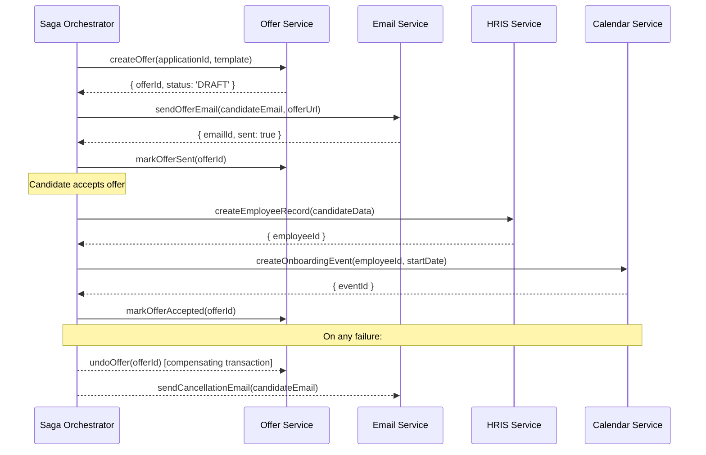
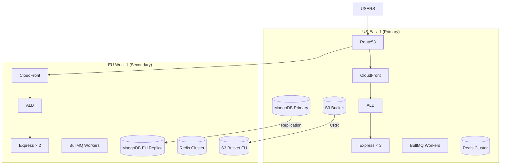
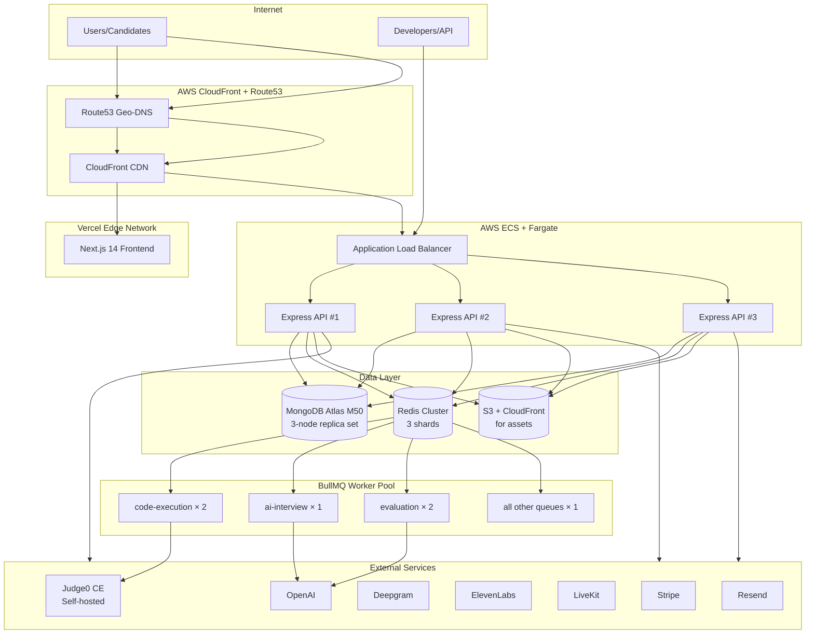

# Fluxberry AI — Enterprise Platform Architecture
## Programmable Hiring Operating System v2.0

**Role:** Chief Platform Architect · Distributed Systems Lead · Enterprise Infrastructure Architect · SaaS OS Engineer  
**Date:** 2026-05-15  
**Status:** Production Implementation Blueprint  
**Objective:** Transform Fluxberry AI from a hiring platform into the programmable hiring operating system for modern startups and enterprises — scalable, extensible, deeply integrated, and operationally resilient.

---

## Table of Contents

1. [Current State Assessment](#1-current-state-assessment)
2. [Visual Workflow Builder Architecture](#2-visual-workflow-builder-architecture)
3. [Distributed Systems Design](#3-distributed-systems-design)
4. [Enterprise Integration Platform](#4-enterprise-integration-platform)
5. [Public API Platform](#5-public-api-platform)
6. [Webhook Architecture](#6-webhook-architecture)
7. [Enterprise Security Systems](#7-enterprise-security-systems)
8. [Enterprise Observability](#8-enterprise-observability)
9. [Billing Architecture](#9-billing-architecture)
10. [Scalability Architecture](#10-scalability-architecture)
11. [Multi-Region Infrastructure](#11-multi-region-infrastructure)
12. [Queue Scaling Strategy](#12-queue-scaling-strategy)
13. [Infrastructure Resilience](#13-infrastructure-resilience)
14. [Enterprise Analytics Architecture](#14-enterprise-analytics-architecture)
15. [DevOps & Deployment Systems](#15-devops--deployment-systems)
16. [Disaster Recovery](#16-disaster-recovery)
17. [API Contracts (Enterprise Layer)](#17-api-contracts-enterprise-layer)
18. [Database Scaling Strategies](#18-database-scaling-strategies)
19. [Deployment Architecture](#19-deployment-architecture)
20. [Long-Term Platform Moat Strategy](#20-long-term-platform-moat-strategy)

---

## 1. Current State Assessment

### Infrastructure Maturity

| System | Maturity | Notes |
|--------|----------|-------|
| MongoDB (Mongoose) | Production | 40+ models, basic indexes |
| BullMQ Queues | Production | 10 queues, basic retry |
| Redis | Production | BullMQ backing, basic caching |
| JWT Auth | Production | 9 RBAC roles |
| S3 Integration | Production | Resume + asset storage |
| Stripe | Partial | Basic billing, no metered usage |
| Workflow Engine V2 | Partial | DAG model exists, delays/approvals TODO |
| FluxEvents | Partial | In-process only, not persistent |
| Webhooks Module | Partial | Schema exists, delivery engine incomplete |
| Observability | Missing | No distributed tracing, no metrics |
| SSO / SCIM | Missing | JWT only |
| Enterprise Integrations | Missing | Google Calendar only |
| Multi-Region | Missing | Single-region deployment |
| Public API | Missing | No API keys, no rate limiting |
| Feature Flags | Missing | No rollout mechanism |
| Analytics Pipeline | Missing | No batch analytics |

### What Must Be Built (Priority Order)

```
P0 (blocks enterprise sales):
  - Audit logs (SOC2 requirement)
  - Workflow engine completion (delays + approvals)
  - Webhook delivery engine

P1 (unlocks growth):
  - Public API + API keys
  - Slack / Google Calendar integrations
  - Persistent event log
  - Metered billing

P2 (enterprise tier):
  - SSO (SAML + OIDC)
  - SCIM provisioning
  - Distributed tracing
  - Multi-region

P3 (platform moat):
  - Workflow marketplace
  - Full integration platform
  - AI usage metering
```

---

## 2. Visual Workflow Builder Architecture

### 2.1 Node Type System

```typescript
// Discriminated union of all node types
export type WorkflowNode = 
  | TriggerNode
  | ConditionNode
  | ActionNode
  | DelayNode
  | AIDecisionNode
  | ApprovalNode
  | LoopNode
  | SubWorkflowNode

// ── Trigger Nodes ──────────────────────────────────────────────────────────
export interface TriggerNode {
  id: string
  type: 'TRIGGER'
  triggerType: 
    | 'APPLICATION_SUBMITTED'
    | 'STAGE_CHANGED'
    | 'ASSESSMENT_COMPLETED'
    | 'INTERVIEW_COMPLETED'
    | 'OFFER_ACCEPTED'
    | 'OFFER_REJECTED'
    | 'CANDIDATE_TAGGED'
    | 'TIME_ELAPSED'         // e.g., "3 days after application"
    | 'WEBHOOK_RECEIVED'     // external trigger
    | 'MANUAL'              // recruiter-triggered
  config: Record<string, unknown>
  position: { x: number; y: number }
}

// ── Condition Nodes ────────────────────────────────────────────────────────
export interface ConditionNode {
  id: string
  type: 'CONDITION'
  conditionType: 
    | 'SCORE_ABOVE'
    | 'SCORE_BELOW'
    | 'SCORE_BETWEEN'
    | 'FIELD_EQUALS'
    | 'FIELD_CONTAINS'
    | 'TAG_EXISTS'
    | 'STAGE_IS'
    | 'AND'
    | 'OR'
    | 'NOT'
  config: {
    field?: string           // e.g., 'candidate.hiringConfidenceScore.finalScore'
    operator?: string        // 'gt' | 'lt' | 'eq' | 'contains'
    value?: unknown
    conditions?: ConditionNode[]  // for AND/OR/NOT
  }
  trueEdge: string           // next nodeId if condition passes
  falseEdge: string          // next nodeId if condition fails
  position: { x: number; y: number }
}

// ── Action Nodes ───────────────────────────────────────────────────────────
export interface ActionNode {
  id: string
  type: 'ACTION'
  actionType:
    | 'SEND_EMAIL'
    | 'SEND_SLACK_MESSAGE'
    | 'MOVE_STAGE'
    | 'ASSIGN_RECRUITER'
    | 'ADD_TAG'
    | 'REMOVE_TAG'
    | 'TRIGGER_ASSESSMENT'
    | 'SCHEDULE_AI_INTERVIEW'
    | 'GENERATE_OFFER'
    | 'CALL_WEBHOOK'
    | 'CREATE_CALENDAR_EVENT'
    | 'SEND_TEAMS_MESSAGE'
    | 'UPDATE_HRIS'
    | 'ENRICH_CANDIDATE_PROFILE'
  config: Record<string, unknown>  // type-specific config
  retryConfig?: { maxAttempts: number; backoffMs: number }
  position: { x: number; y: number }
}

// ── Delay Nodes ────────────────────────────────────────────────────────────
export interface DelayNode {
  id: string
  type: 'DELAY'
  delayType: 'WAIT_HOURS' | 'WAIT_DAYS' | 'WAIT_UNTIL_TIME'
  config: {
    hours?: number
    days?: number
    untilTime?: string       // ISO time string, e.g., "09:00:00"
    untilDayOfWeek?: number  // 0=Sun, 1=Mon, ... 5=Fri (business hours)
    timezone?: string        // default: org timezone
  }
  position: { x: number; y: number }
}

// ── AI Decision Nodes ──────────────────────────────────────────────────────
export interface AIDecisionNode {
  id: string
  type: 'AI_DECISION'
  config: {
    prompt: string           // "Is this candidate a strong technical fit for {{job.title}}?"
    context: string[]        // fields to include: ['candidate.resumeSummary', 'candidate.hiringConfidenceScore']
    yesEdge: string
    noEdge: string
    uncertainEdge: string    // if AI confidence < threshold
    confidenceThreshold: number  // default 0.7
    model: 'gpt-4o-mini' | 'gpt-4o'
    fallbackEdge: string     // if AI call fails
  }
  position: { x: number; y: number }
}

// ── Approval Nodes ─────────────────────────────────────────────────────────
export interface ApprovalNode {
  id: string
  type: 'APPROVAL'
  config: {
    approvers: string[]      // user IDs or role names (e.g., 'HIRING_MANAGER')
    timeoutHours: number     // auto-escalate or reject after N hours
    timeoutAction: 'APPROVE' | 'REJECT' | 'ESCALATE'
    escalateTo?: string[]    // user IDs if escalating
    approvalMode: 'ANY_ONE' | 'ALL_REQUIRED'
    notificationTemplate?: string
  }
  approvedEdge: string
  rejectedEdge: string
  timedOutEdge: string
  position: { x: number; y: number }
}

// ── Loop Nodes ─────────────────────────────────────────────────────────────
export interface LoopNode {
  id: string
  type: 'LOOP'
  config: {
    collection: string       // e.g., '{{job.candidates}}' or 'applications_in_stage'
    itemVariable: string     // e.g., 'candidate' — available in loop body
    maxIterations: number    // safety limit (default 500)
  }
  loopBodyStartEdge: string  // first node inside loop
  loopCompleteEdge: string   // after all iterations done
  position: { x: number; y: number }
}

// ── Sub-Workflow Nodes ─────────────────────────────────────────────────────
export interface SubWorkflowNode {
  id: string
  type: 'SUB_WORKFLOW'
  config: {
    workflowId: string       // ID of another WorkflowDefinition
    inputMapping: Record<string, string>  // map parent vars → child vars
    outputMapping: Record<string, string> // map child output → parent vars
    waitForCompletion: boolean
  }
  completedEdge: string
  failedEdge: string
  position: { x: number; y: number }
}
```

### 2.2 Workflow Definition & Execution Models

```typescript
// WorkflowDefinitionV3
interface IWorkflowDefinitionV3 {
  organizationId: ObjectId
  name: string
  description?: string
  version: number
  status: 'DRAFT' | 'ACTIVE' | 'PAUSED' | 'ARCHIVED'
  triggerNode: TriggerNode
  nodes: WorkflowNode[]
  edges: WorkflowEdge[]
  variables: WorkflowVariable[]     // org-level template variables
  tags: string[]
  isTemplate: boolean               // org can publish to marketplace
  createdBy: ObjectId
  updatedAt: Date
}

interface WorkflowEdge {
  id: string
  sourceNodeId: string
  targetNodeId: string
  label?: string                    // 'Yes', 'No', 'Approved', etc.
}

interface WorkflowVariable {
  name: string
  type: 'STRING' | 'NUMBER' | 'BOOLEAN' | 'DATE'
  defaultValue?: unknown
  description: string
}

// WorkflowExecutionV3 — one instance per trigger
interface IWorkflowExecutionV3 {
  workflowId: ObjectId
  organizationId: ObjectId
  triggerEvent: string
  triggerEntityId: ObjectId
  triggerEntityType: 'APPLICATION' | 'CANDIDATE' | 'JOB' | 'ASSESSMENT'
  status: 'RUNNING' | 'COMPLETED' | 'FAILED' | 'PAUSED' | 'CANCELLED'
  currentNodeId: string
  variables: Record<string, unknown>   // runtime variable bindings
  trace: ExecutionTraceEntry[]
  pendingApproval?: PendingApproval
  startedAt: Date
  completedAt?: Date
  errorNodeId?: string
  errorMessage?: string
}

interface ExecutionTraceEntry {
  nodeId: string
  nodeType: string
  startedAt: Date
  completedAt?: Date
  input: Record<string, unknown>
  output: Record<string, unknown>
  status: 'RUNNING' | 'COMPLETED' | 'FAILED' | 'SKIPPED'
  error?: string
  retryCount: number
}

interface PendingApproval {
  approvalNodeId: string
  approvers: string[]
  requestedAt: Date
  expiresAt: Date
  responses: Array<{
    userId: ObjectId
    decision: 'APPROVED' | 'REJECTED'
    reason?: string
    respondedAt: Date
  }>
}
```

### 2.3 Workflow Runtime Engine

```typescript
class WorkflowRuntimeV3 {
  async execute(executionId: string): Promise<void> {
    const execution = await WorkflowExecutionV3.findById(executionId)
    const definition = await WorkflowDefinitionV3.findById(execution.workflowId)
    
    while (execution.status === 'RUNNING') {
      const currentNode = this.findNode(definition, execution.currentNodeId)
      if (!currentNode) {
        await this.failExecution(execution, 'Node not found: ' + execution.currentNodeId)
        return
      }
      
      const traceEntry: ExecutionTraceEntry = {
        nodeId: currentNode.id,
        nodeType: currentNode.type,
        startedAt: new Date(),
        input: this.resolveVariables(currentNode.config, execution.variables),
        output: {},
        status: 'RUNNING',
        retryCount: 0,
      }
      
      try {
        const result = await this.executeNode(currentNode, execution)
        traceEntry.output = result.output
        traceEntry.status = 'COMPLETED'
        traceEntry.completedAt = new Date()
        
        // Advance to next node
        execution.currentNodeId = result.nextNodeId
        execution.variables = { ...execution.variables, ...result.newVariables }
        
        if (!result.nextNodeId) {
          execution.status = 'COMPLETED'
          execution.completedAt = new Date()
        }
        
        // Pause for DELAY nodes — resume via scheduled job
        if (currentNode.type === 'DELAY') {
          execution.status = 'PAUSED'
        }
        
        // Pause for APPROVAL nodes — resume via approval webhook
        if (currentNode.type === 'APPROVAL') {
          execution.status = 'PAUSED'
          execution.pendingApproval = result.pendingApproval
        }
        
      } catch (err) {
        traceEntry.status = 'FAILED'
        traceEntry.error = (err as Error).message
        traceEntry.completedAt = new Date()
        
        const retryConfig = (currentNode as ActionNode).retryConfig
        if (retryConfig && traceEntry.retryCount < retryConfig.maxAttempts) {
          traceEntry.retryCount++
          await sleep(retryConfig.backoffMs)
          continue
        }
        
        await this.failExecution(execution, (err as Error).message, currentNode.id)
        break
      }
      
      execution.trace.push(traceEntry)
      await execution.save()
    }
  }
  
  private async executeNode(node: WorkflowNode, execution: IWorkflowExecutionV3): Promise<NodeResult> {
    const ctx = execution.variables
    
    switch (node.type) {
      case 'CONDITION': return this.evaluateCondition(node, ctx)
      case 'ACTION': return this.executeAction(node, ctx)
      case 'DELAY': return this.scheduleDelay(node, execution._id)
      case 'AI_DECISION': return this.aiDecision(node, ctx)
      case 'APPROVAL': return this.requestApproval(node, execution)
      case 'LOOP': return this.executeLoop(node, ctx)
      case 'SUB_WORKFLOW': return this.callSubWorkflow(node, ctx)
      default: throw new Error(`Unknown node type: ${(node as any).type}`)
    }
  }
  
  private resolveVariables(config: Record<string, unknown>, vars: Record<string, unknown>): Record<string, unknown> {
    // Liquid-style template resolution: {{ candidate.name }}, {{ job.title }}
    const resolved: Record<string, unknown> = {}
    for (const [key, value] of Object.entries(config)) {
      if (typeof value === 'string') {
        resolved[key] = value.replace(/\{\{\s*([^}]+)\s*\}\}/g, (_, path) => {
          return get(vars, path.trim()) ?? ''
        })
      } else {
        resolved[key] = value
      }
    }
    return resolved
  }
  
  private async aiDecision(node: AIDecisionNode, ctx: Record<string, unknown>): Promise<NodeResult> {
    const contextData = node.config.context.reduce((acc, field) => {
      acc[field] = get(ctx, field)
      return acc
    }, {} as Record<string, unknown>)
    
    const prompt = node.config.prompt.replace(/\{\{([^}]+)\}\}/g, (_, path) => 
      String(get(ctx, path.trim()) ?? '')
    )
    
    const response = await openai.chat.completions.create({
      model: node.config.model,
      messages: [{
        role: 'system',
        content: 'You are a hiring decision assistant. Respond with JSON: { "decision": "YES" | "NO" | "UNCERTAIN", "confidence": 0-1, "reason": string }'
      }, {
        role: 'user',
        content: `${prompt}\n\nContext:\n${JSON.stringify(contextData, null, 2)}`
      }],
      response_format: { type: 'json_object' },
      max_tokens: 200,
    })
    
    const { decision, confidence } = JSON.parse(response.choices[0].message.content!)
    
    const nextNodeId = confidence < node.config.confidenceThreshold
      ? node.config.uncertainEdge
      : decision === 'YES' ? node.config.yesEdge : node.config.noEdge
    
    return { nextNodeId, output: { decision, confidence }, newVariables: {} }
  }
}
```

### 2.4 Variable Template System

Templates use Liquid-style `{{ }}` syntax:

```
Available variables in workflow context:
  {{ candidate.name }}
  {{ candidate.email }}
  {{ candidate.hiringConfidenceScore.finalScore }}
  {{ candidate.hiringConfidenceScore.classification }}
  {{ job.title }}
  {{ job.department }}
  {{ application.appliedAt }}
  {{ application.stage }}
  {{ assessment.mcqScore }}
  {{ assessment.dsaScore }}
  {{ assessment.aiInterviewScore }}
  {{ recruiter.name }}
  {{ org.name }}
  {{ org.timezone }}
```

### 2.5 Workflow Debugging

```
Execution detail page shows:
  ┌──────────────────────────────────────────────────────────────────┐
  │  Execution #3847    Status: PAUSED (waiting for approval)        │
  │  Triggered: APPLICATION_SUBMITTED  Entity: John Smith            │
  │  Started: 2026-05-15 14:23:01  Duration: 2h 14m               │
  ├──────────────────────────────────────────────────────────────────┤
  │  Node Trace:                                                     │
  │  ✓ TRIGGER   APPLICATION_SUBMITTED     0ms                      │
  │  ✓ CONDITION score > 70               1ms  → YES               │
  │  ✓ ACTION    SEND_EMAIL (invite)      234ms                     │
  │  ✓ DELAY     WAIT_HOURS(24)           24h (skipped in debug)    │
  │  ✓ CONDITION assessment.status = COMPLETED  → YES              │
  │  ⏸ APPROVAL  Hiring Manager approval  WAITING (23h left)       │
  │                                                                  │
  │  Variables at current state:                                     │
  │  { candidateScore: 78, stage: "ASSESSMENT_COMPLETE" }           │
  ├──────────────────────────────────────────────────────────────────┤
  │  [Approve manually]  [Reject manually]  [Cancel]  [View Vars]   │
  └──────────────────────────────────────────────────────────────────┘
```

### 2.6 Frontend Builder Component Architecture

```
WorkflowBuilderPage
  ├── NodePalette (left sidebar)
  │     ├── TriggerSection
  │     ├── ConditionSection
  │     ├── ActionSection
  │     └── AdvancedSection (Delay, AI, Approval, Loop)
  ├── FlowCanvas (center — React Flow)
  │     ├── WorkflowNodes (custom node renderers per type)
  │     ├── WorkflowEdges (labeled edges)
  │     └── MiniMap
  ├── NodeConfigPanel (right sidebar — appears on node click)
  │     ├── TriggerConfig
  │     ├── ConditionConfig
  │     ├── ActionConfig (varies by actionType)
  │     ├── DelayConfig
  │     ├── AIDecisionConfig
  │     └── ApprovalConfig
  ├── WorkflowToolbar (top)
  │     ├── SaveButton
  │     ├── TestRunButton (dry run with sample data)
  │     ├── ActivateButton
  │     └── VersionHistory dropdown
  └── ExecutionHistoryPanel (bottom drawer)
        ├── ExecutionList
        └── ExecutionDetail (trace view)
```

---

## 3. Distributed Systems Design

### 3.1 Persistent Event Log

Replace in-process FluxEvents with a persistent, replayable event log:

```typescript
// EventLog model — append-only
interface IEventLog {
  eventId: string                    // UUID v4
  type: string                       // e.g., 'APPLICATION_SUBMITTED'
  organizationId: ObjectId
  entityId: ObjectId
  entityType: string                 // 'Application' | 'Candidate' | 'Job'
  payload: Record<string, unknown>
  publishedAt: Date
  processedByWorkflow: boolean
  workflowExecutionIds: ObjectId[]
  retentionUntil: Date               // for GDPR data retention
}

const EventLogSchema = new Schema<IEventLog>({
  eventId: { type: String, required: true, unique: true },
  type: { type: String, required: true, index: true },
  organizationId: { type: Schema.Types.ObjectId, required: true, index: true },
  entityId: { type: Schema.Types.ObjectId, required: true },
  entityType: { type: String, required: true },
  payload: { type: Schema.Types.Mixed, required: true },
  publishedAt: { type: Date, default: Date.now, index: true },
  processedByWorkflow: { type: Boolean, default: false, index: true },
  workflowExecutionIds: [{ type: Schema.Types.ObjectId }],
  retentionUntil: { type: Date, required: true },
}, { timestamps: false })

EventLogSchema.index({ organizationId: 1, type: 1, publishedAt: -1 })
EventLogSchema.index({ publishedAt: 1, processedByWorkflow: 1 })  // for processor

// EventBus — thin wrapper over the persistent log
class PersistentEventBus {
  async publish(type: string, entityId: string, entityType: string, orgId: string, payload: unknown): Promise<IEventLog> {
    const retentionMonths = await this.getRetentionPolicy(orgId)
    const log = await EventLog.create({
      eventId: uuidv4(),
      type,
      organizationId: orgId,
      entityId,
      entityType,
      payload,
      retentionUntil: addMonths(new Date(), retentionMonths),
    })
    
    // Still emit in-process for real-time handlers (workflows)
    inMemoryBus.emit(type, { ...payload, _eventLogId: log._id })
    
    // Enqueue workflow matching job
    await workflowQueue.add('match-event', { eventLogId: log._id.toString(), orgId, type })
    
    // Push to webhook subscribers
    await webhookQueue.add('deliver-event', { eventLogId: log._id.toString(), type, orgId })
    
    return log
  }
  
  async replay(orgId: string, fromDate: Date, eventTypes?: string[]): Promise<IEventLog[]> {
    const query: any = { organizationId: orgId, publishedAt: { $gte: fromDate } }
    if (eventTypes?.length) query.type = { $in: eventTypes }
    return EventLog.find(query).sort({ publishedAt: 1 }).limit(10000)
  }
}
```

### 3.2 Idempotency Layer

Every write operation has an idempotency key, stored 24h in Redis:

```typescript
// Middleware: X-Idempotency-Key header handling
async function idempotencyMiddleware(req: Request, res: Response, next: NextFunction) {
  const key = req.headers['x-idempotency-key'] as string
  if (!key || req.method === 'GET') return next()
  
  const cacheKey = `idempotency:${req.headers['x-org-id']}:${key}`
  const cached = await redis.get(cacheKey)
  if (cached) {
    const { status, body } = JSON.parse(cached)
    return res.status(status).json(body)
  }
  
  // Intercept response to cache it
  const originalJson = res.json.bind(res)
  res.json = (body: unknown) => {
    redis.setex(cacheKey, 86400, JSON.stringify({ status: res.statusCode, body }))
    return originalJson(body)
  }
  
  next()
}
```

### 3.3 Distributed Locking (Concurrent Workflow Protection)

```typescript
// Prevent two workflow executions from acting on the same candidate simultaneously
async function acquireWorkflowLock(
  orgId: string,
  entityId: string,
  workflowId: string,
  ttlMs = 30000
): Promise<string | null> {
  const lockKey = `workflow-lock:${orgId}:${entityId}:${workflowId}`
  const lockToken = uuidv4()
  
  // SET key value NX PX ttl — atomic acquisition
  const acquired = await redis.set(lockKey, lockToken, 'NX', 'PX', ttlMs)
  return acquired ? lockToken : null
}

async function releaseWorkflowLock(
  orgId: string, entityId: string, workflowId: string, token: string
): Promise<void> {
  const lockKey = `workflow-lock:${orgId}:${entityId}:${workflowId}`
  const current = await redis.get(lockKey)
  if (current === token) await redis.del(lockKey)  // only release if we own it
}
```

### 3.4 Saga Pattern for Multi-Step Operations

For offer generation (multi-step, must be atomic or fully undoable):



---

## 4. Enterprise Integration Platform

### 4.1 OAuth Connection Model

```typescript
interface IOAuthConnection {
  organizationId: ObjectId
  provider: 'SLACK' | 'GOOGLE_WORKSPACE' | 'MICROSOFT_365' | 'ZOOM' | 'LINKEDIN' | 'BAMBOOHR' | 'WORKDAY' | 'RIPPLING' | 'GUSTO'
  accountId: string                  // provider-specific workspace/account ID
  accountName: string                // display name
  accessToken: string                // encrypted at rest (AES-256-GCM)
  refreshToken?: string              // encrypted at rest
  expiresAt?: Date
  scopes: string[]
  status: 'ACTIVE' | 'EXPIRED' | 'DISCONNECTED' | 'ERROR'
  webhookSubscriptionId?: string     // if provider uses webhooks
  metadata: Record<string, unknown>  // provider-specific config
  connectedBy: ObjectId
  connectedAt: Date
  lastUsedAt: Date
  errorMessage?: string
}

// Token refresh scheduler (BullMQ cron: every 10 minutes)
async function refreshExpiringTokens(): Promise<void> {
  const expiresThreshold = addMinutes(new Date(), 10)  // refresh 10 min before expiry
  const connections = await OAuthConnection.find({
    status: 'ACTIVE',
    expiresAt: { $lte: expiresThreshold },
    refreshToken: { $exists: true }
  })
  
  for (const conn of connections) {
    try {
      const refreshed = await providers[conn.provider].refreshAccessToken(
        decrypt(conn.refreshToken!)
      )
      await OAuthConnection.findByIdAndUpdate(conn._id, {
        accessToken: encrypt(refreshed.accessToken),
        expiresAt: refreshed.expiresAt,
        status: 'ACTIVE',
        errorMessage: null,
      })
    } catch (err) {
      await OAuthConnection.findByIdAndUpdate(conn._id, {
        status: 'ERROR',
        errorMessage: (err as Error).message,
      })
      await notifyOrgAdmin(conn.organizationId, 'INTEGRATION_ERROR', { provider: conn.provider })
    }
  }
}
```

### 4.2 Slack Integration

```typescript
class SlackIntegration {
  async sendMessage(orgId: string, channelId: string, message: SlackMessage): Promise<void> {
    const conn = await OAuthConnection.findOne({ organizationId: orgId, provider: 'SLACK', status: 'ACTIVE' })
    if (!conn) throw new Error('Slack not connected')
    
    const token = decrypt(conn.accessToken)
    
    await retry(async () => {
      const response = await fetch('https://slack.com/api/chat.postMessage', {
        method: 'POST',
        headers: { 'Authorization': `Bearer ${token}`, 'Content-Type': 'application/json' },
        body: JSON.stringify({ channel: channelId, ...message }),
      })
      const data = await response.json()
      if (!data.ok) throw new Error(`Slack error: ${data.error}`)
    }, { retries: 3, minTimeout: 1000, maxTimeout: 8000 })
  }
  
  // Workflow action: SEND_SLACK_MESSAGE
  buildSlackMessage(template: string, variables: Record<string, unknown>): SlackMessage {
    return {
      text: resolveTemplate(template, variables),
      blocks: [
        {
          type: 'section',
          text: { type: 'mrkdwn', text: resolveTemplate(template, variables) },
        },
        {
          type: 'actions',
          elements: [
            { type: 'button', text: { type: 'plain_text', text: 'View Candidate' }, 
              url: `${process.env.FRONTEND_URL}/dashboard/ats/candidates/${variables['candidateId']}` },
          ],
        },
      ],
    }
  }
}
```

### 4.3 Google Calendar Integration

```typescript
class GoogleCalendarIntegration {
  async createInterviewEvent(orgId: string, params: CreateInterviewEventParams): Promise<string> {
    const conn = await OAuthConnection.findOne({ 
      organizationId: orgId, provider: 'GOOGLE_WORKSPACE', status: 'ACTIVE' 
    })
    
    const token = decrypt(conn.accessToken)
    const eventBody = {
      summary: `Interview: ${params.candidateName} — ${params.jobTitle}`,
      description: params.description,
      start: { dateTime: params.startTime, timeZone: params.timezone },
      end: { dateTime: params.endTime, timeZone: params.timezone },
      attendees: [
        { email: params.candidateEmail },
        { email: params.recruiterEmail },
        ...(params.interviewerEmails || []).map(e => ({ email: e })),
      ],
      conferenceData: params.videoLink ? {
        createRequest: { requestId: uuidv4(), conferenceSolutionKey: { type: 'hangoutsMeet' } }
      } : undefined,
      reminders: { useDefault: false, overrides: [{ method: 'email', minutes: 1440 }, { method: 'popup', minutes: 30 }] },
    }
    
    const response = await fetch(
      'https://www.googleapis.com/calendar/v3/calendars/primary/events?conferenceDataVersion=1',
      { method: 'POST', headers: { 'Authorization': `Bearer ${token}`, 'Content-Type': 'application/json' }, body: JSON.stringify(eventBody) }
    )
    const event = await response.json()
    return event.id
  }
}
```

### 4.4 HRIS Integration (BambooHR example)

```typescript
class BambooHRIntegration {
  async createEmployee(orgId: string, candidate: HiredCandidateData): Promise<string> {
    const conn = await OAuthConnection.findOne({ organizationId: orgId, provider: 'BAMBOOHR', status: 'ACTIVE' })
    const apiKey = decrypt(conn.accessToken)
    const subdomain = conn.metadata['subdomain'] as string
    
    const response = await fetch(
      `https://api.bamboohr.com/api/gateway.php/${subdomain}/v1/employees`,
      {
        method: 'POST',
        headers: {
          'Authorization': `Basic ${Buffer.from(`${apiKey}:x`).toString('base64')}`,
          'Content-Type': 'application/json',
          'Accept': 'application/json',
        },
        body: JSON.stringify({
          firstName: candidate.firstName,
          lastName: candidate.lastName,
          workEmail: candidate.email,
          jobTitle: candidate.jobTitle,
          department: candidate.department,
          hireDate: candidate.startDate,
          employeeType: 'Full-Time',
        }),
      }
    )
    const data = await response.json()
    return data.id
  }
}
```

### 4.5 Sync Reconciliation

```typescript
// Hourly reconciliation job — detect drift between Fluxberry and external systems
async function reconcileHRIS(orgId: string): Promise<void> {
  const conn = await OAuthConnection.findOne({ organizationId: orgId, provider: 'BAMBOOHR', status: 'ACTIVE' })
  
  // Get all hired candidates in Fluxberry
  const hiredApplications = await JobApplication.find({
    organizationId: orgId,
    status: 'HIRED',
    hrisEmployeeId: { $exists: true }
  })
  
  // Get all employees from HRIS
  const hrisEmployees = await bambooHR.getAllEmployees(orgId)
  const hrisIds = new Set(hrisEmployees.map(e => e.id))
  
  // Detect: hired in Fluxberry but missing from HRIS
  const missing = hiredApplications.filter(a => !hrisIds.has(a.hrisEmployeeId))
  for (const app of missing) {
    await SyncLog.create({
      connectionId: conn._id,
      direction: 'FLUXBERRY_TO_HRIS',
      entityType: 'Employee',
      entityId: app._id,
      result: 'DRIFT_DETECTED',
      errors: ['Employee record not found in HRIS'],
      timestamp: new Date(),
    })
    // Alert recruiter to manually verify
    await notificationQueue.add('sync-alert', { orgId, type: 'HRIS_DRIFT', applicationId: app._id })
  }
}
```

---

## 5. Public API Platform

### 5.1 API Key Model

```typescript
interface IApiKey {
  organizationId: ObjectId
  name: string                       // human-readable label
  keyHash: string                    // SHA-256 hash of the actual key
  keyPrefix: string                  // first 8 chars shown in UI: "flx_live_AbCd..."
  scopes: ApiScope[]
  rateLimit: { requestsPerHour: number; burstLimit: number }
  status: 'ACTIVE' | 'REVOKED'
  lastUsedAt?: Date
  lastUsedIp?: string
  expiresAt?: Date
  createdBy: ObjectId
  createdAt: Date
  revokedAt?: Date
  revokedBy?: ObjectId
}

type ApiScope = 
  | 'read:candidates'
  | 'write:candidates'
  | 'read:jobs'
  | 'write:jobs'
  | 'read:assessments'
  | 'read:applications'
  | 'write:applications'
  | 'read:analytics'
  | 'webhook:manage'
  | 'admin'

// Key generation
function generateApiKey(): { key: string; hash: string; prefix: string } {
  const randomBytes = crypto.randomBytes(32).toString('base64url')
  const key = `flx_live_${randomBytes}`                // 'flx_test_' for test keys
  const hash = crypto.createHash('sha256').update(key).digest('hex')
  const prefix = key.slice(0, 12)
  return { key, hash, prefix }
}
```

### 5.2 API Authentication Middleware

```typescript
async function apiKeyAuthMiddleware(req: Request, res: Response, next: NextFunction) {
  const authHeader = req.headers.authorization
  if (!authHeader?.startsWith('Bearer flx_')) return next()  // fall through to JWT auth
  
  const key = authHeader.slice(7)
  const hash = crypto.createHash('sha256').update(key).digest('hex')
  
  const apiKey = await ApiKey.findOne({ keyHash: hash, status: 'ACTIVE' })
  if (!apiKey) return res.status(401).json({ error: 'Invalid API key' })
  if (apiKey.expiresAt && apiKey.expiresAt < new Date()) {
    return res.status(401).json({ error: 'API key expired' })
  }
  
  // Rate limiting check
  const rateLimitResult = await checkRateLimit(apiKey._id.toString(), apiKey.rateLimit)
  if (!rateLimitResult.allowed) {
    res.set('Retry-After', String(rateLimitResult.retryAfter))
    return res.status(429).json({ error: 'Rate limit exceeded', retryAfter: rateLimitResult.retryAfter })
  }
  
  // Scope check (done per-route by requireScope middleware)
  req.apiKey = apiKey
  req.organizationId = apiKey.organizationId.toString()
  
  // Update lastUsed asynchronously
  ApiKey.findByIdAndUpdate(apiKey._id, { lastUsedAt: new Date(), lastUsedIp: req.ip }).exec()
  
  next()
}
```

### 5.3 Rate Limiting (Redis Sliding Window)

```typescript
async function checkRateLimit(
  keyId: string,
  limits: { requestsPerHour: number; burstLimit: number }
): Promise<{ allowed: boolean; remaining: number; retryAfter?: number }> {
  const now = Date.now()
  const windowMs = 3600_000  // 1 hour
  const windowKey = `ratelimit:${keyId}:${Math.floor(now / windowMs)}`
  
  const [count] = await redis.multi()
    .incr(windowKey)
    .expire(windowKey, 3600)
    .exec()
  
  const currentCount = count as number
  const remaining = Math.max(0, limits.requestsPerHour - currentCount)
  
  if (currentCount > limits.requestsPerHour) {
    const windowExpiry = (Math.floor(now / windowMs) + 1) * windowMs
    return { allowed: false, remaining: 0, retryAfter: Math.ceil((windowExpiry - now) / 1000) }
  }
  
  // Set rate limit headers
  return { allowed: true, remaining }
}
```

### 5.4 API Versioning

```typescript
// Version routing — /api/v1/ and /api/v2/
app.use('/api/v1', v1Router)
app.use('/api/v2', v2Router)

// Deprecation headers
function deprecationMiddleware(deprecatedIn: string, sunsetDate: string) {
  return (req: Request, res: Response, next: NextFunction) => {
    res.set('Deprecation', `version="${deprecatedIn}"`)
    res.set('Sunset', sunsetDate)
    res.set('Link', '</api/v2>; rel="successor-version"')
    next()
  }
}

// v1 routes get deprecation headers 12 months before sunsetting
v1Router.use(deprecationMiddleware('v1', 'Sat, 15 May 2027 00:00:00 GMT'))
```

### 5.5 Pagination (Cursor-Based)

```typescript
// All list endpoints use cursor-based pagination
interface PaginatedResponse<T> {
  data: T[]
  nextCursor: string | null
  hasMore: boolean
  total?: number  // only on first page (expensive)
}

async function paginateCandidates(
  orgId: string,
  cursor: string | undefined,
  limit = 50
): Promise<PaginatedResponse<CandidateResponse>> {
  const query: any = { organizationId: orgId }
  
  if (cursor) {
    // Cursor encodes: { createdAt, _id } — stable sort
    const { createdAt, _id } = decodeCursor(cursor)
    query.$or = [
      { createdAt: { $lt: createdAt } },
      { createdAt: createdAt, _id: { $lt: _id } },
    ]
  }
  
  const results = await Candidate.find(query)
    .sort({ createdAt: -1, _id: -1 })
    .limit(limit + 1)
  
  const hasMore = results.length > limit
  const data = results.slice(0, limit)
  
  const nextCursor = hasMore ? encodeCursor({
    createdAt: data[data.length - 1].createdAt,
    _id: data[data.length - 1]._id,
  }) : null
  
  return { data: data.map(formatCandidate), nextCursor, hasMore }
}
```

---

## 6. Webhook Architecture

### 6.1 Webhook Endpoint & Delivery Models

```typescript
interface IWebhookEndpoint {
  organizationId: ObjectId
  url: string
  description?: string
  events: string[]                   // event types subscribed to
  secret: string                     // HMAC signing secret (encrypted at rest)
  status: 'ACTIVE' | 'FAILING' | 'DISABLED'
  failureCount: number               // consecutive failures
  lastDeliveredAt?: Date
  lastDeliveryStatus?: number        // HTTP status of last delivery
  createdAt: Date
}

interface IWebhookDelivery {
  endpointId: ObjectId
  eventLogId: ObjectId
  eventType: string
  payload: Record<string, unknown>
  status: 'PENDING' | 'DELIVERED' | 'FAILED' | 'RETRYING'
  attempts: number
  lastAttemptAt?: Date
  responseStatus?: number
  responseBody?: string              // truncated to 1000 chars
  nextRetryAt?: Date
  createdAt: Date
  completedAt?: Date
}
```

### 6.2 Delivery Pipeline

```typescript
class WebhookDeliveryService {
  // Retry schedule: immediate, 30s, 5m, 30m, 2h, 12h, 24h (7 total)
  private static RETRY_DELAYS_MS = [0, 30_000, 300_000, 1_800_000, 7_200_000, 43_200_000, 86_400_000]
  
  async deliverToEndpoint(delivery: IWebhookDelivery, endpoint: IWebhookEndpoint): Promise<void> {
    const secret = decrypt(endpoint.secret)
    const timestamp = Math.floor(Date.now() / 1000)
    const body = JSON.stringify({ ...delivery.payload, timestamp })
    
    // HMAC-SHA256 signature
    const signature = crypto
      .createHmac('sha256', secret)
      .update(`${timestamp}.${body}`)
      .digest('hex')
    
    try {
      const response = await fetch(endpoint.url, {
        method: 'POST',
        headers: {
          'Content-Type': 'application/json',
          'X-Fluxberry-Signature': `v1=${signature}`,
          'X-Fluxberry-Event': delivery.eventType,
          'X-Fluxberry-Delivery': delivery._id.toString(),
          'User-Agent': 'Fluxberry-Webhook/1.0',
        },
        body,
        signal: AbortSignal.timeout(30_000),  // 30s timeout
      })
      
      const responseBody = await response.text()
      const success = response.status >= 200 && response.status < 300
      
      await WebhookDelivery.findByIdAndUpdate(delivery._id, {
        status: success ? 'DELIVERED' : 'FAILED',
        responseStatus: response.status,
        responseBody: responseBody.slice(0, 1000),
        attempts: delivery.attempts + 1,
        lastAttemptAt: new Date(),
        completedAt: success ? new Date() : undefined,
      })
      
      if (success) {
        await WebhookEndpoint.findByIdAndUpdate(endpoint._id, {
          failureCount: 0,
          lastDeliveredAt: new Date(),
          lastDeliveryStatus: response.status,
          status: 'ACTIVE',
        })
      } else {
        await this.handleDeliveryFailure(delivery, endpoint)
      }
      
    } catch (err) {
      await this.handleDeliveryFailure(delivery, endpoint)
    }
  }
  
  private async handleDeliveryFailure(delivery: IWebhookDelivery, endpoint: IWebhookEndpoint): Promise<void> {
    const nextAttempt = delivery.attempts + 1
    
    if (nextAttempt >= WebhookDeliveryService.RETRY_DELAYS_MS.length) {
      // Max retries exhausted
      await WebhookDelivery.findByIdAndUpdate(delivery._id, { status: 'FAILED' })
      await WebhookEndpoint.findByIdAndUpdate(endpoint._id, {
        $inc: { failureCount: 1 },
        lastDeliveryStatus: 0,
      })
      
      if (endpoint.failureCount + 1 >= 10) {
        await WebhookEndpoint.findByIdAndUpdate(endpoint._id, { status: 'FAILING' })
        await notifyOrgAdmin(endpoint.organizationId, 'WEBHOOK_ENDPOINT_FAILING', { url: endpoint.url })
      }
      return
    }
    
    // Schedule retry
    const delayMs = WebhookDeliveryService.RETRY_DELAYS_MS[nextAttempt]
    const nextRetryAt = new Date(Date.now() + delayMs)
    
    await WebhookDelivery.findByIdAndUpdate(delivery._id, {
      status: 'RETRYING',
      attempts: nextAttempt,
      nextRetryAt,
    })
    
    await webhookQueue.add('retry-delivery', { deliveryId: delivery._id.toString() }, { delay: delayMs })
  }
}
```

### 6.3 Event Catalog

All webhook-able events:

```
APPLICATION_SUBMITTED       → { applicationId, candidateId, jobId, appliedAt }
APPLICATION_STAGE_CHANGED   → { applicationId, fromStage, toStage, changedAt }
ASSESSMENT_COMPLETED        → { assessmentId, attemptId, candidateId, scores }
INTERVIEW_COMPLETED         → { sessionId, candidateId, recommendation }
OFFER_SENT                  → { offerId, candidateId, jobId, expiresAt }
OFFER_ACCEPTED              → { offerId, candidateId, startDate }
OFFER_REJECTED              → { offerId, candidateId, reason }
CANDIDATE_HIRED             → { applicationId, candidateId, startDate }
CANDIDATE_REJECTED          → { applicationId, candidateId, stage, reason }
HIRING_CONFIDENCE_COMPUTED  → { applicationId, finalScore, classification }
INTEGRITY_FLAG_RAISED       → { attemptId, flagType, severity }
WORKFLOW_FAILED             → { executionId, workflowId, nodeId, error }
```

---

## 7. Enterprise Security Systems

### 7.1 RBAC Extension

Current 9 roles extended with resource-level permissions:

```typescript
interface Permission {
  resource: 'job' | 'candidate' | 'application' | 'assessment' | 'offer' | 'report' | 'billing' | 'settings'
  resourceId?: ObjectId              // if null, applies to all resources of this type
  actions: ('view' | 'create' | 'edit' | 'delete' | 'approve')[]
  conditions?: PermissionCondition[]
}

interface PermissionCondition {
  field: string                      // e.g., 'job.department', 'candidate.location'
  operator: 'equals' | 'in' | 'not_equals'
  value: unknown
}

// ABAC: Hiring Manager can only see candidates for their department
const hiringManagerPermissions: Permission[] = [
  {
    resource: 'candidate',
    actions: ['view', 'edit'],
    conditions: [{ field: 'job.department', operator: 'equals', value: '{{user.department}}' }]
  },
  {
    resource: 'application',
    actions: ['view', 'approve'],
    conditions: [{ field: 'job.department', operator: 'equals', value: '{{user.department}}' }]
  },
]
```

### 7.2 SSO Integration

```typescript
// SAML 2.0 SP configuration
interface SAMLConfig {
  organizationId: ObjectId
  idpMetadataUrl: string            // IdP metadata endpoint
  idpEntityId: string
  idpSsoUrl: string
  idpCertificate: string            // PEM format
  spEntityId: string                // Fluxberry SP entity ID
  spAcsUrl: string                  // Assertion Consumer Service URL
  attributeMappings: {
    email: string                   // e.g., 'http://schemas.xmlsoap.org/ws/2005/05/identity/claims/emailaddress'
    firstName: string
    lastName: string
    role?: string                   // optional role mapping
    department?: string
  }
  jitProvisioning: boolean          // auto-create users on first SSO login
  enforceSso: boolean               // block password login if SSO configured
}

// SAML SSO routes
POST /auth/saml/:orgSlug/initiate    → redirect to IdP
POST /auth/saml/:orgSlug/callback   → validate assertion, create/update user, issue JWT
GET  /auth/saml/:orgSlug/metadata   → serve SP metadata XML
```

### 7.3 SCIM 2.0

```
SCIM endpoint: /scim/v2/

Users:
  GET    /scim/v2/Users              → list users (filter, pagination)
  GET    /scim/v2/Users/:id          → get user
  POST   /scim/v2/Users              → provision new user
  PUT    /scim/v2/Users/:id          → replace user
  PATCH  /scim/v2/Users/:id          → partial update (deactivate, role change)
  DELETE /scim/v2/Users/:id          → deprovision (soft delete)

Groups:
  GET    /scim/v2/Groups             → list groups/roles
  POST   /scim/v2/Groups             → create group (maps to Fluxberry role)
  PATCH  /scim/v2/Groups/:id         → add/remove members

Authentication: Bearer token (org-specific SCIM token, separate from API keys)
```

```typescript
// SCIM PATCH user — handles deactivation
async function scimPatchUser(orgId: string, scimId: string, operations: SCIMOperation[]): Promise<void> {
  const user = await User.findOne({ organizationId: orgId, scimId })
  
  for (const op of operations) {
    if (op.op === 'Replace' && op.path === 'active' && op.value === false) {
      // Deactivate: revoke all sessions, mark inactive
      await User.findByIdAndUpdate(user._id, { status: 'INACTIVE', deactivatedAt: new Date() })
      await ApiKey.updateMany({ createdBy: user._id }, { status: 'REVOKED' })
      await AuditLog.create({ orgId, action: 'USER_DEPROVISIONED', targetId: user._id, via: 'SCIM' })
    }
  }
}
```

### 7.4 Audit Logs

```typescript
interface IAuditLog {
  organizationId: ObjectId
  actor: {
    type: 'USER' | 'API_KEY' | 'SYSTEM' | 'SCIM'
    id: ObjectId | string
    name: string
    ip?: string
    userAgent?: string
  }
  action: AuditAction
  resource: {
    type: string
    id: string
    name?: string
  }
  changes?: {
    before: Record<string, unknown>
    after: Record<string, unknown>
  }
  metadata?: Record<string, unknown>
  timestamp: Date
  requestId: string                  // correlates with HTTP logs
}

type AuditAction =
  | 'USER_LOGIN' | 'USER_LOGOUT' | 'USER_INVITED' | 'USER_ROLE_CHANGED' | 'USER_DEPROVISIONED'
  | 'CANDIDATE_VIEWED' | 'CANDIDATE_EDITED' | 'CANDIDATE_DELETED'
  | 'APPLICATION_STAGE_CHANGED' | 'APPLICATION_REJECTED'
  | 'OFFER_SENT' | 'OFFER_APPROVED' | 'OFFER_REVOKED'
  | 'ASSESSMENT_CREATED' | 'ASSESSMENT_ACTIVATED'
  | 'INTEGRITY_OVERRIDE' | 'SCORE_OVERRIDE'
  | 'API_KEY_CREATED' | 'API_KEY_REVOKED'
  | 'WEBHOOK_CREATED' | 'WEBHOOK_DELETED'
  | 'GDPR_ERASURE_REQUESTED' | 'GDPR_EXPORT_REQUESTED'
  | 'BILLING_PLAN_CHANGED' | 'BILLING_CARD_UPDATED'
  | 'SETTINGS_CHANGED'
  | 'SSO_LOGIN' | 'SSO_USER_PROVISIONED'
  | 'DATA_EXPORTED' | 'DATA_DELETED'
```

**Audit logs are:**
- Immutable: no updates, no deletes
- Retained: minimum 2 years (SOC2 requirement)
- Searchable: indexed by orgId, actor.id, action, resource.id, timestamp
- Exportable: CSV export for compliance reviews

### 7.5 GDPR Tools

```typescript
// Right to erasure
POST /api/gdpr/erasure-request
Body: { candidateId, reason }
Process:
  1. Verify requester identity
  2. Anonymize PII fields: name → "Deleted User", email → hash, phone → null
  3. Retain aggregate statistics (scores, timestamps) — non-personal
  4. Delete: resume S3 files, webcam recordings, audio segments
  5. Mark EventLog records with anonymizedAt flag
  6. Create GDPRErasureRecord (immutable, for audit)
  7. Return: { erasureId, completedAt, fieldsAnonymized, filesDeleted }

// Data export
POST /api/gdpr/export
Body: { candidateId }
Process:
  1. Collect all data: candidate profile, applications, assessments, interview transcripts, proctoring events
  2. Generate JSON + CSV package
  3. Upload to S3 as private ZIP
  4. Return presigned URL (expires 48h)
```

### 7.6 Field-Level Encryption

For sensitive fields (salary, offer amount, SSN):

```typescript
const SENSITIVE_FIELDS = ['offerSalary', 'currentSalary', 'expectedSalary', 'ssn', 'taxId']

// AES-256-GCM encryption using AWS KMS data key
async function encryptSensitiveField(value: string, orgId: string): Promise<string> {
  const dataKey = await kms.generateDataKey({ KeyId: process.env.KMS_KEY_ARN!, KeySpec: 'AES_256' })
  const iv = crypto.randomBytes(12)
  const cipher = crypto.createCipheriv('aes-256-gcm', dataKey.Plaintext!, iv)
  const encrypted = Buffer.concat([cipher.update(value, 'utf8'), cipher.final()])
  const authTag = cipher.getAuthTag()
  
  // Store: encryptedDataKey:iv:ciphertext:authTag (base64-encoded)
  return [
    dataKey.CiphertextBlob!.toString('base64'),
    iv.toString('base64'),
    encrypted.toString('base64'),
    authTag.toString('base64'),
  ].join(':')
}
```

---

## 8. Enterprise Observability

### 8.1 OpenTelemetry Integration

```typescript
// Tracer setup
import { NodeSDK } from '@opentelemetry/sdk-node'
import { getNodeAutoInstrumentations } from '@opentelemetry/auto-instrumentations-node'
import { OTLPTraceExporter } from '@opentelemetry/exporter-trace-otlp-http'

const sdk = new NodeSDK({
  traceExporter: new OTLPTraceExporter({ url: process.env.OTEL_EXPORTER_OTLP_ENDPOINT }),
  instrumentations: [getNodeAutoInstrumentations({
    '@opentelemetry/instrumentation-http': { enabled: true },
    '@opentelemetry/instrumentation-mongoose': { enabled: true },
    '@opentelemetry/instrumentation-redis': { enabled: true },
  })],
})

// Custom spans for business events
async function withSpan<T>(name: string, attrs: Record<string, string | number>, fn: () => Promise<T>): Promise<T> {
  const tracer = trace.getTracer('fluxberry')
  const span = tracer.startSpan(name, { attributes: attrs })
  try {
    const result = await context.with(trace.setSpan(context.active(), span), fn)
    span.setStatus({ code: SpanStatusCode.OK })
    return result
  } catch (err) {
    span.setStatus({ code: SpanStatusCode.ERROR, message: (err as Error).message })
    span.recordException(err as Error)
    throw err
  } finally {
    span.end()
  }
}

// BullMQ trace propagation — carry trace context into job data
worker.on('active', (job) => {
  const traceCtx = job.data._traceContext
  if (traceCtx) {
    propagation.extract(context.active(), traceCtx)
  }
})
```

### 8.2 Prometheus Metrics

```typescript
import { Counter, Histogram, Gauge, register } from 'prom-client'

// HTTP metrics
const httpDuration = new Histogram({
  name: 'http_request_duration_ms',
  help: 'HTTP request duration in milliseconds',
  labelNames: ['method', 'route', 'status'],
  buckets: [10, 50, 100, 200, 500, 1000, 2000, 5000],
})

// Queue metrics
const queueDepth = new Gauge({
  name: 'bullmq_queue_depth',
  help: 'Number of jobs waiting in queue',
  labelNames: ['queue'],
})

const jobDuration = new Histogram({
  name: 'bullmq_job_duration_ms',
  help: 'BullMQ job processing duration',
  labelNames: ['queue', 'status'],
  buckets: [100, 500, 1000, 5000, 15000, 30000, 60000],
})

// AI metrics
const aiTokenUsage = new Counter({
  name: 'ai_token_usage_total',
  help: 'Total AI tokens consumed',
  labelNames: ['model', 'orgId', 'operation'],
})

const aiCostEstimate = new Counter({
  name: 'ai_cost_usd_total',
  help: 'Estimated AI cost in USD',
  labelNames: ['model', 'orgId'],
})

// Assessment metrics
const activeAssessments = new Gauge({
  name: 'active_assessment_attempts',
  help: 'Number of currently active assessment attempts',
})

const webhookFailures = new Counter({
  name: 'webhook_delivery_failure_total',
  help: 'Total webhook delivery failures',
  labelNames: ['endpointId', 'eventType'],
})

// Scrape endpoint
app.get('/metrics', async (req, res) => {
  res.set('Content-Type', register.contentType)
  res.end(await register.metrics())
})

// Queue depth updater (every 30s)
setInterval(async () => {
  for (const queueName of ALL_QUEUES) {
    const depth = await queues[queueName].getWaitingCount()
    queueDepth.set({ queue: queueName }, depth)
  }
}, 30_000)
```

### 8.3 Alerting Rules

```yaml
# Prometheus AlertManager rules (alerting.rules.yml)
groups:
  - name: fluxberry
    rules:
      - alert: HighErrorRate
        expr: rate(http_request_duration_ms_count{status=~"5.."}[5m]) / rate(http_request_duration_ms_count[5m]) > 0.02
        for: 2m
        labels: { severity: warning }
        annotations: { summary: "Error rate above 2%" }

      - alert: HighP99Latency
        expr: histogram_quantile(0.99, rate(http_request_duration_ms_bucket[5m])) > 2000
        for: 5m
        labels: { severity: warning }
        annotations: { summary: "P99 latency above 2 seconds" }

      - alert: QueueDepthCritical
        expr: bullmq_queue_depth > 2000
        for: 1m
        labels: { severity: critical }
        annotations: { summary: "Queue depth exceeds 2000 jobs" }

      - alert: AIHighCost
        expr: rate(ai_cost_usd_total[1h]) > 50
        for: 5m
        labels: { severity: warning }
        annotations: { summary: "AI cost exceeding $50/hr" }

      - alert: WebhookEndpointFailing
        expr: webhook_delivery_failure_total > 10
        for: 0m
        labels: { severity: warning }
        annotations: { summary: "Webhook endpoint has >10 consecutive failures" }
```

### 8.4 Grafana Dashboard Panels

**Platform Health Dashboard:**
```
Row 1: Request Rate (req/s) | Error Rate (%) | P50 Latency | P99 Latency
Row 2: Active Users (real-time) | Active Assessments | Active AI Interviews
Row 3: HTTP status distribution heatmap | Top 10 slowest endpoints
```

**Queue Health Dashboard:**
```
Row 1: Queue depth per queue (grouped bar chart, last 24h)
Row 2: Job processing rate per queue | Job failure rate | DLQ size
Row 3: Worker utilization % | Job wait time distribution
```

**AI Usage Dashboard:**
```
Row 1: Total tokens today | Cost estimate today | Tokens by model
Row 2: Top 10 orgs by token usage | Token usage trend (7d)
Row 3: GPT-4o vs GPT-4o-mini usage split | Cached vs uncached ratio
```

---

## 9. Billing Architecture

### 9.1 Plans & Pricing

```typescript
const BILLING_PLANS = {
  STARTER: {
    name: 'Starter',
    price: { monthly: 99, annual: 79 },
    limits: {
      seats: 5,
      assessmentsPerMonth: 100,
      aiInterviewsPerMonth: 10,
      apiCallsPerMonth: 10_000,
      storageGb: 10,
    },
    features: ['MCQ', 'DSA', 'AI_INTERVIEW', 'BASIC_ANALYTICS', 'EMAIL_SUPPORT'],
  },
  GROWTH: {
    name: 'Growth',
    price: { monthly: 299, annual: 239 },
    limits: {
      seats: 15,
      assessmentsPerMonth: 500,
      aiInterviewsPerMonth: 50,
      apiCallsPerMonth: 50_000,
      storageGb: 50,
    },
    features: ['ALL_STARTER', 'BEHAVIORAL', 'TAKE_HOME', 'PUBLIC_API', 'SLACK_INTEGRATION', 'ADVANCED_ANALYTICS'],
  },
  PRO: {
    name: 'Pro',
    price: { monthly: 699, annual: 559 },
    limits: {
      seats: -1,         // unlimited
      assessmentsPerMonth: -1,
      aiInterviewsPerMonth: 200,
      apiCallsPerMonth: 500_000,
      storageGb: 500,
    },
    features: ['ALL_GROWTH', 'SYSTEM_DESIGN', 'LIVE_COLLAB', 'WORKFLOW_BUILDER', 'ALL_INTEGRATIONS', 'PRIORITY_SUPPORT'],
  },
  ENTERPRISE: {
    name: 'Enterprise',
    price: 'custom',
    limits: { seats: -1, assessmentsPerMonth: -1, aiInterviewsPerMonth: -1, apiCallsPerMonth: -1 },
    features: ['ALL_PRO', 'SSO', 'SCIM', 'CUSTOM_SLA', 'DEDICATED_SUPPORT', 'SOC2_REPORT', 'CUSTOM_CONTRACTS'],
  },
}

// Overage pricing
const OVERAGE_RATES = {
  aiInterviewMinutes: 0.15,         // $0.15/min beyond plan limit
  extraAssessments: 2.00,           // $2 per assessment beyond limit
  apiCallsPerThousand: 1.00,        // $1 per 1000 API calls beyond limit
  aiTokensPerMillion: 15.00,        // $15 per 1M tokens (cost + 20% margin)
  storageGbPerMonth: 0.05,          // $0.05/GB/month
}
```

### 9.2 Metered Billing Models

```typescript
interface IUsageRecord {
  organizationId: ObjectId
  metric: 'AI_INTERVIEW_MINUTES' | 'ASSESSMENTS' | 'API_CALLS' | 'AI_TOKENS' | 'STORAGE_GB'
  quantity: number
  unit: string
  period: string                    // 'YYYY-MM' format
  billedAt?: Date
  stripeUsageRecordId?: string
  metadata: Record<string, unknown>
  createdAt: Date
}

interface IQuota {
  organizationId: ObjectId
  metric: string
  limit: number                     // -1 = unlimited
  used: number
  resetAt: Date                     // next billing cycle start
  warningEmailSentAt?: Date         // to avoid spam
}

// Quota enforcement middleware
async function enforceQuota(orgId: string, metric: string, quantity = 1): Promise<void> {
  const quota = await Quota.findOne({ organizationId: orgId, metric })
  if (!quota || quota.limit === -1) return  // unlimited plan
  
  if (quota.used + quantity > quota.limit) {
    // Check if overage is enabled (for orgs on overage billing)
    const org = await Organization.findById(orgId).select('billing')
    if (org?.billing.overageEnabled) {
      // Allow but record overage usage
      await recordUsage(orgId, metric, quantity, 'OVERAGE')
      return
    }
    throw new QuotaExceededError({
      metric,
      limit: quota.limit,
      used: quota.used,
      upgradeUrl: `${process.env.FRONTEND_URL}/dashboard/settings/billing`,
    })
  }
  
  await Quota.findOneAndUpdate(
    { organizationId: orgId, metric },
    { $inc: { used: quantity } }
  )
  
  // Send warning at 80% usage (once per period)
  const usagePercent = (quota.used + quantity) / quota.limit
  if (usagePercent >= 0.80 && !quota.warningEmailSentAt) {
    await emailQueue.add('quota-warning', { orgId, metric, percent: Math.round(usagePercent * 100) })
    await Quota.findOneAndUpdate({ organizationId: orgId, metric }, { warningEmailSentAt: new Date() })
  }
}
```

### 9.3 Stripe Integration

```typescript
class BillingService {
  async createSubscription(orgId: string, planId: string, paymentMethodId: string): Promise<void> {
    const org = await Organization.findById(orgId)
    
    // Create Stripe customer if not exists
    let customerId = org.billing?.stripeCustomerId
    if (!customerId) {
      const customer = await stripe.customers.create({
        email: org.billingEmail,
        name: org.name,
        metadata: { orgId: orgId },
      })
      customerId = customer.id
      await Organization.findByIdAndUpdate(orgId, { 'billing.stripeCustomerId': customerId })
    }
    
    // Attach payment method
    await stripe.paymentMethods.attach(paymentMethodId, { customer: customerId })
    await stripe.customers.update(customerId, {
      invoice_settings: { default_payment_method: paymentMethodId }
    })
    
    // Create subscription with metered items
    const subscription = await stripe.subscriptions.create({
      customer: customerId,
      items: [
        { price: PLAN_STRIPE_PRICE_IDS[planId].base },
        { price: PLAN_STRIPE_PRICE_IDS[planId].aiInterviewMinutes },  // metered
        { price: PLAN_STRIPE_PRICE_IDS[planId].apiCalls },            // metered
      ],
      expand: ['latest_invoice.payment_intent'],
    })
    
    await Organization.findByIdAndUpdate(orgId, {
      'billing.stripeSubscriptionId': subscription.id,
      'billing.plan': planId,
      'billing.status': 'ACTIVE',
    })
    
    await this.resetQuotas(orgId, planId)
  }
  
  // Report metered usage to Stripe (nightly job)
  async syncMeteredUsage(orgId: string, period: string): Promise<void> {
    const usageRecords = await UsageRecord.find({ organizationId: orgId, period, billedAt: null })
    
    for (const record of usageRecords) {
      const subscriptionItemId = await this.getMeteredSubscriptionItem(orgId, record.metric)
      await stripe.subscriptionItems.createUsageRecord(subscriptionItemId, {
        quantity: Math.ceil(record.quantity),
        timestamp: Math.floor(record.createdAt.getTime() / 1000),
        action: 'increment',
      })
      await UsageRecord.findByIdAndUpdate(record._id, { billedAt: new Date() })
    }
  }
}
```

---

## 10. Scalability Architecture

### 10.1 Stateless Web Tier

```
All Express server instances are stateless:
  - Session tokens: JWT (no server-side session)
  - Real-time state: Redis pub/sub (not in-memory)
  - File uploads: streamed directly to S3 (not stored on server)
  - WebSocket sticky sessions: Nginx ip_hash for same-server routing

Auto-scaling trigger: CPU > 70% for 3 minutes → scale out by 2 instances
Scale-in: CPU < 20% for 10 minutes → scale in by 1 instance
Min instances: 2 (for HA), Max: 20

Health check: GET /health/ready (checks MongoDB ping + Redis ping)
```

### 10.2 MongoDB Scaling Plan

```
Phase 1 (0-100k candidates): M30 Atlas (3 nodes, 8GB RAM, 40GB storage)
  - All read operations: primary preferred
  - Analytics queries: explicitly route to secondary

Phase 2 (100k-1M candidates): M50 Atlas (add read replicas)
  - Analytics DB: dedicated secondary, reads only
  - Archive policy: applications > 2 years → archive collection
  - Connection pool: max 100 connections per server

Phase 3 (1M+ candidates): M80 Atlas with sharding
  - Shard key: { organizationId: 'hashed' }
  - Zone sharding: EU orgs → EU shard, US orgs → US shard
  - CQRS: writes → operational cluster, sync → analytics cluster (async)
```

### 10.3 Redis Cluster

```
3 shards × 2 replicas (1 primary + 1 replica per shard)

Separate Redis instances for different workloads:
  redis-queue:    BullMQ job store (APPENDONLY yes, RDB every 15min)
  redis-cache:    Application cache (no persistence, eviction: allkeys-lru)
  redis-session:  JWT session blacklist (TTL = token expiry)
  redis-pubsub:   Real-time WebSocket events (no persistence needed)

Cache TTLs:
  AI synthesis results: 30 min
  Hiring confidence score: 1 hr (invalidated on override)
  API responses (read-only): 30s
  Benchmark stats: 24 hr
  Expensive analytics queries: 5 min
```

### 10.4 Async-First Architecture

```
HTTP endpoints return immediately for heavy operations:

Heavy operation → HTTP returns 202 + jobId
                → BullMQ job enqueued
                → Worker processes async
                → WebSocket push on completion
                OR
                → Client polls GET /api/jobs/:jobId/status

Example flow:
  POST /api/ai-interview/sessions/:id/turn
    → validate turn, store in DB (< 50ms)
    → return { turnId, status: 'PROCESSING' }
    → BullMQ job: generate AI response + evaluate
    → WebSocket push: { turnId, aiResponse, evaluation }
    → client renders AI response in real-time via stream
```

---

## 11. Multi-Region Infrastructure

### 11.1 Architecture Overview



### 11.2 Data Residency (GDPR)

```
EU Organizations:
  - MongoDB Atlas: zone sharding routes EU org data to EU-West-1 shard
  - S3: EU bucket with bucket policy blocking cross-region reads
  - Redis: separate EU Redis cluster
  - Backups: EU-West-1 only

EU org detection:
  - During onboarding: org selects "EU" region
  - Stored in Organization.dataRegion = 'EU'
  - All subsequent writes route to EU cluster
  - API gateway geo-routes EU IPs to EU endpoints
```

### 11.3 Failover

```
Primary (US-East-1) → Secondary (EU-West-1):
  Trigger: Route53 health check fails for 60s
  Action: Automatic DNS failover to EU endpoints
  RTO: ~2 minutes (DNS propagation)
  RPO: < 30 seconds (MongoDB replication lag)

During failover:
  - Read operations: immediately served from EU replicas
  - Write operations: queued locally for up to 5 minutes
  - BullMQ: jobs persist in Redis, processed by EU workers when available
  - WebSocket sessions: clients reconnect to EU endpoint (1-5s)
```

### 11.4 Latency Optimization

```
CloudFront caching:
  - Static assets: 1 year TTL
  - API responses (GET, public): 30s TTL
  - Assessment media: 7 day TTL
  - Never cache: authenticated API responses

Regional API endpoints:
  api.fluxberry.ai   → Route53 latency routing → nearest region
  api.us.fluxberry.ai → US-East-1 directly
  api.eu.fluxberry.ai → EU-West-1 directly

WebSocket for AI interviews:
  LiveKit regional clusters deployed in US + EU
  Candidate WebSocket routes to nearest LiveKit cluster
```

---

## 12. Queue Scaling Strategy

### 12.1 Per-Queue Production Configuration

```typescript
const QUEUE_CONFIGS: Record<string, QueueConfig> = {
  'code-execution':     { concurrency: 10, priority: 1, attempts: 3, timeout: 75_000 },
  'ai-interview':       { concurrency: 5,  priority: 1, attempts: 2, timeout: 300_000 },
  'evaluation':         { concurrency: 5,  priority: 2, attempts: 3, timeout: 600_000 },
  'interview-synthesis':{ concurrency: 3,  priority: 2, attempts: 3, timeout: 120_000 },
  'ats-screening':      { concurrency: 8,  priority: 3, attempts: 3, timeout: 30_000 },
  'integrity-scoring':  { concurrency: 5,  priority: 3, attempts: 2, timeout: 30_000 },
  'hiring-confidence':  { concurrency: 5,  priority: 3, attempts: 3, timeout: 30_000 },
  'resume-parsing':     { concurrency: 8,  priority: 4, attempts: 3, timeout: 60_000 },
  'workflow':           { concurrency: 5,  priority: 4, attempts: 3, timeout: 300_000 },
  'webhook':            { concurrency: 20, priority: 4, attempts: 7, timeout: 35_000 },
  'notification':       { concurrency: 10, priority: 5, attempts: 3, timeout: 15_000 },
  'email':              { concurrency: 20, priority: 5, attempts: 5, timeout: 10_000 },
  'skill-graph-update': { concurrency: 5,  priority: 6, attempts: 2, timeout: 30_000 },
  'transcript-analysis':{ concurrency: 3,  priority: 6, attempts: 2, timeout: 60_000 },
  'analytics':          { concurrency: 2,  priority: 9, attempts: 2, timeout: 300_000 },
  'benchmarking':       { concurrency: 1,  priority: 9, attempts: 2, timeout: 600_000 },
  'ats-rescoring':      { concurrency: 3,  priority: 7, attempts: 2, timeout: 120_000 },
  'offer-expiry':       { concurrency: 2,  priority: 8, attempts: 2, timeout: 30_000 },
}
```

### 12.2 Worker Auto-Scaling

```typescript
// Queue depth-based auto-scaling for Kubernetes
// HPA configured per queue worker deployment

// Example: code-execution worker HPA
metadata:
  name: code-execution-worker-hpa
spec:
  scaleTargetRef:
    name: code-execution-worker
  minReplicas: 1
  maxReplicas: 10
  metrics:
    - type: External
      external:
        metric:
          name: bullmq_queue_depth
          selector: { queue: "code-execution" }
        target:
          type: AverageValue
          averageValue: "50"    # scale up when >50 jobs per worker

// For PM2 cluster mode (non-K8s):
const cluster = new QueueCluster({
  queues: ['code-execution'],
  initialWorkers: 2,
  scaleUpThreshold: 100,      // jobs in queue
  scaleDownThreshold: 10,
  maxWorkers: 8,
  minWorkers: 1,
  checkIntervalMs: 30_000,
})
```

### 12.3 Backpressure & Circuit Breaking

```typescript
// Backpressure: if queue too full, pause job addition
const QUEUE_DEPTH_LIMITS: Record<string, number> = {
  'code-execution': 500,
  'ai-interview': 200,
  default: 1000,
}

async function addJobWithBackpressure<T>(
  queue: Queue,
  jobName: string,
  data: T,
  opts?: JobsOptions
): Promise<Job<T>> {
  const limit = QUEUE_DEPTH_LIMITS[queue.name] ?? QUEUE_DEPTH_LIMITS.default
  const depth = await queue.getWaitingCount()
  
  if (depth > limit) {
    logger.warn({ queue: queue.name, depth, limit }, 'Queue at capacity, applying backpressure')
    await sleep(calculateBackpressureDelay(depth, limit))
  }
  
  return queue.add(jobName, data, opts)
}

function calculateBackpressureDelay(depth: number, limit: number): number {
  const ratio = depth / limit
  if (ratio < 1.0) return 0
  if (ratio < 1.5) return 500
  if (ratio < 2.0) return 2000
  return 5000  // max 5s delay
}
```

---

## 13. Infrastructure Resilience

### 13.1 Circuit Breakers

```typescript
import CircuitBreaker from 'opossum'

function createCircuitBreaker<T>(
  fn: (...args: any[]) => Promise<T>,
  options: Partial<CircuitBreakerOptions> = {}
): CircuitBreaker {
  const cb = new CircuitBreaker(fn, {
    timeout: options.timeout ?? 10_000,
    errorThresholdPercentage: options.errorThreshold ?? 50,
    resetTimeout: options.resetTimeout ?? 30_000,
    rollingCountTimeout: 10_000,
    rollingCountBuckets: 10,
    ...options,
  })
  
  cb.on('open', () => logger.warn({ fn: fn.name }, 'Circuit OPEN — fast-failing requests'))
  cb.on('halfOpen', () => logger.info({ fn: fn.name }, 'Circuit HALF-OPEN — testing recovery'))
  cb.on('close', () => logger.info({ fn: fn.name }, 'Circuit CLOSED — recovered'))
  
  // Expose state to Prometheus
  new Gauge({
    name: `circuit_breaker_state`,
    help: 'Circuit breaker state (0=closed, 1=open, 2=half-open)',
    labelNames: ['service'],
    collect() { this.set({ service: fn.name }, cb.opened ? 1 : cb.halfOpen ? 2 : 0) }
  })
  
  return cb
}

// Apply to all external services
const openAIBreaker = createCircuitBreaker(callOpenAI, { timeout: 30_000, errorThreshold: 40 })
const judge0Breaker = createCircuitBreaker(submitToJudge0, { timeout: 70_000, errorThreshold: 30 })
const deepgramBreaker = createCircuitBreaker(transcribeAudio, { timeout: 10_000, errorThreshold: 40 })
const s3Breaker = createCircuitBreaker(uploadToS3, { timeout: 15_000, errorThreshold: 30 })
const stripeBreaker = createCircuitBreaker(callStripe, { timeout: 10_000, errorThreshold: 20 })
```

### 13.2 Graceful Degradation

```typescript
// OpenAI down: use deterministic fallback for interview evaluation
async function evaluateTurnWithFallback(turn: InterviewTurn): Promise<TurnEvaluation> {
  try {
    return await openAIBreaker.fire(() => llmEvaluateTurn(turn))
  } catch (err) {
    if (err instanceof CircuitBreakerOpenError) {
      logger.warn('OpenAI circuit open, using deterministic fallback')
      return {
        correctnessScore: 0,
        depthScore: 0,
        communicationScore: 0,
        relevanceScore: 0,
        feedback: 'Evaluation pending manual review (AI system unavailable)',
        requiresManualReview: true,
      }
    }
    throw err
  }
}

// Judge0 down: queue for later execution
async function submitCodeWithFallback(job: CodeExecutionJob): Promise<void> {
  try {
    await judge0Breaker.fire(() => executeOnJudge0(job))
  } catch (err) {
    if (err instanceof CircuitBreakerOpenError) {
      await ExecutionResult.create({
        submissionId: job.submissionId,
        status: 'PENDING_RETRY',
        error: 'Execution system temporarily unavailable',
      })
      // Retry when circuit closes (scheduled check)
      await redis.sadd('pending-judge0-submissions', job.submissionId)
      // Notify candidate
      await notificationQueue.add('execution-delayed', { submissionId: job.submissionId })
    }
  }
}
```

### 13.3 Health Check System

```typescript
// GET /health — liveness (always 200 if process is running)
app.get('/health', (req, res) => res.status(200).json({ status: 'ok', uptime: process.uptime() }))

// GET /health/ready — readiness (checks dependencies)
app.get('/health/ready', async (req, res) => {
  const checks = await Promise.allSettled([
    mongoose.connection.db.admin().ping().then(() => ({ service: 'mongodb', status: 'ok' })),
    redis.ping().then(() => ({ service: 'redis', status: 'ok' })),
    // Don't fail on external services — just report
  ])
  
  const results = checks.map((c, i) => c.status === 'fulfilled' ? c.value : { status: 'error' })
  const healthy = results.every(r => r.status === 'ok')
  
  res.status(healthy ? 200 : 503).json({
    status: healthy ? 'ready' : 'not_ready',
    checks: results,
  })
})

// GET /health/deep — deep check (all integrations)  
app.get('/health/deep', async (req, res) => {
  // Tests all external services — used for monitoring, not load balancer
  const results = await checkAllIntegrations()
  res.json({ checks: results, timestamp: new Date() })
})
```

---

## 14. Enterprise Analytics Architecture

### 14.1 Analytics Data Pipeline

```
Real-time (Operational):
  Primary MongoDB → aggregation pipelines → API responses
  WebSocket push for live recruiter dashboard

Batch (Reporting):
  Nightly job (2am UTC) → aggregation → analytics_* collections
  Analytics collections are read-only, rebuilt nightly
  Separate MongoDB secondary for analytics queries
```

### 14.2 Analytics Models

```typescript
// Nightly aggregated — per org, per period
interface IHiringFunnelAnalytics {
  organizationId: ObjectId
  period: string                   // 'YYYY-MM' or 'YYYY-WW'
  jobId?: ObjectId                 // null = org-wide
  funnel: {
    applications: number
    screened: number
    assessmentInvited: number
    assessmentCompleted: number
    interviewCompleted: number
    offered: number
    hired: number
    rejected: number
  }
  conversionRates: {
    applicationToScreen: number    // 0-1
    screenToAssessment: number
    assessmentToInterview: number
    interviewToOffer: number
    offerToHire: number
  }
  avgTimeInStageDays: Record<string, number>
  computedAt: Date
}

interface IRecruiterProductivityStats {
  organizationId: ObjectId
  userId: ObjectId
  period: string
  metrics: {
    candidatesReviewed: number
    assessmentsSent: number
    stageChanges: number
    offersGenerated: number
    avgTimeToReviewMinutes: number
    automationUsageRate: number    // % of actions taken by automation vs manually
    overrideRate: number           // % of AI decisions overridden
  }
  computedAt: Date
}

interface IAssessmentAnalytics {
  organizationId: ObjectId
  assessmentId: ObjectId
  period: string
  stats: {
    invitesSent: number
    startRate: number
    completionRate: number
    avgScoreMCQ: number
    avgScoreDSA: number
    avgScoreAIInterview: number
    dropoutPoints: Record<string, number>  // where candidates abandon
    avgDurationMinutes: number
  }
  questionDifficultyHeatmap: Record<string, number>  // questionId → pass rate
  computedAt: Date
}
```

### 14.3 Analytics API

```
GET /api/v2/analytics/funnel
  Query: ?period=2026-05&jobId=...&groupBy=week
  Response: IHiringFunnelAnalytics

GET /api/v2/analytics/recruiter-productivity
  Query: ?period=2026-05&userId=...
  Response: IRecruiterProductivityStats

GET /api/v2/analytics/assessments/:id
  Query: ?period=2026-05
  Response: IAssessmentAnalytics

GET /api/v2/analytics/ai-performance
  Query: ?period=2026-05
  Response: {
    interviewCompletionRate: number,
    avgTimeToComplete: number,
    scoreDistribution: Record<string, number>,
    falsePositiveRate: number,    // high score → didn't get hired
    falseNegativeRate: number,    // low score → recruiter override → hired
    calibrationTrend: DataPoint[]
  }

GET /api/v2/analytics/source
  Query: ?period=2026-05
  Response: {
    bySource: Record<string, { applications, hires, conversionRate }>,
    topSources: string[],
    sourceQualityScore: Record<string, number>
  }
```

---

## 15. DevOps & Deployment Systems

### 15.1 CI/CD Pipeline (GitHub Actions)

```yaml
# .github/workflows/ci.yml
name: CI/CD

on:
  push:
    branches: [main, develop]
  pull_request:
    branches: [main]

jobs:
  lint-and-test:
    runs-on: ubuntu-latest
    steps:
      - uses: actions/checkout@v4
      - uses: actions/setup-node@v4
        with: { node-version: '20', cache: 'npm' }
      - run: npm ci
      - run: npm run lint
      - run: npm run typecheck
      - run: npm run test:unit
      - run: npm run test:integration
        env:
          MONGODB_URI: mongodb://localhost:27017/fluxberry-test
          REDIS_URL: redis://localhost:6379
      - uses: codecov/codecov-action@v4

  build:
    needs: lint-and-test
    runs-on: ubuntu-latest
    steps:
      - uses: actions/checkout@v4
      - name: Build Docker images
        run: |
          docker build -t fluxberry-backend:${{ github.sha }} ./FluxAI-backend
          docker build -t fluxberry-frontend:${{ github.sha }} ./FluxAI-frontend
      - name: Push to ECR
        run: |
          aws ecr get-login-password | docker login --username AWS --password-stdin $ECR_REGISTRY
          docker push $ECR_REGISTRY/fluxberry-backend:${{ github.sha }}

  deploy-preview:
    if: github.event_name == 'pull_request'
    needs: build
    runs-on: ubuntu-latest
    steps:
      - name: Deploy to preview environment
        # Vercel for frontend (automatic), Railway for backend
        run: railway up --environment preview-${{ github.event.pull_request.number }}

  deploy-staging:
    if: github.ref == 'refs/heads/develop'
    needs: build
    runs-on: ubuntu-latest
    steps:
      - name: Deploy to staging
        run: |
          aws ecs update-service --cluster staging --service fluxberry-backend --force-new-deployment
          
  smoke-test-staging:
    needs: deploy-staging
    runs-on: ubuntu-latest
    steps:
      - name: Run smoke tests
        run: npm run test:smoke -- --baseUrl https://api-staging.fluxberry.ai

  deploy-production:
    if: github.ref == 'refs/heads/main'
    needs: [build, smoke-test-staging]
    environment: production           # requires manual approval
    runs-on: ubuntu-latest
    steps:
      - name: Blue-Green Deploy
        run: |
          # Get inactive environment (blue or green)
          INACTIVE=$(./scripts/get-inactive-env.sh)
          
          # Deploy new version to inactive environment
          aws ecs update-service --cluster $INACTIVE --service fluxberry-backend \
            --task-definition fluxberry-backend:${{ github.sha }} --force-new-deployment
          
          # Wait for health check to pass
          ./scripts/wait-for-healthy.sh $INACTIVE
          
          # Switch Route53 to new environment
          ./scripts/switch-route53.sh $INACTIVE
          
          echo "Deployed to $INACTIVE, keeping previous as standby for 15 min"
```

### 15.2 Feature Flag System

```typescript
interface IFeatureFlag {
  key: string                        // e.g., 'ai_generated_assessments'
  organizationId?: ObjectId          // null = all orgs
  enabled: boolean
  rolloutPercentage?: number         // 0-100 gradual rollout
  config?: Record<string, unknown>   // flag-specific config
  createdAt: Date
  updatedAt: Date
}

class FeatureFlagService {
  async isEnabled(orgId: string, flag: string): Promise<boolean> {
    const cacheKey = `ff:${orgId}:${flag}`
    const cached = await redis.get(cacheKey)
    if (cached !== null) return cached === '1'
    
    const flagRecord = await FeatureFlag.findOne({
      key: flag,
      $or: [{ organizationId: null }, { organizationId: orgId }]
    }).sort({ organizationId: -1 })  // org-specific takes precedence
    
    if (!flagRecord) {
      await redis.setex(cacheKey, 300, '0')
      return false
    }
    
    let enabled = flagRecord.enabled
    if (enabled && flagRecord.rolloutPercentage !== undefined) {
      // Consistent hash: same org always gets same result
      const hash = parseInt(crypto.createHash('md5').update(`${orgId}:${flag}`).digest('hex').slice(0, 8), 16)
      enabled = (hash % 100) < flagRecord.rolloutPercentage
    }
    
    await redis.setex(cacheKey, 300, enabled ? '1' : '0')
    return enabled
  }
  
  // Kill switch: instantly disable a feature for all orgs
  async killSwitch(flag: string): Promise<void> {
    await FeatureFlag.updateMany({ key: flag }, { enabled: false })
    // Flush all cached values for this flag
    const keys = await redis.keys(`ff:*:${flag}`)
    if (keys.length > 0) await redis.del(...keys)
  }
}
```

### 15.3 Secrets Management

```typescript
// All secrets injected at runtime from AWS Secrets Manager
// Never stored in .env files committed to git

async function loadSecrets(): Promise<void> {
  const client = new SecretsManagerClient({ region: process.env.AWS_REGION })
  
  const secrets = await client.send(new GetSecretValueCommand({
    SecretId: `fluxberry/${process.env.NODE_ENV}/secrets`,
  }))
  
  const values = JSON.parse(secrets.SecretString!)
  
  // Inject into process.env
  Object.assign(process.env, {
    OPENAI_API_KEY: values.openaiApiKey,
    MONGODB_URI: values.mongodbUri,
    REDIS_URL: values.redisUrl,
    STRIPE_SECRET_KEY: values.stripeSecretKey,
    JWT_SECRET: values.jwtSecret,
    ENCRYPTION_KEY: values.encryptionKey,
    // ... all other secrets
  })
}

// Called at startup before any other initialization
await loadSecrets()
```

---

## 16. Disaster Recovery

### 16.1 RTO / RPO Targets

| Component | RTO | RPO | Strategy |
|-----------|-----|-----|----------|
| MongoDB Primary | 10-30s | 0s | Atlas auto-failover to replica |
| Redis | 15 min | 15 min | RDB snapshot restore |
| S3 | N/A | 0 | Multi-AZ, Cross-Region Replication |
| Application | 2 min | 0 | Blue-green rollback |
| Full Region | 30 min | 1 hr | Manual failover to secondary region |

### 16.2 Backup Strategy

```
MongoDB Atlas:
  - Continuous backup with point-in-time recovery (72h window)
  - Daily snapshots, 7-day retention
  - Weekly snapshots, 4-week retention
  - Monthly snapshots, 12-month retention (SOC2 requirement)
  - Test restore monthly (automated)

Redis:
  - RDB snapshot every 15 minutes → S3
  - AOF (Append-Only File) for write transactions
  - Cross-region replication of snapshots
  - Recovery: restore latest RDB + replay AOF (expected 15min loss)

S3:
  - Versioning enabled on all buckets
  - Cross-Region Replication to backup bucket in opposite region
  - MFA Delete protection on critical buckets

Application Config:
  - All IaC in git (Terraform)
  - Secrets in AWS Secrets Manager with automatic backup
  - Docker images retained in ECR for 90 days
```

### 16.3 Recovery Runbooks

```
Runbook 1: MongoDB Primary Failure
  1. Atlas monitors primary health (every 10s)
  2. Auto-elects new primary from replica set (10-30s)
  3. Application reconnects automatically (MongoDB driver)
  4. Alert fires if failover takes >60s
  Expected downtime: 10-30s (writes fail during election)

Runbook 2: Redis Total Failure
  1. Alert triggers immediately
  2. Deploy new Redis from latest RDB snapshot (10min)
  3. BullMQ: jobs in queue are LOST (that's OK — max 15min of jobs)
  4. Re-enqueue any critical in-flight jobs from DB state
  5. Workers auto-reconnect when Redis is back
  Expected data loss: last 15 minutes of queue jobs

Runbook 3: Full US-East-1 Region Failure
  1. Route53 health check detects failure (60s)
  2. Engineer confirms (to avoid false positive)
  3. Update Route53 weighted routing: EU weight = 100
  4. EU workers pick up any queued jobs
  5. Verify MongoDB EU replica is accepting writes
  6. Notify users: "We're experiencing service disruption, EU failover active"
  Expected downtime: 30 minutes (manual steps + DNS propagation)

Runbook 4: Bad Deploy (Production Rollback)
  1. Alert fires (error rate spike, health check failure)
  2. Engineer runs: ./scripts/rollback.sh
  3. Route53 flipped back to previous blue/green environment (< 1 min)
  4. Investigate root cause with trace logs
  Expected downtime: < 2 minutes
```

---

## 17. API Contracts (Enterprise Layer)

### Workflow Builder API

```
POST /api/v2/workflows
  Body: { name, description, nodes[], edges[], variables[], tags[] }
  Response: { id, version: 1, status: 'DRAFT' }
  Auth: requireScope('write:workflows')

GET /api/v2/workflows/:id
  Response: WorkflowDefinitionV3 (full)

PUT /api/v2/workflows/:id
  Body: { nodes[], edges[], ... }  — creates new version
  Response: { id, version: N+1 }

POST /api/v2/workflows/:id/activate
  Body: {}
  Response: { status: 'ACTIVE', activatedAt }

POST /api/v2/workflows/:id/test-run
  Body: { triggerEntityId, triggerEntityType, dryRun: true }
  Response: { executionTrace, wouldHaveExecuted: string[] }

GET /api/v2/workflows/:id/executions
  Query: ?status=RUNNING&limit=50&cursor=...
  Response: PaginatedResponse<WorkflowExecutionV3>

GET /api/v2/workflows/executions/:executionId
  Response: WorkflowExecutionV3 (full trace)

POST /api/v2/workflows/executions/:executionId/approve
  Body: { decision: 'APPROVED' | 'REJECTED', reason? }
  Response: { status, nextNodeId }
```

### Integration API

```
GET /api/v2/integrations
  Response: OAuthConnection[] (no tokens, only metadata)

POST /api/v2/integrations/:provider/connect
  Body: { callbackUrl }
  Response: { authorizationUrl }   — redirect user here

GET /api/v2/integrations/:provider/callback
  Query: code, state
  Response: redirect to settings page

DELETE /api/v2/integrations/:id
  Response: { disconnected: true }

GET /api/v2/integrations/:id/sync-log
  Query: ?limit=50&cursor=...
  Response: PaginatedResponse<SyncLog>

POST /api/v2/integrations/:id/sync
  Body: {}  — trigger manual sync
  Response: { jobId, status: 'QUEUED' }
```

### Webhooks API

```
POST /api/v2/webhooks
  Body: { url, events[], description? }
  Response: { id, secret (shown once), status: 'ACTIVE' }
  Auth: requireScope('webhook:manage')

GET /api/v2/webhooks
  Response: WebhookEndpoint[] (no secrets)

PUT /api/v2/webhooks/:id
  Body: { url?, events?, status? }
  Response: WebhookEndpoint

DELETE /api/v2/webhooks/:id
  Response: { deleted: true }

GET /api/v2/webhooks/:id/deliveries
  Query: ?status=FAILED&limit=50
  Response: PaginatedResponse<WebhookDelivery>

POST /api/v2/webhooks/:id/deliveries/:deliveryId/retry
  Body: {}
  Response: { queued: true, deliveryId }

POST /api/v2/webhooks/secret/rotate
  Body: { endpointId }
  Response: { newSecret }  — shown once, update your systems
```

### Security & Admin API

```
POST /api/v1/api-keys
  Body: { name, scopes[], expiresAt? }
  Response: { id, key (shown once!), prefix, scopes }

GET /api/v1/api-keys
  Response: ApiKey[] (no key values, only prefixes)

DELETE /api/v1/api-keys/:id
  Response: { revoked: true, revokedAt }

GET /api/v1/audit-logs
  Query: ?action=CANDIDATE_VIEWED&actorId=...&from=...&to=...&limit=100
  Auth: ADMIN or above
  Response: PaginatedResponse<AuditLog>

POST /api/v1/gdpr/erasure-request
  Body: { candidateId, reason }
  Response: { erasureId, estimatedCompletionMs: 30000 }

POST /api/v1/gdpr/export
  Body: { candidateId }
  Response: { exportUrl (presigned S3), expiresAt }

GET /api/v1/usage
  Query: ?period=2026-05
  Response: {
    plan: string,
    limits: Record<metric, limit>,
    usage: Record<metric, used>,
    overage: Record<metric, amount>
  }
```

### SCIM API

```
GET    /scim/v2/Users?filter=userName eq "jane@acme.com"
POST   /scim/v2/Users    { userName, name, emails, active }
GET    /scim/v2/Users/:id
PUT    /scim/v2/Users/:id
PATCH  /scim/v2/Users/:id  { Operations: [{ op, path, value }] }
DELETE /scim/v2/Users/:id

GET    /scim/v2/Groups
POST   /scim/v2/Groups   { displayName, members[] }
PATCH  /scim/v2/Groups/:id  (add/remove members)
DELETE /scim/v2/Groups/:id

GET /scim/v2/Schemas
GET /scim/v2/ServiceProviderConfig
```

---

## 18. Database Scaling Strategies

### 18.1 Critical Index Strategy

```typescript
// Candidate collection
CandidateSchema.index({ organizationId: 1, email: 1 }, { unique: true })
CandidateSchema.index({ organizationId: 1, status: 1, createdAt: -1 })
CandidateSchema.index({ organizationId: 1, 'skills.name': 1 })
CandidateSchema.index({ 'embedding': '2dsphere' }, { sparse: true })  // for vector search

// JobApplication collection  
JobApplicationSchema.index({ jobId: 1, status: 1, createdAt: -1 })
JobApplicationSchema.index({ candidateId: 1, createdAt: -1 })
JobApplicationSchema.index({ organizationId: 1, stage: 1, updatedAt: -1 })

// AssessmentAttempt collection
AssessmentAttemptSchema.index({ assessmentId: 1, candidateId: 1 }, { unique: true })
AssessmentAttemptSchema.index({ assessmentId: 1, status: 1 })
AssessmentAttemptSchema.index({ candidateId: 1, createdAt: -1 })

// WorkflowExecutionV3 collection
WorkflowExecutionV3Schema.index({ workflowId: 1, status: 1, startedAt: -1 })
WorkflowExecutionV3Schema.index({ organizationId: 1, status: 1, startedAt: -1 })
WorkflowExecutionV3Schema.index({ triggerEntityId: 1 })
WorkflowExecutionV3Schema.index({ 'pendingApproval.expiresAt': 1 }, { sparse: true })  // for expiry jobs

// EventLog collection
EventLogSchema.index({ organizationId: 1, type: 1, publishedAt: -1 })
EventLogSchema.index({ publishedAt: 1, processedByWorkflow: 1 })
EventLogSchema.index({ retentionUntil: 1 })  // for GDPR cleanup

// HiringConfidenceScore collection
HiringConfidenceScoreSchema.index({ applicationId: 1 }, { unique: true })
HiringConfidenceScoreSchema.index({ role: 1, finalScore: -1 })

// AuditLog collection (large, immutable)
AuditLogSchema.index({ organizationId: 1, timestamp: -1 })
AuditLogSchema.index({ 'actor.id': 1, timestamp: -1 })
AuditLogSchema.index({ 'resource.id': 1, action: 1 })
// TTL index for old audit logs (after 2 years → auto-delete, SOC2 compliant)
AuditLogSchema.index({ timestamp: 1 }, { expireAfterSeconds: 63_072_000 })  // 2 years
```

### 18.2 Archival Strategy

```typescript
// Nightly archival job: move old completed applications to archive
async function archiveOldApplications(): Promise<void> {
  const cutoffDate = subYears(new Date(), 2)
  
  const toArchive = await JobApplication.find({
    status: { $in: ['HIRED', 'REJECTED'] },
    updatedAt: { $lt: cutoffDate },
  }).limit(1000)
  
  if (toArchive.length === 0) return
  
  // Insert to archive collection (same schema, different collection)
  await JobApplicationArchive.insertMany(toArchive.map(a => a.toObject()))
  
  // Delete from primary collection
  await JobApplication.deleteMany({ _id: { $in: toArchive.map(a => a._id) } })
  
  logger.info({ archived: toArchive.length }, 'Archived old applications')
}
```

### 18.3 Read/Write Splitting

```typescript
// MongoDB connection options
const mongooseOptions = {
  readPreference: 'secondaryPreferred',  // reads go to replica
  readConcern: { level: 'local' },
  writeConcern: { w: 'majority' },       // writes to majority of replica set
}

// For analytics queries: explicitly target secondary
const analyticsReadPref = new mongoose.mongo.ReadPreference('secondary', undefined, { maxStalenessSeconds: 60 })

// For financial/critical writes: explicitly primary
const financialWriteConcern = { w: 'majority', j: true }  // journaled majority
```

---

## 19. Deployment Architecture



### Container Configuration

```dockerfile
# FluxAI-backend/Dockerfile
FROM node:20-alpine AS builder
WORKDIR /app
COPY package*.json ./
RUN npm ci --only=production
COPY . .
RUN npm run build

FROM node:20-alpine AS production
WORKDIR /app
COPY --from=builder /app/dist ./dist
COPY --from=builder /app/node_modules ./node_modules
COPY --from=builder /app/package.json .

# Health check
HEALTHCHECK --interval=30s --timeout=10s --start-period=60s --retries=3 \
  CMD curl -f http://localhost:3001/health || exit 1

# Non-root user
USER node
EXPOSE 3001
CMD ["node", "dist/server.js"]
```

```yaml
# ECS Task Definition structure (simplified)
{
  "family": "fluxberry-backend",
  "cpu": "1024",
  "memory": "2048",
  "containerDefinitions": [{
    "name": "backend",
    "image": "${ECR_REGISTRY}/fluxberry-backend:${GIT_SHA}",
    "portMappings": [{ "containerPort": 3001 }],
    "environment": [
      { "name": "NODE_ENV", "value": "production" },
      { "name": "AWS_SECRETS_ARN", "value": "arn:aws:secretsmanager:..." }
    ],
    "logConfiguration": {
      "logDriver": "awslogs",
      "options": { "awslogs-group": "/fluxberry/backend", "awslogs-region": "us-east-1" }
    }
  }]
}
```

---

## 20. Long-Term Platform Moat Strategy

### 20.1 The Programmable Hiring OS Moat

**Why "programmable" is a moat:**  
Every ATS has some automation. But programmable means customers can build *their own* workflows that encode their unique hiring processes. The moment a company builds 10 custom workflows, creates their own assessment templates, and connects their Slack/HRIS/Calendar — they have invested 20+ hours of configuration. Switching cost becomes the entire process re-documentation, not just data migration.

### 20.2 Data Network Effects

| Data Type | Network Effect | Moat Strength |
|-----------|---------------|---------------|
| Benchmark percentiles | More orgs → more accurate benchmarks → more useful to each org | Strong |
| Question difficulty coefficients | More attempts → more accurate difficulty → better normalization | Moderate |
| AI interview calibration | More hire/no-hire outcomes → better score calibration per role | Strong |
| Workflow templates | More orgs publish templates → better marketplace → stickier for new orgs | Moderate |
| Candidate skill graphs | Cross-org skill benchmarks impossible for any single org tool | Very Strong |

### 20.3 Integration Lock-in Architecture

The integration platform creates layered lock-in:

```
Layer 1: Slack notifications (1 week to set up)
          → notifications about candidates flow through Fluxberry
          
Layer 2: Google Calendar (1 week)
          → interview scheduling managed by Fluxberry
          
Layer 3: HRIS sync (2-4 weeks)
          → hired employee records flow from Fluxberry to HRIS
          
Layer 4: Custom workflows (ongoing)
          → company's hiring process is encoded in Fluxberry
          
Layer 5: API integrations (ongoing)
          → custom internal tools built on Fluxberry API
          
Result: Each layer compounds switching cost. An enterprise with all 5 layers 
        would need 3-6 months and a dedicated project to switch vendors.
```

### 20.4 Enterprise Security as Moat

SOC2 Type II + GDPR + SSO/SCIM is a 6-12 month investment for any competitor. Once Fluxberry achieves SOC2, enterprise procurement requires it from all vendors. Smaller competitors can't sell to enterprises without it — we can.

### 20.5 AI Quality Flywheel

```
Better AI interview → better hiring decisions
→ better candidate outcomes
→ more recruiter trust
→ more assessments run through platform
→ more training signal
→ better AI calibration per org
→ even better hiring decisions
```

The calibration loop (knowing which high-scorers actually performed well) takes 6-18 months of production data to be meaningful. This is a time-based moat that no new entrant can shortcut.

### 20.6 Developer Ecosystem Play

```
Phase 1: Internal APIs (now)
Phase 2: Public API + SDK (Growth plan)
Phase 3: Webhook ecosystem (Pro plan)
Phase 4: Assessment template marketplace (post-SOC2)
Phase 5: Workflow template marketplace (18 months out)
Phase 6: Third-party integration SDK (24 months out)

Once developers build tools on top of Fluxberry (custom assessment types, 
specialized scoring models, HR tool integrations), the platform becomes 
self-reinforcing. HackerRank has no developer ecosystem. Fluxberry will.
```

### 20.7 The 5-Year Platform Vision

```
Year 1: Best AI-native assessment + interview platform for startups
Year 2: Programmable hiring OS with full enterprise security
Year 3: Industry benchmark database with predictive hiring scores
Year 4: Developer platform with marketplace ecosystem
Year 5: The hiring intelligence layer that every ATS integrates with
         (APIs powering Greenhouse, Lever, Workday's assessment layer)
```

The final moat: when your competitors integrate WITH you, you've won.
