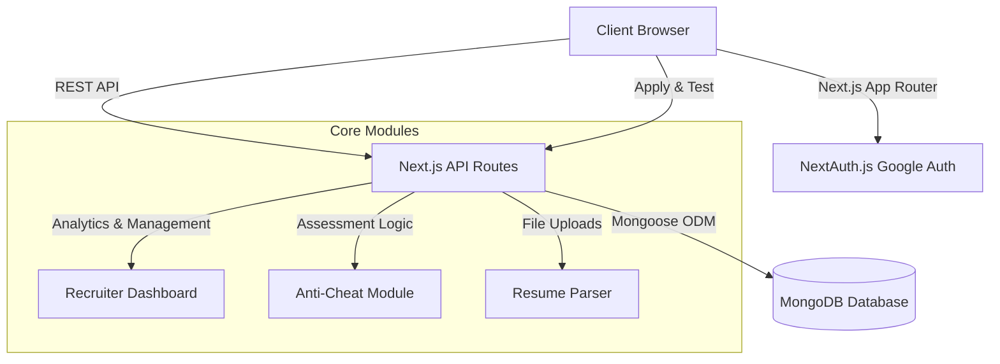

# Fluxberry-AI

A modern, end-to-end recruitment platform designed to streamline the hiring process. Fluxberry-AI features dynamic Job Creation, automated Candidate Skill Assessments, Resume Parsing capabilities, and a comprehensive Recruiter Dashboard with premium SaaS aesthetics.

**[🎥 Watch the Demo Video on Loom](https://www.loom.com/share/be7ea023fa15430cbf00db8af50e2cf1)**

## 🌟 Key Features

*   **Intelligent Job Wizard:** Create and publish customized job posts with custom fields and configured technical assessments.
*   **Curated Question Bank:** A robust 50-question technical bank categorized by difficulty and domain, allowing recruiters to effortlessly compose skill tests.
*   **Automated Skill Assessment Interface:** A secure candidate testing environment featuring a floating timer, progress tracking, and **tab-switch detection (anti-cheat)**.
*   **Candidate Application Portal:** Shareable public links for candidates to apply, upload resumes (with AI parsing capabilities), and immediately take required assessments.
*   **Recruiter Dashboard & Analytics:** Track applicants, view pass/fail metrics, review calculated expected vs. current CTC, and manage candidate pipelines efficiently.
*   **Premium SaaS UI/UX:** Built with high-end modern design principles—glassmorphism, subtle gradients, and highly interactive components.

## 🏗 System Architecture



## 💻 Tech Stack

**Frontend & API:**
*   **Framework:** Next.js 14 (App Router)
*   **Language:** TypeScript
*   **Styling:** Tailwind CSS, Radix UI (shadcn/ui)
*   **Icons:** Lucide React

**Data Layer & Auth:**
*   **Database:** MongoDB
*   **ORM/ODM:** Mongoose
*   **Authentication:** NextAuth.js (Google OAuth)

## 🚀 Getting Started

### Prerequisites
*   Node.js (v18+)
*   MongoDB instance (Local or Atlas)
*   Google Cloud Console account (for OAuth credentials)

### Local Setup

1. **Clone the repository**
   ```bash
   git clone <repository-url>
   cd Fluxberry-AI
   ```

2. **Setup Frontend (Main Application)**
   ```bash
   cd frontend
   npm install
   ```

3. **Configure Environment Variables**
   Create a `.env.local` file in the `frontend` directory:
   ```env
   MONGODB_URI=your_mongodb_connection_string
   NEXTAUTH_SECRET=your_nextauth_secret
   NEXTAUTH_URL=http://localhost:3000
   GOOGLE_CLIENT_ID=your_google_client_id
   GOOGLE_CLIENT_SECRET=your_google_client_secret
   ```

4. **Start the Development Server**
   ```bash
   npm run dev
   ```
   The application will be running at `http://localhost:3000`.

## 📐 Architectural Decisions

*   **Monolithic Next.js Architecture:** Chose Next.js App Router with integrated API routes for a unified developer experience, simplifying deployment and reducing latency between frontend and backend operations.
*   **Schema-less Custom Fields:** Utilized MongoDB's flexible document structure to allow recruiters to define dynamic `customFields` for applications without requiring complex relational schema migrations.
*   **Client-Side Anti-Cheat:** Implemented lightweight visibility and blur event listeners in the browser to detect tab switching, deterring cheating during assessments without requiring invasive proctoring software.
