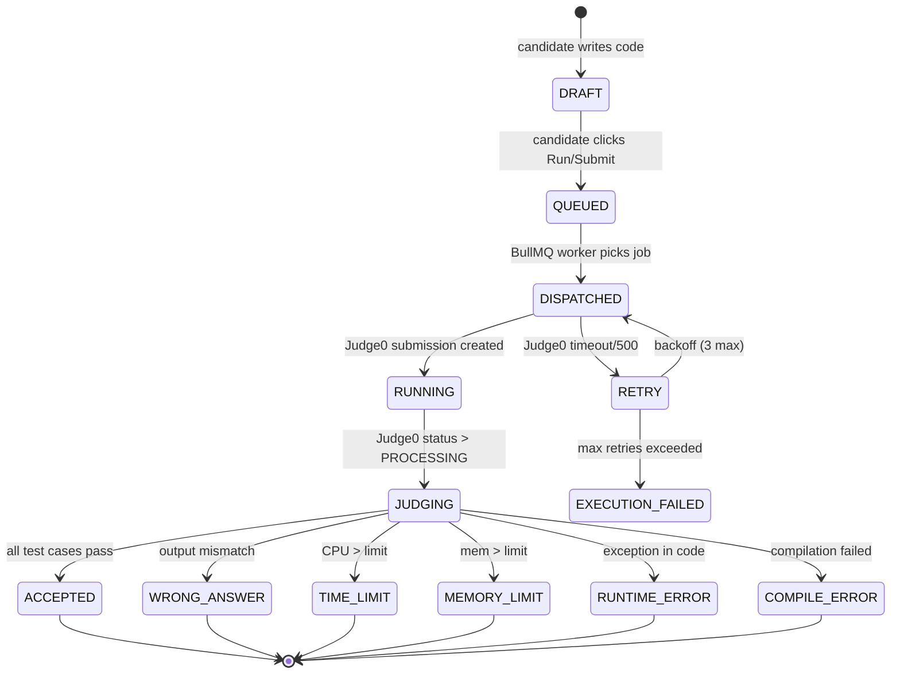
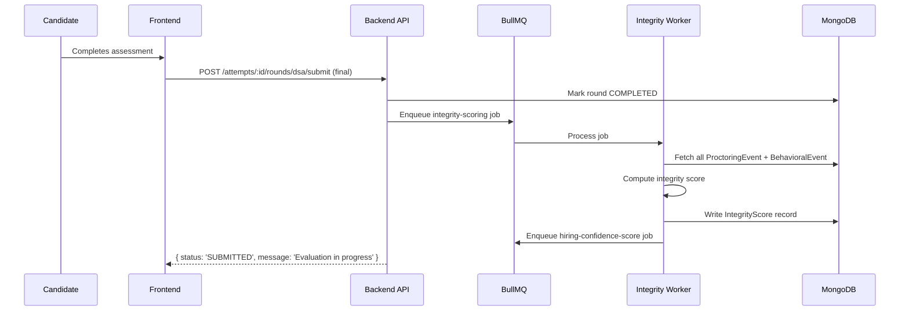
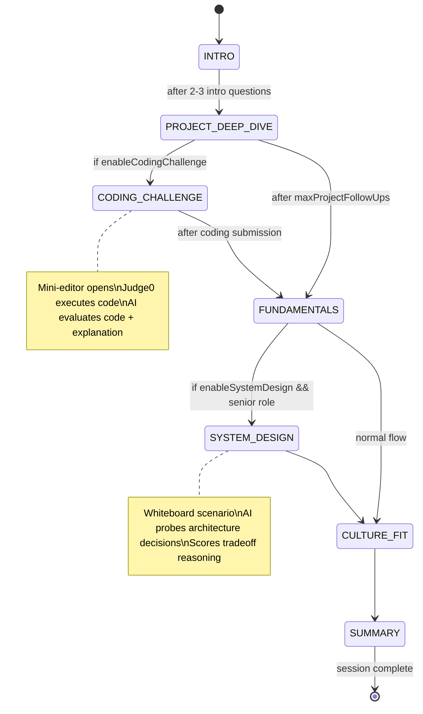
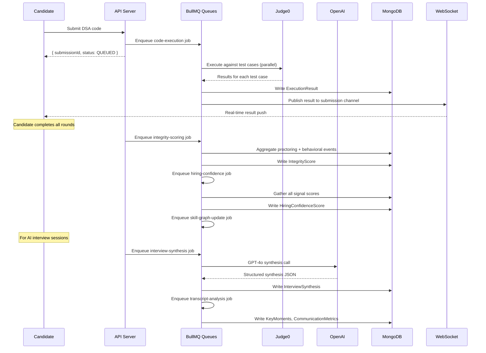

# Fluxberry AI — Technical Evaluation Engine
## AI-Native Assessment Infrastructure v2.0

**Role:** VP of AI Evaluation Systems · Assessment Infrastructure Architect · AI Interview Systems Engineer  
**Date:** 2026-05-15  
**Status:** Production Implementation Blueprint  
**Objective:** Transform Fluxberry AI into the deepest, most intelligent technical hiring evaluation engine — outperforming HackerRank, Karat, Codility, HireVue, and every generic ATS assessment tool.

---

## Table of Contents

1. [Existing Infrastructure Audit](#1-existing-infrastructure-audit)
2. [Assessment Type Registry](#2-assessment-type-registry)
3. [Production Coding Engine](#3-production-coding-engine)
4. [Sandbox Security Design](#4-sandbox-security-design)
5. [Keystroke & Behavioral Analytics](#5-keystroke--behavioral-analytics)
6. [Anti-Cheating & Trust Engine](#6-anti-cheating--trust-engine)
7. [AI Interviewer Evolution](#7-ai-interviewer-evolution)
8. [AI Reasoning & Evaluation Pipelines](#8-ai-reasoning--evaluation-pipelines)
9. [Hiring Confidence Engine](#9-hiring-confidence-engine)
10. [Transcript Analysis Pipeline](#10-transcript-analysis-pipeline)
11. [Replay System](#11-replay-system)
12. [Skill Graph Architecture](#12-skill-graph-architecture)
13. [Benchmarking Engine](#13-benchmarking-engine)
14. [Queue & Event Systems](#14-queue--event-systems)
15. [Recruiter UX Flows](#15-recruiter-ux-flows)
16. [Candidate UX Flows](#16-candidate-ux-flows)
17. [Failure Recovery Systems](#17-failure-recovery-systems)
18. [API Contracts](#18-api-contracts)
19. [Database Schema Changes](#19-database-schema-changes)
20. [Technical Moat Strategy](#20-technical-moat-strategy)

---

## 1. Existing Infrastructure Audit

### What's Production-Ready

| System | Detail | Maturity |
|--------|--------|----------|
| MCQ Round | 30 questions (20 single-correct + 10 multi-correct). Exact-match grading. Per-question timing. | Production |
| DSA Round | 4 questions, Judge0 CE execution. `runTestCase()`, `runCode()`. Sync + async polling. CPU 2s, Mem 128MB. | Production |
| AI Interview Orchestrator | 5-phase state machine (INTRO → PROJECT_DEEP_DIVE → FUNDAMENTALS → CULTURE_FIT → SUMMARY). 4 rubric dimensions. Per-turn LLM scoring. RedFlags array. | Production |
| Judge0 Client | 15 languages. `authenticate()`, `runSubmission()`, `runTestCase()`, `runCode()`, `getSubmission()`. Sync-first with async fallback. | Production |
| Proctoring | TAB_SWITCH, FACE_NOT_DETECTED, MULTIPLE_FACES, MIC_MUTED, FULLSCREEN_EXIT. Append-only event log. Severity (LOW/MEDIUM/HIGH/CRITICAL). Summary aggregation. | Partial |
| Voice Pipeline | Deepgram STT, ElevenLabs TTS, LiveKit WebRTC, turn detection, audio stream processor. | Production |
| Evaluation Service | MCQ auto-grade, DSA Judge0 evaluation, AI LLM evaluation. Writes `Evaluation` record. | Production |
| Attempt State Machine | NOT_STARTED → IN_PROGRESS → COMPLETED/EXPIRED/ABANDONED. Per-round status. | Production |
| BullMQ Queues | 10 queues: evaluation, notification, ai-interview, resume-parsing, email, analytics, workflow, ats-screening, ats-rescoring, offer-expiry. | Production |
| FluxEvents | In-process EventEmitter. APPLICATION_SUBMITTED, STAGE_CHANGED, SCREENING_COMPLETED, AI_SCREENING_COMPLETED. | Partial |

### What's Missing (the gap to fill)

| Missing | Impact | Priority |
|---------|--------|----------|
| Async code-execution queue | Judge0 polling blocks HTTP workers | P0 |
| Autosave + version history | Candidates lose work on crash | P0 |
| Integrity Score computation | Proctoring events not aggregated into score | P0 |
| Behavioral analytics (keystrokes/paste) | No AI-answer detection, no paste detection | P0 |
| Hiring Confidence Score | Each signal is isolated, no composite | P1 |
| AI interview adaptive difficulty | Difficulty is static across session | P1 |
| 6 interviewer personas | Only FRONTEND/BACKEND/FULLSTACK/DEVOPS exist | P1 |
| Skill graph | No cross-assessment skill tracking | P1 |
| Benchmarking engine | No percentile ranking | P2 |
| Transcript replay | Transcripts exist, no replay UX | P2 |
| Take-home / system design / async coding | Only MCQ + DSA + AI interview | P2 |
| AI-generated assessments | Manual question selection only | P3 |

---

## 2. Assessment Type Registry

### Supported Assessment Types (9 Total)

```typescript
export const AssessmentRoundType = {
  MCQ: 'MCQ',                           // Multiple choice questions
  DSA: 'DSA',                           // Algorithmic coding
  AI_INTERVIEW: 'AI_INTERVIEW',          // Voice + AI interviewer
  BEHAVIORAL: 'BEHAVIORAL',             // STAR-method behavioral
  TAKE_HOME: 'TAKE_HOME',              // Async project assignment
  SYSTEM_DESIGN: 'SYSTEM_DESIGN',      // Architecture discussion
  ASYNC_CODING: 'ASYNC_CODING',        // Time-boxed async coding
  LIVE_COLLAB: 'LIVE_COLLAB',         // Shared editor with interviewer
  AI_GENERATED: 'AI_GENERATED',        // AI creates questions from JD
} as const
```

### Type Specifications

#### 1. MCQ — Existing, Extend

```typescript
interface MCQRoundConfig {
  singleCorrectQuestionIds: string[]    // exactly 20
  multiCorrectQuestionIds: string[]     // exactly 10
  timePerQuestion: number               // seconds (default 90)
  allowReview: boolean                  // can revisit answered questions
  shuffleQuestions: boolean
  shuffleOptions: boolean
}
```

**Scoring:** Exact match = 1 point. Partial match = 0 (no negative marking). Score = correct / total × 100.  
**Timing:** Per-question countdown. Auto-submit on timeout.  
**When to use:** Initial screening for large applicant pools. Filters knowledge breadth.

#### 2. DSA — Existing, Extend

```typescript
interface DSARoundConfig {
  questionIds: string[]                 // exactly 4
  totalTimeMinutes: number             // default 90
  languagesAllowed: string[]           // ['python', 'javascript', 'java', 'cpp', 'go']
  cpuTimeLimitSeconds: number          // default 2
  memoryLimitMb: number                // default 128
  publicTestCasesPerQuestion: number   // shown to candidate (default 3)
  hiddenTestCasesPerQuestion: number   // grading only (default 10)
  allowRunBeforeSubmit: boolean        // default true
}
```

**Scoring:** hiddenTestsPassed / totalHiddenTests × 100 per question. Composite = weighted avg.  
**When to use:** SWE roles requiring algorithmic depth.

#### 3. AI_INTERVIEW — Existing, Extend (see Section 7)

```typescript
interface AIInterviewRoundConfig {
  agentId: string
  role: 'FRONTEND' | 'BACKEND' | 'FULLSTACK' | 'DEVOPS' | 'ML' | 'SYSTEM_ARCHITECT' | 'PRODUCT_MANAGER'
  difficulty: 'JUNIOR' | 'MID' | 'SENIOR' | 'STAFF'
  maxDurationMinutes: number           // 15-90
  grillingIntensity: 'LOW' | 'MEDIUM' | 'HIGH' | 'EXTREME'
  enabledPhases: InterviewPhase[]
  enableCodingChallenge: boolean       // mini-editor during interview
  enableSystemDesign: boolean          // whiteboard-style discussion
  maxFundamentalQuestions: number
  maxProjectFollowUps: number
  adaptiveDifficulty: boolean          // NEW: adjust based on performance
}
```

#### 4. BEHAVIORAL — New

```typescript
interface BehavioralRoundConfig {
  questionSet: 'LEADERSHIP' | 'TEAMWORK' | 'CONFLICT' | 'GROWTH' | 'CUSTOM'
  customQuestions?: string[]
  maxQuestions: number                 // 5-10
  timePerQuestion: number              // seconds to think before answering
  scoringDimensions: BehavioralDimension[]  // STAR completeness, specificity, impact
  videoEnabled: boolean
  asyncMode: boolean                   // candidate completes on own time
}

type BehavioralDimension = 
  | 'STAR_COMPLETENESS'    // Did they cover Situation, Task, Action, Result?
  | 'SPECIFICITY'          // Concrete details vs vague generalities
  | 'IMPACT'               // Did they quantify results?
  | 'SELF_AWARENESS'       // Reflection, lessons learned
  | 'COMMUNICATION'        // Clarity, structure, conciseness
```

**Scoring:** LLM evaluates each dimension 0-10. Role-specific STAR rubric. Highlights key moments.  
**When to use:** Non-technical roles, final-round cultural assessment, leadership evaluation.

#### 5. TAKE_HOME — New

```typescript
interface TakeHomeRoundConfig {
  title: string
  description: string                  // markdown, problem statement
  deliverables: string[]               // what to submit
  durationHours: number                // 24, 48, or 72
  submissionTypes: ('GITHUB_REPO' | 'FILE_UPLOAD' | 'LOOM_VIDEO' | 'WRITTEN_DOC')[]
  rubric: TakeHomeRubricItem[]
  autoExtendHours: number              // grace period (default 2)
  maxFileSizeMb: number                // default 50
}

interface TakeHomeRubricItem {
  dimension: string                    // e.g. "Code Quality", "Problem Solving"
  weight: number                       // 0-1, sum to 1
  scoringGuide: string                 // what 10/10 looks like
}
```

**Scoring:** Recruiter manual scores each rubric dimension. AI pre-scores code quality (AST analysis) and readability.  
**When to use:** Product, design, writing, complex engineering projects.

#### 6. SYSTEM_DESIGN — New

```typescript
interface SystemDesignRoundConfig {
  scenario: string                     // problem description
  focusAreas: SystemDesignFocus[]
  durationMinutes: number              // 45-60
  sketchpadEnabled: boolean            // collaborative whiteboard
  aiModeratorEnabled: boolean          // AI asks probing questions
  evaluationDimensions: SystemDesignDimension[]
}

type SystemDesignFocus = 
  | 'SCALABILITY' | 'RELIABILITY' | 'DATA_MODELING' 
  | 'API_DESIGN' | 'CACHING' | 'QUEUES' | 'SECURITY'

type SystemDesignDimension =
  | 'REQUIREMENT_CLARIFICATION'   // Did they ask the right questions?
  | 'HIGH_LEVEL_DESIGN'           // Overall architecture clarity
  | 'COMPONENT_DESIGN'            // Individual component depth
  | 'SCALABILITY_REASONING'       // Handles 10x/100x traffic?
  | 'TRADE_OFF_ANALYSIS'          // Recognized and reasoned about tradeoffs
  | 'DATA_MODELING'               // Schema design correctness
  | 'COMMUNICATION'               // Explains complexity clearly
```

**When to use:** Senior+ engineering roles. Staff/Principal interviews.

#### 7. ASYNC_CODING — New

```typescript
interface AsyncCodingRoundConfig {
  questionIds: string[]                // DSA questions
  durationHours: number               // 24-72h window to complete
  sessionsAllowed: number             // can pause and resume (default 3)
  totalCodingTimeMinutes: number      // actual working time tracked (default 120)
  proctored: boolean                  // webcam required
}
```

**Difference from DSA:** Candidate chooses when in the window to complete. Better for candidates with work commitments.

#### 8. LIVE_COLLAB — New

```typescript
interface LiveCollabRoundConfig {
  questionId: string                   // single DSA/system design question
  durationMinutes: number             // 45-60
  interviewerId: string               // recruiter/hiring manager user ID
  editorMode: 'PAIR_PROGRAMMING' | 'CANDIDATE_ONLY' | 'INTERVIEWER_DRIVEN'
  videoEnabled: boolean
  sharedEditorProvider: 'CODEMIRROR_COLLAB' | 'LIVEBLOCK'
  allowInterviewerEdit: boolean
}
```

**When to use:** Final technical round. Simulates real pair programming.

#### 9. AI_GENERATED — New

```typescript
interface AIGeneratedRoundConfig {
  sourceType: 'JOB_DESCRIPTION' | 'SKILL_TAGS' | 'CUSTOM_PROMPT'
  jobDescriptionId?: string
  skillTags?: string[]
  customPrompt?: string
  roundType: 'MCQ' | 'DSA' | 'BEHAVIORAL'
  questionCount: number
  difficulty: 'JUNIOR' | 'MID' | 'SENIOR'
  approvalRequired: boolean            // recruiter must approve before activation
  generatedAt: Date
  generationModel: string              // which model generated it
}
```

**Pipeline:** JD → GPT-4o extracts skills → generates questions → recruiter reviews → activates.

### Assessment Composition Matrix

```
┌─────────────────────────────────────────────────────────────┐
│                    ASSESSMENT BUILDER                        │
├──────────────────────────────────────────────────────────────┤
│ Step 1: Choose rounds (up to 5, ordered)                     │
│                                                              │
│  Round Type     When in Pipeline    Typical Duration         │
│  ─────────────  ──────────────────  ───────────────          │
│  MCQ            Screening (1st)     20-30 min                │
│  DSA            Technical (2nd)     60-90 min                │
│  AI_INTERVIEW   Deep-dive (3rd)     30-60 min                │
│  BEHAVIORAL     Cultural (4th)      20-40 min                │
│  SYSTEM_DESIGN  Senior-round (5th)  45-60 min                │
│  TAKE_HOME      Anytime async       24-72h window            │
│  LIVE_COLLAB    Final round         45-60 min                │
│                                                              │
│ Step 2: Configure each round                                 │
│ Step 3: Set advancement criteria (auto vs manual)            │
│ Step 4: Activate                                             │
└──────────────────────────────────────────────────────────────┘
```

---

## 3. Production Coding Engine

### 3.1 Execution Lifecycle State Machine



### 3.2 Async Execution Queue

**New BullMQ queue: `code-execution`**

```typescript
// Job data schema
interface CodeExecutionJob {
  jobId: string                        // BullMQ job ID
  attemptId: string
  questionId: string
  sessionId: string                    // for WebSocket push on completion
  code: string
  language: string
  mode: 'RUN' | 'SUBMIT'             // RUN = public tests only, SUBMIT = all tests
  submissionId: string                 // UUID, for polling
  testCases: TestCase[]
  limits: { cpuSeconds: number; memoryMb: number }
  triggeredAt: Date
}

interface TestCase {
  id: string
  stdin: string
  expectedOutput: string
  isPublic: boolean                   // shown to candidate
  weight: number                      // scoring weight (default 1)
}
```

**Queue config:**
```typescript
const codeExecutionQueue = new Queue('code-execution', {
  defaultJobOptions: {
    priority: 1,                      // HIGHEST priority
    attempts: 3,
    backoff: { type: 'exponential', delay: 1000 },
    removeOnComplete: { count: 1000 },
    removeOnFail: { count: 500 },
    timeout: 75000,                   // 75s (Judge0 60s + 15s overhead)
  }
})
```

**Worker (concurrency 10 per instance):**
```typescript
const worker = new Worker('code-execution', async (job: Job<CodeExecutionJob>) => {
  const { attemptId, questionId, code, language, mode, submissionId, testCases, limits } = job.data
  
  const langId = getJudge0LanguageId(language)
  if (!langId) throw new Error(`Unsupported language: ${language}`)
  
  // Run public tests (for RUN mode) or all tests (for SUBMIT)
  const testsToRun = mode === 'RUN' 
    ? testCases.filter(t => t.isPublic) 
    : testCases
  
  // Parallel execution — all test cases simultaneously
  const results = await Promise.allSettled(
    testsToRun.map(tc => runTestCase(
      process.env.JUDGE0_BASE_URL!,
      code, langId, tc.stdin, tc.expectedOutput,
      { cpuTimeLimit: limits.cpuSeconds, memoryLimitKb: limits.memoryMb * 1024 }
    ))
  )
  
  const executionResults: TestCaseResult[] = results.map((r, i) => {
    const tc = testsToRun[i]
    if (r.status === 'fulfilled') {
      return { testCaseId: tc.id, passed: r.value.passed, ...r.value.result, isPublic: tc.isPublic }
    }
    return { testCaseId: tc.id, passed: false, statusDescription: 'EXECUTION_ERROR', isPublic: tc.isPublic }
  })
  
  const score = mode === 'SUBMIT' 
    ? computeScore(executionResults, testCases)
    : null
  
  // Persist to DB
  const execResult = await ExecutionResult.create({
    submissionId,
    attemptId,
    questionId,
    mode,
    language,
    code,
    testCaseResults: executionResults,
    score,
    executedAt: new Date(),
  })
  
  // Push real-time result via WebSocket
  await redisPublisher.publish(`execution:${submissionId}`, JSON.stringify({
    submissionId,
    status: 'COMPLETE',
    results: executionResults,
    score,
  }))
  
  return execResult
}, { concurrency: 10 })
```

### 3.3 HTTP Endpoints

```
POST /api/attempts/:id/rounds/dsa/run-code
  → validates code + language
  → creates CodeSnapshot (autosave)
  → enqueues code-execution job (mode: RUN)
  → returns { submissionId, status: 'QUEUED' }
  
POST /api/attempts/:id/rounds/dsa/submit
  → same as run-code but mode: SUBMIT
  → locks question from further edits
  → returns { submissionId, status: 'QUEUED' }
  
GET /api/attempts/:id/code-result/:submissionId
  → returns current result if done, or { status: 'PENDING' }
  
WebSocket: ws://api/attempts/:id/code-result-stream
  → subscribes to Redis channel execution:{submissionId}
  → pushes result when done (no polling needed)
```

### 3.4 Autosave & Version History

```typescript
// Debounced autosave — fires 10s after last keystroke
// Frontend calls:
POST /api/attempts/:id/autosave
Body: { questionId, code, language, cursorPosition }

// Backend creates snapshot:
interface ICodeSnapshot {
  attemptId: ObjectId
  questionId: ObjectId
  code: string
  language: string
  cursorPosition: number
  snapshotIndex: number              // incremental per question per attempt
  createdAt: Date
}

// Retention: max 50 snapshots per question per attempt
// On 51st: delete oldest
async function pruneSnapshots(attemptId: string, questionId: string) {
  const count = await CodeSnapshot.countDocuments({ attemptId, questionId })
  if (count >= 50) {
    const oldest = await CodeSnapshot.find({ attemptId, questionId })
      .sort({ createdAt: 1 }).limit(count - 49)
    await CodeSnapshot.deleteMany({ _id: { $in: oldest.map(s => s._id) } })
  }
}
```

### 3.5 Reconnect Recovery

```
On WebSocket reconnect / page reload:
  1. GET /api/attempts/:id/snapshots/:questionId/latest
  2. Frontend receives: { code, language, snapshotIndex, savedAt }
  3. Shows toast: "Recovered from autosave (saved 2 min ago)"
  4. Candidate can click "Restore" or "Start fresh"
```

### 3.6 Language Support Matrix

| Language | Judge0 ID | Run/Submit | AI Interview Coding | Live Collab |
|----------|-----------|------------|---------------------|-------------|
| Python 3 | 71 | ✓ | ✓ | ✓ |
| JavaScript | 63 | ✓ | ✓ | ✓ |
| Java | 62 | ✓ | ✓ | ✓ |
| C++ | 54 | ✓ | ✓ | ✓ |
| Go | 60 | ✓ | ✓ | ✓ |
| Rust | 73 | ✓ | ✗ | ✓ |
| Kotlin | 78 | ✓ | ✗ | ✗ |
| C | 50 | ✓ | ✗ | ✗ |
| C# | 51 | ✓ | ✗ | ✗ |
| Ruby | 72 | ✓ | ✗ | ✗ |
| Swift | 83 | ✓ | ✗ | ✗ |
| PHP | 68 | ✓ | ✗ | ✗ |

### 3.7 Per-Question Scoring

```typescript
function computeScore(results: TestCaseResult[], allTests: TestCase[]): number {
  // Weighted scoring: hidden tests weighted by their `weight` field
  const totalWeight = allTests.reduce((sum, tc) => sum + tc.weight, 0)
  const passedWeight = results
    .filter(r => r.passed)
    .reduce((sum, r) => {
      const tc = allTests.find(t => t.id === r.testCaseId)!
      return sum + tc.weight
    }, 0)
  return Math.round((passedWeight / totalWeight) * 100)
}
```

---

## 4. Sandbox Security Design

### 4.1 Judge0 CE Isolation Model

Judge0 CE uses **Isolate** (a Linux kernel isolation tool) to sandbox code execution:

```
┌────────────────────────────────────────────────────────┐
│                   JUDGE0 CE SANDBOX                     │
├────────────────────────────────────────────────────────┤
│  Process isolation: separate Linux namespace per run   │
│  Filesystem: read-only root, isolated /tmp (64MB max)  │
│  Network: DISABLED — no outbound connections           │
│  CPU: cgroup hard limit (2s default)                   │
│  Memory: cgroup hard limit (128MB default)             │
│  PIDs: limit 64 to prevent fork bombs                  │
│  Syscalls: seccomp filter (blocks dangerous calls)     │
│  User: runs as unprivileged UID (65534)                │
└────────────────────────────────────────────────────────┘
```

### 4.2 Network Isolation

Judge0 CE disables all network by default. Self-hosted config:

```bash
# docker-compose.judge0.yml
environment:
  - ALLOW_ENABLE_NETWORK=false          # no outbound HTTP
  - DISABLE_NETWORKING=true
  - NETWORK_MODE=none
```

This prevents:
- Exfiltrating test case inputs
- Calling external APIs for answers
- Cryptomining side-channels

### 4.3 Dangerous Pattern Detection (Pre-execution)

Before submitting to Judge0, scan code for forbidden patterns:

```typescript
const FORBIDDEN_PATTERNS: Record<string, RegExp[]> = {
  python: [
    /import\s+subprocess/,
    /import\s+os\s*;?\s*os\.(system|popen|exec)/,
    /__import__\s*\(\s*['"]subprocess/,
    /open\s*\(.+['"]w['"]/,           // file write attempts
  ],
  javascript: [
    /require\s*\(\s*['"]child_process/,
    /process\.env/,                    // env var access
    /eval\s*\(/,
    /Function\s*\(/,
  ],
  java: [
    /Runtime\.getRuntime\(\)/,
    /ProcessBuilder/,
    /System\.exit/,
  ],
}

function checkForbiddenPatterns(code: string, language: string): string | null {
  const patterns = FORBIDDEN_PATTERNS[language] || []
  for (const pattern of patterns) {
    if (pattern.test(code)) {
      return `Forbidden pattern detected: ${pattern.source}`
    }
  }
  return null
}
```

### 4.4 Rate Limiting Per Org

```typescript
// Redis sliding window: max 50 concurrent submissions per org
async function checkOrgSubmissionQuota(orgId: string): Promise<void> {
  const key = `judge0:quota:${orgId}`
  const count = await redis.incr(key)
  if (count === 1) await redis.expire(key, 60)  // 60s window
  if (count > 50) {
    throw new QuotaError('Too many concurrent code submissions. Please wait.')
  }
}
// Decrement on completion
async function releaseOrgSubmissionQuota(orgId: string): Promise<void> {
  await redis.decr(`judge0:quota:${orgId}`)
}
```

### 4.5 Self-Hosted vs RapidAPI

| Factor | Self-Hosted | RapidAPI |
|--------|-------------|----------|
| Cost at scale | Fixed ($50-200/mo VPS) | $0.001/submission |
| Latency | <50ms (same VPC) | 200-500ms (external) |
| Network isolation | Full control | Shared tenant |
| GDPR | Code never leaves infra | Data goes to RapidAPI |
| Recommendation | Enterprise/Pro plans | Starter/Growth plans |

**Production recommendation:** Self-host Judge0 CE on a dedicated VPS (4 vCPU, 8GB RAM). Handles ~500 concurrent submissions.

---

## 5. Keystroke & Behavioral Analytics

### 5.1 Frontend Event Collection

Collected by the DSA editor component, batched every 5s:

```typescript
interface BehavioralEvent {
  type: BehavioralEventType
  timestamp: Date
  metadata: Record<string, unknown>
}

type BehavioralEventType = 
  | 'PASTE_DETECTED'          // large clipboard paste (>50 chars in <100ms)
  | 'RAPID_TYPING'            // >200 WPM for >10s
  | 'IDLE_DETECTED'           // no keystrokes for >60s
  | 'FOCUS_LOSS'              // editor lost focus
  | 'FOCUS_GAIN'              // editor gained focus
  | 'LARGE_DELETION'          // >30 chars deleted at once
  | 'CODE_CLEARED'            // entire code deleted
  | 'BACKSPACE_STORM'         // >20 backspaces in 5s
  | 'WINDOW_BLUR'             // browser window lost focus
  | 'WINDOW_FOCUS'            // browser window regained focus
```

```typescript
// Frontend behavioral tracker (runs inside DSA editor)
class BehavioralTracker {
  private events: BehavioralEvent[] = []
  private lastKeyTime = 0
  private keystrokeTimes: number[] = []
  
  onKeyDown(e: KeyboardEvent) {
    const now = Date.now()
    
    // Detect paste (Ctrl+V)
    if (e.ctrlKey && e.key === 'v') {
      // Check clipboard content length vs current text delta after paste
      this.events.push({ type: 'PASTE_DETECTED', timestamp: new Date(), metadata: {} })
    }
    
    // Track typing velocity
    this.keystrokeTimes.push(now)
    // Keep only last 60s
    this.keystrokeTimes = this.keystrokeTimes.filter(t => now - t < 60000)
    const wpm = (this.keystrokeTimes.length / 5)  // rough WPM estimate
    if (wpm > 200) {
      this.events.push({ type: 'RAPID_TYPING', timestamp: new Date(), metadata: { estimatedWpm: wpm } })
    }
    
    this.lastKeyTime = now
  }
  
  onInputChange(prev: string, next: string) {
    const delta = next.length - prev.length
    // Large single-operation paste detection
    if (delta > 50 && (Date.now() - this.lastKeyTime) < 150) {
      this.events.push({ type: 'PASTE_DETECTED', timestamp: new Date(), metadata: { charCount: delta } })
    }
    // Large deletion
    if (delta < -30) {
      this.events.push({ type: 'LARGE_DELETION', timestamp: new Date(), metadata: { charCount: Math.abs(delta) } })
    }
    // Code cleared
    if (next.length < 10 && prev.length > 100) {
      this.events.push({ type: 'CODE_CLEARED', timestamp: new Date(), metadata: {} })
    }
  }
  
  // Flush every 5s
  async flush(attemptId: string, questionId: string) {
    if (this.events.length === 0) return
    const batch = [...this.events]
    this.events = []
    await fetch(`/api/attempts/${attemptId}/behavioral-events`, {
      method: 'POST',
      body: JSON.stringify({ questionId, events: batch })
    })
  }
}
```

### 5.2 Idle Detection

```typescript
// Track idle periods
class IdleDetector {
  private lastActivity = Date.now()
  private idleThresholdMs = 60_000  // 60s
  
  recordActivity() {
    this.lastActivity = Date.now()
  }
  
  checkIdle(): boolean {
    return Date.now() - this.lastActivity > this.idleThresholdMs
  }
}
```

### 5.3 Backend Event Storage

```typescript
// POST /api/attempts/:id/behavioral-events
// Batch insert, server timestamp only
async function logBehavioralEvents(
  attemptId: string,
  questionId: string,
  events: Array<{ type: BehavioralEventType; metadata: Record<string, unknown> }>
) {
  const docs = events.map(e => ({
    attemptId,
    questionId,
    eventType: e.type,
    metadata: e.metadata,
    createdAt: new Date(),  // server timestamp always
  }))
  await BehavioralEvent.insertMany(docs)
}
```

### 5.4 Time-to-First-Keystroke

Tracked per question. High TTFK (>5 minutes) may indicate:
- Candidate was researching/looking up the problem online
- Candidate is reading problem carefully (normal at senior level)

Low TTFK (<10 seconds on hard problems) combined with high paste volume → strong AI cheating signal.

---

## 6. Anti-Cheating & Trust Engine

### 6.1 Extended Proctoring Events

Add to existing `ProctoringEventType`:

```typescript
export const ProctoringEventType = {
  // Existing
  TAB_SWITCH: 'TAB_SWITCH',
  FACE_NOT_DETECTED: 'FACE_NOT_DETECTED',
  MULTIPLE_FACES: 'MULTIPLE_FACES',
  MIC_MUTED: 'MIC_MUTED',
  FULLSCREEN_EXIT: 'FULLSCREEN_EXIT',
  // New
  AI_ANSWER_SUSPECTED: 'AI_ANSWER_SUSPECTED',    // GPT-like fluency detected
  PASTE_ANOMALY: 'PASTE_ANOMALY',                // large paste in coding env
  RAPID_ANSWER: 'RAPID_ANSWER',                  // answered complex Q in <30s
  VOICE_ANOMALY: 'VOICE_ANOMALY',                // multiple speakers detected
  BROWSER_EXTENSION: 'BROWSER_EXTENSION',         // AI extension detected
  COPY_DETECTED: 'COPY_DETECTED',                // text copied from editor
  IDLE_SUSPICIOUS: 'IDLE_SUSPICIOUS',            // idle >5 min then instant answer
  EXTERNAL_MONITOR: 'EXTERNAL_MONITOR',           // resolution change = second screen
} as const
```

### 6.2 AI-Generated Answer Detection

For AI interview text responses (when candidate types instead of speaks):

```typescript
async function detectAIGeneratedText(text: string): Promise<{
  suspected: boolean
  confidence: number
  reason: string
}> {
  // Heuristics (fast, no LLM call):
  const wordCount = text.split(/\s+/).length
  const avgWordLength = text.replace(/[^a-z]/gi, '').length / wordCount
  const hasFillerWords = /\b(um|uh|like|you know|basically)\b/i.test(text)
  const hasPerfectStructure = /^(First|Firstly|To begin|In order to)/i.test(text) && 
                               /\b(Furthermore|Moreover|Additionally|In conclusion)\b/i.test(text)
  
  // GPT text characteristics: perfect structure, no filler, high vocabulary
  const aiScore = (hasPerfectStructure ? 0.4 : 0) + 
                  (!hasFillerWords && wordCount > 50 ? 0.3 : 0) +
                  (avgWordLength > 6 ? 0.3 : 0)
  
  if (aiScore >= 0.6) {
    // Confirm with cheap LLM call
    const verification = await openai.chat.completions.create({
      model: 'gpt-4o-mini',
      messages: [{
        role: 'system',
        content: 'You detect AI-generated text. Reply JSON: { "isAI": boolean, "confidence": 0-1, "reason": string }'
      }, {
        role: 'user',
        content: `Is this AI-generated? "${text.slice(0, 500)}"`
      }],
      response_format: { type: 'json_object' },
      max_tokens: 100,
    })
    const result = JSON.parse(verification.choices[0].message.content!)
    return { suspected: result.isAI, confidence: result.confidence, reason: result.reason }
  }
  
  return { suspected: false, confidence: 1 - aiScore, reason: 'Heuristic check passed' }
}
```

### 6.3 Integrity Score Formula

```
IntegrityScore = 100

Deductions:
  TAB_SWITCH:            -5 per event  (max -25)
  FACE_NOT_DETECTED > 30s: -10 per occurrence
  MULTIPLE_FACES:        -15 per event (max -30)
  PASTE_ANOMALY:         -8 per event  (max -24)
  AI_ANSWER_SUSPECTED:   -20 (applied once)
  RAPID_COPY_PASTE:      -12 (applied once)
  FULLSCREEN_EXIT:       -3 per event  (max -15)
  VOICE_ANOMALY:         -10 per event (max -20)
  BROWSER_EXTENSION:     -15 (applied once)
  IDLE_SUSPICIOUS:       -8 per event  (max -16)

Floor: 0 (cannot go negative)

Classification:
  90-100: TRUSTED
  75-89:  ACCEPTABLE
  50-74:  SUSPICIOUS
  0-49:   HIGH_RISK
```

```typescript
async function computeIntegrityScore(attemptId: string): Promise<IntegrityScoreResult> {
  const proctoringEvents = await ProctoringEvent.find({ attemptId })
  const behavioralEvents = await BehavioralEvent.find({ attemptId })
  
  let score = 100
  const deductions: IntegrityDeduction[] = []
  
  // Proctoring deductions
  const tabSwitches = proctoringEvents.filter(e => e.eventType === 'TAB_SWITCH').length
  if (tabSwitches > 0) {
    const deduction = Math.min(tabSwitches * 5, 25)
    score -= deduction
    deductions.push({ type: 'TAB_SWITCH', count: tabSwitches, deduction })
  }
  
  // AI answer detection (from behavioral events)
  const aiSuspected = behavioralEvents.some(e => e.eventType === 'AI_ANSWER_SUSPECTED')
  if (aiSuspected) {
    score -= 20
    deductions.push({ type: 'AI_ANSWER_SUSPECTED', count: 1, deduction: 20 })
  }
  
  // ... (all other deductions)
  
  score = Math.max(0, score)
  
  const classification: IntegrityClassification = 
    score >= 90 ? 'TRUSTED' :
    score >= 75 ? 'ACCEPTABLE' :
    score >= 50 ? 'SUSPICIOUS' : 'HIGH_RISK'
  
  const result = await IntegrityScore.findOneAndUpdate(
    { attemptId },
    { score, classification, deductions, computedAt: new Date() },
    { upsert: true, new: true }
  )
  
  return result
}
```

### 6.4 Recruiter Override & Audit Trail

```typescript
// POST /api/attempts/:id/integrity/override
interface IntegrityOverride {
  attemptId: string
  flagId: string                       // which specific flag to override
  overriddenBy: string                 // recruiter userId
  reason: string                       // required explanation
  isFalsePositive: boolean
  overriddenAt: Date
}
```

**False positive handling:** Each deduction item has an `overrideId`. Recruiter can mark any flag as false positive. Score is recomputed excluding false positives.

### 6.5 Integrity Pipeline



---

## 7. AI Interviewer Evolution

### 7.1 Expanded Personas

```typescript
export const InterviewerPersona = {
  FRONTEND_ENGINEER: 'FRONTEND_ENGINEER',
  BACKEND_ENGINEER: 'BACKEND_ENGINEER',
  ML_ENGINEER: 'ML_ENGINEER',
  DEVOPS_ENGINEER: 'DEVOPS_ENGINEER',
  PRODUCT_MANAGER: 'PRODUCT_MANAGER',
  SYSTEM_ARCHITECT: 'SYSTEM_ARCHITECT',
  FULLSTACK_ENGINEER: 'FULLSTACK_ENGINEER',
} as const

const PERSONA_BLUEPRINTS: Record<string, PersonaBlueprint> = {
  ML_ENGINEER: {
    personaPrompt: `You are Alex, a senior ML engineer at a top tech company. 
    You conduct ML engineering interviews focusing on practical implementation, 
    not just theory. You probe for real-world experience with training pipelines, 
    model deployment, debugging training runs, and MLOps. You challenge vague answers 
    about "accuracy" by asking about precision/recall tradeoffs, class imbalance, 
    and production monitoring. You always verify if the candidate has deployed models 
    to production vs only done academic/notebook work. Reply ONLY as valid JSON.`,
    rubric: { 
      mlFundamentals: 0.30,
      systemsThinking: 0.25,
      practicalMl: 0.30,
      communication: 0.15 
    },
    questionFocusAreas: ['Feature Engineering', 'Model Evaluation', 'MLOps', 'Distributed Training', 'Production ML'],
    forbiddenTopics: [],
    grillingStyle: 'Ask for specific metrics, model sizes, and infrastructure details',
  },
  
  DEVOPS_ENGINEER: {
    personaPrompt: `You are Jordan, a staff DevOps/SRE engineer. You focus on 
    reliability, scalability, and operational excellence. You probe for experience 
    with incident response, on-call, infrastructure-as-code, and cost optimization. 
    You challenge claims about "99.9% uptime" by asking HOW they achieved it. 
    You care deeply about observability and debugging production issues. Reply ONLY as valid JSON.`,
    rubric: {
      infraKnowledge: 0.30,
      reliabilityDesign: 0.30,
      automationMindset: 0.25,
      communication: 0.15
    },
    questionFocusAreas: ['Kubernetes', 'CI/CD', 'Monitoring/Alerting', 'Incident Response', 'IaC'],
    forbiddenTopics: [],
    grillingStyle: 'Demand specifics about incident timelines, runbooks, and postmortems',
  },
  
  PRODUCT_MANAGER: {
    personaPrompt: `You are Sam, a Director of Product at a growth-stage startup. 
    You interview PM candidates on product sense, user empathy, data-driven decisions, 
    and cross-functional leadership. You present ambiguous product scenarios and evaluate 
    how they structure the problem, what questions they ask, and how they prioritize. 
    You probe for evidence of shipping products that users actually use. Reply ONLY as valid JSON.`,
    rubric: {
      productSense: 0.35,
      dataThinking: 0.25,
      leadership: 0.25,
      communication: 0.15
    },
    questionFocusAreas: ['Product Strategy', 'User Research', 'Metrics', 'Prioritization', 'Stakeholder Management'],
    forbiddenTopics: [],
    grillingStyle: 'Always ask "How do you know this is the right problem?" and "What would you measure?"',
  },
  
  SYSTEM_ARCHITECT: {
    personaPrompt: `You are Robin, a Principal Engineer and system design expert. 
    You conduct senior/staff technical interviews focused on distributed systems, 
    scalability, reliability, and architectural trade-offs. You present real-world 
    scenarios (design Twitter, design a payments system) and probe deeply on every 
    component chosen. You are especially interested in failure modes, data consistency, 
    and how they handle scale from 100 to 100M users. Reply ONLY as valid JSON.`,
    rubric: {
      architectureDepth: 0.35,
      scalabilityReasoning: 0.30,
      tradeoffAnalysis: 0.20,
      communication: 0.15
    },
    questionFocusAreas: ['Distributed Systems', 'Database Design', 'API Design', 'Caching', 'Event-Driven Architecture'],
    forbiddenTopics: [],
    grillingStyle: 'Always challenge "why this choice?" and "what breaks at 10x scale?"',
  },
}
```

### 7.2 Adaptive Difficulty System

```typescript
interface DifficultyState {
  currentLevel: 1 | 2 | 3 | 4 | 5      // 1=easiest, 5=hardest
  consecutiveHighScores: number
  consecutiveLowScores: number
  adjustmentHistory: DifficultyAdjustment[]
}

interface DifficultyAdjustment {
  fromLevel: number
  toLevel: number
  triggeredBy: string
  timestamp: Date
}

function computeNextDifficulty(
  state: DifficultyState,
  lastScore: number                        // 0-10 average of all rubric dims
): DifficultyState {
  const threshold = { high: 8, low: 4 }
  
  if (lastScore >= threshold.high) {
    state.consecutiveHighScores++
    state.consecutiveLowScores = 0
  } else if (lastScore <= threshold.low) {
    state.consecutiveLowScores++
    state.consecutiveHighScores = 0
  } else {
    state.consecutiveHighScores = 0
    state.consecutiveLowScores = 0
  }
  
  // Increase difficulty after 2 consecutive strong answers
  if (state.consecutiveHighScores >= 2 && state.currentLevel < 5) {
    state.adjustmentHistory.push({ fromLevel: state.currentLevel, toLevel: state.currentLevel + 1 as any, triggeredBy: 'consecutive_high', timestamp: new Date() })
    state.currentLevel = (state.currentLevel + 1) as any
    state.consecutiveHighScores = 0
  }
  
  // Decrease difficulty after 2 consecutive weak answers
  if (state.consecutiveLowScores >= 2 && state.currentLevel > 1) {
    state.adjustmentHistory.push({ fromLevel: state.currentLevel, toLevel: state.currentLevel - 1 as any, triggeredBy: 'consecutive_low', timestamp: new Date() })
    state.currentLevel = (state.currentLevel - 1) as any
    state.consecutiveLowScores = 0
  }
  
  return state
}
```

### 7.3 Adaptive Follow-Up Logic

```typescript
function shouldAskFollowUp(
  evaluation: TurnEvaluation,
  followUpCount: number,
  maxFollowUps: number,
  phase: InterviewPhase
): { ask: boolean; reason: FollowUpReason | null } {
  if (followUpCount >= maxFollowUps) return { ask: false, reason: null }
  
  // Low depth score → probe for more detail
  if (evaluation.depthScore < 6) 
    return { ask: true, reason: 'LOW_DEPTH' }
  
  // Answer contains vague terms → ask for specifics
  const vagueTerms = ['it depends', 'generally', 'usually', 'kind of', 'sort of', 'basically']
  if (vagueTerms.some(t => evaluation.feedback?.toLowerCase().includes(t)))
    return { ask: true, reason: 'VAGUE_ANSWER' }
  
  // Red flags present → challenge
  if (evaluation.redFlags && evaluation.redFlags.length > 0)
    return { ask: true, reason: 'RED_FLAG' }
  
  // Correctness < 5 and in technical phase → must follow up
  if (evaluation.correctnessScore < 5 && 
      [InterviewPhase.PROJECT_DEEP_DIVE, InterviewPhase.FUNDAMENTALS].includes(phase))
    return { ask: true, reason: 'INCORRECT_ANSWER' }
  
  return { ask: false, reason: null }
}
```

### 7.4 Extended Phase State Machine



### 7.5 Coding Challenge in AI Interview

```typescript
// When AI decides to issue a coding challenge:
const codingChallengePrompt = `
You have decided to give the candidate a coding challenge. 
Generate a coding challenge appropriate for ${aiConfig.difficulty} level.
Keep it solvable in 10-15 minutes. Output JSON:
{
  "problemStatement": string,
  "examples": [{ "input": string, "output": string, "explanation": string }],
  "hints": string[],
  "expectedComplexity": { "time": string, "space": string }
}
`

// After candidate submits code (via mini-editor in interview UI):
// 1. Run against test cases via Judge0
// 2. Pass result + code to AI for evaluation
const codeEvalPrompt = `
The candidate submitted code for: "${challenge.problemStatement}"

Their code:
\`\`\`${language}
${code}
\`\`\`

Execution result: ${passed ? 'PASSED' : 'FAILED'} (${passedTests}/${totalTests} test cases)

Evaluate both the correctness AND their approach/explanation. Output JSON:
{
  "correctnessScore": 0-10,      // based on test cases + code quality
  "depthScore": 0-10,            // understanding of the algorithm
  "communicationScore": 0-10,    // how well they explained their approach
  "relevanceScore": 10,          // always 10 for coding challenges
  "feedback": string,
  "codeQualityNotes": string,    // variable names, edge cases handled, etc.
  "redFlags": string[]
}
`
```

---

## 8. AI Reasoning & Evaluation Pipelines

### 8.1 Per-Turn Evaluation (Existing, Extended)

Extended rubric dimensions with weights:

```typescript
const EXTENDED_RUBRICS = {
  BACKEND_ENGINEER: {
    correctness: { weight: 0.30, description: 'Technical accuracy of the answer' },
    depth: { weight: 0.30, description: 'Depth of knowledge demonstrated' },
    systemsThinking: { weight: 0.20, description: 'Considers edge cases, scale, failure modes' },
    communication: { weight: 0.20, description: 'Clarity, structure, conciseness' },
  },
  ML_ENGINEER: {
    correctness: { weight: 0.25, description: 'Technically accurate ML knowledge' },
    practicalExperience: { weight: 0.30, description: 'Evidence of real-world ML work' },
    depth: { weight: 0.25, description: 'Goes beyond surface-level answers' },
    communication: { weight: 0.20, description: 'Explains complex concepts clearly' },
  },
  PRODUCT_MANAGER: {
    productSense: { weight: 0.35, description: 'User empathy, problem framing, prioritization' },
    dataThinking: { weight: 0.25, description: 'Uses data to justify decisions' },
    structuredThinking: { weight: 0.25, description: 'Logical, organized, covers all angles' },
    communication: { weight: 0.15, description: 'Clear, persuasive, concise' },
  },
}
```

### 8.2 Semantic Answer Scoring

```typescript
async function semanticAnswerScore(
  candidateAnswer: string,
  idealAnswer: string,
  model = 'text-embedding-3-small'
): Promise<number> {
  const [candEmbed, idealEmbed] = await Promise.all([
    openai.embeddings.create({ model, input: candidateAnswer }),
    openai.embeddings.create({ model, input: idealAnswer }),
  ])
  
  const similarity = cosineSimilarity(
    candEmbed.data[0].embedding,
    idealEmbed.data[0].embedding
  )
  
  // Map [-1, 1] → [0, 10]
  return Math.round(((similarity + 1) / 2) * 10)
}

function cosineSimilarity(a: number[], b: number[]): number {
  const dot = a.reduce((sum, v, i) => sum + v * b[i], 0)
  const magA = Math.sqrt(a.reduce((sum, v) => sum + v * v, 0))
  const magB = Math.sqrt(b.reduce((sum, v) => sum + v * v, 0))
  return dot / (magA * magB)
}
```

### 8.3 Post-Interview Synthesis Pipeline

Runs as async BullMQ job after interview completes:

```typescript
async function synthesizeInterviewResults(sessionId: string): Promise<InterviewSynthesis> {
  const session = await AIInterviewSession.findById(sessionId).populate('turns')
  const allTurns = session.turns.filter(t => t.phase !== 'SUMMARY')
  
  // Aggregate scores by phase
  const phaseScores = groupBy(allTurns, 'phase').map(([phase, turns]) => ({
    phase,
    avgCorrectness: avg(turns.map(t => t.evaluation.correctnessScore)),
    avgDepth: avg(turns.map(t => t.evaluation.depthScore)),
    avgCommunication: avg(turns.map(t => t.evaluation.communicationScore)),
    redFlags: turns.flatMap(t => t.evaluation.redFlags || []),
    turnCount: turns.length,
  }))
  
  // Collect all red flags
  const allRedFlags = allTurns.flatMap(t => t.evaluation.redFlags || [])
  const uniqueRedFlags = [...new Set(allRedFlags)]
  
  // Compute composite score
  const compositeScore = computeWeightedScore(phaseScores, session.aiConfig.role)
  
  // Generate synthesis via LLM
  const synthesisPrompt = `
You are evaluating a ${session.aiConfig.role} interview at ${session.aiConfig.difficulty} level.

Phase performance:
${JSON.stringify(phaseScores, null, 2)}

Red flags encountered: ${JSON.stringify(uniqueRedFlags)}

Composite score: ${compositeScore}/100

Generate a comprehensive evaluation. Output JSON:
{
  "overallAssessment": string,           // 2-3 sentence summary
  "strengths": string[],                 // 3-5 specific strengths with evidence
  "weaknesses": string[],               // 3-5 specific gaps with evidence
  "technicalGaps": string[],            // specific skills below bar
  "hiringRecommendation": "STRONG_HIRE" | "HIRE" | "WEAK_HIRE" | "NO_HIRE",
  "recommendationReason": string,        // 1-2 sentences
  "riskFactors": string[],              // specific hiring risks
  "developmentAreas": string[],         // areas to grow if hired
  "confidenceLevel": 0-1               // how confident in this evaluation
}
`
  
  const synthesis = await openai.chat.completions.create({
    model: 'gpt-4o',
    messages: [{ role: 'user', content: synthesisPrompt }],
    response_format: { type: 'json_object' },
    max_tokens: 1000,
  })
  
  const result = JSON.parse(synthesis.choices[0].message.content!)
  
  // Cache the synthesis in Redis (30 min TTL) and persist to DB
  await redis.setex(`synthesis:${sessionId}`, 1800, JSON.stringify(result))
  await InterviewSynthesis.create({ sessionId, ...result, compositeScore, phaseScores })
  
  return result
}
```

### 8.4 Communication Quality Scoring

```typescript
interface CommunicationMetrics {
  wordsPerMinute: number
  fillerWordRate: number              // filler words / total words
  averageSentenceLength: number
  vocabularyDiversity: number        // unique words / total words (type-token ratio)
  structureScore: number             // 0-10: does the answer have clear structure?
  clarityScore: number               // 0-10: LLM-rated clarity
}

async function analyzeTranscriptCommunication(transcript: string[]): Promise<CommunicationMetrics> {
  const allText = transcript.join(' ')
  const words = allText.toLowerCase().split(/\s+/)
  
  const FILLER_WORDS = ['um', 'uh', 'like', 'you know', 'basically', 'literally', 'sort of', 'kind of']
  const fillerCount = words.filter(w => FILLER_WORDS.includes(w)).length
  
  const sentences = allText.split(/[.!?]+/).filter(s => s.trim().length > 0)
  const avgSentLen = words.length / sentences.length
  
  const uniqueWords = new Set(words.filter(w => w.length > 2))
  const ttr = uniqueWords.size / words.length
  
  return {
    wordsPerMinute: 0,  // computed from timestamps in TranscriptSegment
    fillerWordRate: fillerCount / words.length,
    averageSentenceLength: avgSentLen,
    vocabularyDiversity: ttr,
    structureScore: await rateCommunicationStructure(allText),
    clarityScore: await rateCommunicationClarity(allText),
  }
}
```

---

## 9. Hiring Confidence Engine

### 9.1 Score Composition

```
HiringConfidenceScore = composite × integrityModifier

composite = Σ(signal_score × signal_weight)

Default weights (org-customizable per job):
  resumeATSScore:      20%
  mcqScore:            15%  (if MCQ round exists)
  dsaScore:            25%  (if DSA round exists)
  aiInterviewScore:    30%  (if AI interview exists)
  communicationScore:  10%

integrityModifier = clamp(1.0 - (100 - integrityScore) / 200, 0.5, 1.0)
  → IntegrityScore 100 → modifier 1.0 (no penalty)
  → IntegrityScore 60  → modifier 0.8 (20% penalty)
  → IntegrityScore 20  → modifier 0.5 (50% penalty, floor)

recruiterBonus = optional ±10 from manual recruiter score
finalScore = clamp(composite × integrityModifier + recruiterBonus, 0, 100)

Classification:
  80-100: STRONG_HIRE
  65-79:  HIRE
  50-64:  WEAK_HIRE
  0-49:   NO_HIRE
```

### 9.2 Score Computation

```typescript
async function computeHiringConfidenceScore(applicationId: string): Promise<HiringConfidenceScore> {
  const application = await JobApplication.findById(applicationId)
  const job = await Job.findById(application.jobId)
  const config = await JobScoringConfig.findOne({ jobId: job._id }) || DEFAULT_CONFIG
  
  // Collect all signals
  const signals: ScoreSignal[] = []
  
  // Resume/ATS score
  const atsResult = await AIScoringResult.findOne({ candidateId: application.candidateId, jobId: job._id })
  if (atsResult) {
    signals.push({ type: 'RESUME_ATS', score: atsResult.overallScore, weight: config.weights.resumeATS })
  }
  
  // Assessment scores
  const attempt = await AssessmentAttempt.findOne({ 
    assessmentId: { $in: await getJobAssessmentIds(job._id) },
    candidateId: application.candidateId,
    status: 'COMPLETED'
  })
  
  if (attempt) {
    const evaluation = await Evaluation.findOne({ attemptId: attempt._id })
    if (evaluation) {
      if (evaluation.mcqResult) {
        signals.push({ type: 'MCQ', score: evaluation.mcqResult.score, weight: config.weights.mcq })
      }
      if (evaluation.dsaResult) {
        signals.push({ type: 'DSA', score: evaluation.dsaResult.score, weight: config.weights.dsa })
      }
    }
    
    // AI interview score
    const interviewSynthesis = await InterviewSynthesis.findOne({ 
      sessionId: { $in: attempt.rounds.map(r => r.aiInterviewSessionId).filter(Boolean) }
    })
    if (interviewSynthesis) {
      signals.push({ type: 'AI_INTERVIEW', score: interviewSynthesis.compositeScore, weight: config.weights.aiInterview })
      signals.push({ type: 'COMMUNICATION', score: interviewSynthesis.communicationScore, weight: config.weights.communication })
    }
    
    // Integrity score
    const integrityScore = await IntegrityScore.findOne({ attemptId: attempt._id })
    const integrityModifier = integrityScore 
      ? Math.max(0.5, 1.0 - (100 - integrityScore.score) / 200)
      : 1.0
    
    // Normalize weights to available signals
    const totalWeight = signals.reduce((sum, s) => sum + s.weight, 0)
    const composite = signals.reduce((sum, s) => sum + (s.score * s.weight / totalWeight), 0)
    
    const finalScore = Math.min(100, Math.max(0, composite * integrityModifier))
    
    const classification: HiringClassification = 
      finalScore >= 80 ? 'STRONG_HIRE' :
      finalScore >= 65 ? 'HIRE' :
      finalScore >= 50 ? 'WEAK_HIRE' : 'NO_HIRE'
    
    return await HiringConfidenceScore.findOneAndUpdate(
      { applicationId },
      { signals, composite, integrityModifier, finalScore, classification, computedAt: new Date() },
      { upsert: true, new: true }
    )
  }
}
```

### 9.3 Explainability

```
GET /api/applications/:id/confidence-score
Response:
{
  "finalScore": 74,
  "classification": "HIRE",
  "signals": [
    { "type": "RESUME_ATS", "score": 68, "weight": 0.20, "contribution": 13.6 },
    { "type": "MCQ", "score": 85, "weight": 0.15, "contribution": 12.75 },
    { "type": "DSA", "score": 70, "weight": 0.25, "contribution": 17.5 },
    { "type": "AI_INTERVIEW", "score": 78, "weight": 0.30, "contribution": 23.4 },
    { "type": "COMMUNICATION", "score": 80, "weight": 0.10, "contribution": 8.0 }
  ],
  "composite": 75.25,
  "integrityScore": 90,
  "integrityModifier": 0.975,
  "explanation": "Strong technical performer with solid DSA and good AI interview score. Resume matched 68% of job requirements. Communication was clear and structured. Minor integrity flag (1 tab switch).",
  "percentileInCohort": 73,
  "recruiterOverride": null
}
```

### 9.4 Weighting Customization

```typescript
// Per-job weight configuration stored in JobScoringConfig
interface JobScoringConfig {
  jobId: ObjectId
  weights: {
    resumeATS: number      // 0-1
    mcq: number
    dsa: number
    aiInterview: number
    communication: number
  }
  // Must sum to 1.0
  hiringBar: number        // minimum score to auto-advance (default 65)
  autoRejectBelow: number  // auto-reject if below (default 35)
  createdBy: ObjectId
  updatedAt: Date
}
```

---

## 10. Transcript Analysis Pipeline

### 10.1 Word-Level Transcript

```typescript
interface TranscriptSegment {
  sessionId: ObjectId
  turnIndex: number
  speaker: 'AI' | 'CANDIDATE'
  phase: InterviewPhase
  startMs: number              // ms from session start
  endMs: number
  text: string
  words: TranscriptWord[]      // from Deepgram word-level output
  confidence: number           // avg word confidence
  flaggedForReview: boolean    // if confidence < 0.7
}

interface TranscriptWord {
  word: string
  startMs: number
  endMs: number
  confidence: number
}
```

### 10.2 Key Moment Detection

```typescript
type KeyMomentType = 
  | 'STRONG_ANSWER'        // turn score > 8.5
  | 'WEAK_ANSWER'          // turn score < 3.5
  | 'RED_FLAG'             // redFlags array non-empty
  | 'FOLLOW_UP_TRIGGERED'  // follow-up was issued
  | 'TOPIC_SWITCH'         // phase changed
  | 'CODING_CHALLENGE'     // coding challenge issued
  | 'EXCELLENT_DEPTH'      // depthScore == 10
  | 'COMMUNICATION_PEAK'   // communicationScore == 10

interface KeyMoment {
  sessionId: ObjectId
  turnIndex: number
  type: KeyMomentType
  description: string
  startMs: number
  score?: number
  aiAnnotation: string     // human-readable description of why this is notable
}

async function detectKeyMoments(sessionId: string): Promise<KeyMoment[]> {
  const turns = await InterviewTurn.find({ sessionId }).sort({ turnIndex: 1 })
  const moments: KeyMoment[] = []
  
  for (const turn of turns) {
    if (!turn.evaluation) continue
    const avgScore = avg([turn.evaluation.correctnessScore, turn.evaluation.depthScore])
    
    if (avgScore >= 8.5) {
      moments.push({
        sessionId: turn.sessionId,
        turnIndex: turn.turnIndex,
        type: 'STRONG_ANSWER',
        description: `Score: ${avgScore.toFixed(1)}/10`,
        startMs: turn.startMs,
        score: avgScore,
        aiAnnotation: `Candidate demonstrated strong ${turn.phase} knowledge`,
      })
    }
    if ((turn.evaluation.redFlags || []).length > 0) {
      moments.push({
        sessionId: turn.sessionId,
        turnIndex: turn.turnIndex,
        type: 'RED_FLAG',
        description: turn.evaluation.redFlags!.join(', '),
        startMs: turn.startMs,
        aiAnnotation: `Warning: ${turn.evaluation.redFlags![0]}`,
      })
    }
  }
  
  return moments
}
```

### 10.3 Answer Highlights

After synthesis, extract top 3 strongest and weakest answers:

```typescript
async function extractAnswerHighlights(sessionId: string) {
  const turns = await InterviewTurn.find({ sessionId, speaker: 'CANDIDATE' })
    .sort({ 'evaluation.correctnessScore': -1 })
  
  return {
    strongest: turns.slice(0, 3).map(t => ({
      turnIndex: t.turnIndex,
      question: t.questionText,
      answer: t.transcriptText,
      score: avg([t.evaluation.correctnessScore, t.evaluation.depthScore]),
      why: t.evaluation.feedback,
    })),
    weakest: turns.slice(-3).map(t => ({
      turnIndex: t.turnIndex,
      question: t.questionText,
      answer: t.transcriptText,
      score: avg([t.evaluation.correctnessScore, t.evaluation.depthScore]),
      why: t.evaluation.feedback,
    })),
  }
}
```

### 10.4 Recruiter & AI Annotations

```typescript
// Recruiter annotation
POST /api/sessions/:id/transcript/annotations
Body: {
  turnIndex: number,
  text: string,
  type: 'COMMENT' | 'CONCERN' | 'POSITIVE' | 'ACTION_ITEM'
}

// AI auto-annotations are generated during synthesis
// stored as type: 'AI' with canDelete: false
```

---

## 11. Replay System

### 11.1 Audio Replay

```typescript
interface ReplaySession {
  sessionId: ObjectId
  attemptId: ObjectId
  type: 'AI_INTERVIEW' | 'DSA_CODING'
  durationMs: number
  segments: ReplaySegment[]         // indexed for seeking
  keyMoments: KeyMoment[]
  createdAt: Date
}

interface ReplaySegment {
  startMs: number
  endMs: number
  type: 'AUDIO' | 'VIDEO' | 'CODE_SNAPSHOT' | 'PHASE_CHANGE'
  s3Key?: string                    // for audio/video segments
  snapshotId?: ObjectId             // for code snapshots
  metadata: Record<string, unknown>
}
```

**S3 Storage Structure:**
```
s3://fluxberry-recordings/
  sessions/{sessionId}/
    audio/
      segment-{turnIndex}.mp3
    video/
      chunk-{timestamp}.webm
    thumbnails/
      thumb-{timestamp}.jpg
```

**CDN delivery:** All replay assets served via CloudFront. Presigned URLs with 1-hour TTL.

### 11.2 Code Replay

```typescript
// Step through code snapshots chronologically
GET /api/attempts/:id/replay/code/:questionId
Response: {
  snapshots: [
    { snapshotIndex: 1, code: "...", savedAt: "...", durationSinceLastMs: 0 },
    { snapshotIndex: 2, code: "...", savedAt: "...", durationSinceLastMs: 12000 },
    // ...
  ],
  executionResults: ExecutionResult[]
}
```

Frontend code replay player:
- Timeline scrubber (slider)
- Speed controls: 0.5x, 1x, 2x, 4x
- Jump to execution result timestamps
- Diff view between consecutive snapshots (character-level diff)

### 11.3 Interview Replay Controls

```
Phase marker:    [INTRO]──[PROJECT]──[FUNDAMENTALS]──[CULTURE]──[SUMMARY]
Timeline:        ────────────────────────────────────────────────────────
                 0:00     4:30      12:00           22:00      28:00
Key moments:          ★           ⚠️          ★★
                 
Controls:        ◀ 10s  ◀  ▶  ▶ 10s  ⏩2x  [Jump to key moment ▼]
```

---

## 12. Skill Graph Architecture

### 12.1 Skill Taxonomy

```typescript
const SKILL_TAXONOMY = {
  DSA: {
    subSkills: ['Arrays', 'LinkedLists', 'Trees', 'Graphs', 'DynamicProgramming', 
                'Sorting', 'Hashing', 'Heaps', 'StringAlgorithms', 'BitManipulation'],
    weight: 1.0,
  },
  FRONTEND: {
    subSkills: ['React', 'TypeScript', 'CSSLayout', 'BrowserAPIs', 'Performance', 
                'Accessibility', 'StateManagement', 'Testing', 'WebSecurity'],
    weight: 1.0,
  },
  BACKEND: {
    subSkills: ['APIDesign', 'Databases', 'Caching', 'Authentication', 'MessageQueues', 
                'Concurrency', 'SystemDesign', 'Microservices', 'Security'],
    weight: 1.0,
  },
  ARCHITECTURE: {
    subSkills: ['Scalability', 'DataModeling', 'DistributedSystems', 'Reliability', 
                'EventDriven', 'CloudArchitecture'],
    weight: 1.0,
  },
  ML: {
    subSkills: ['FeatureEngineering', 'ModelEvaluation', 'MLOps', 'Statistics', 
                'DeepLearning', 'NLP', 'DataPipelines'],
    weight: 1.0,
  },
  DEVOPS: {
    subSkills: ['CICD', 'Containerization', 'Kubernetes', 'Monitoring', 
                'InfraAsCode', 'CloudPlatforms', 'Networking'],
    weight: 1.0,
  },
  COMMUNICATION: {
    subSkills: ['Clarity', 'Depth', 'Structure', 'Conciseness', 'TechnicalExplanation'],
    weight: 0.8,
  },
  LEADERSHIP: {
    subSkills: ['DecisionMaking', 'TradeoffAnalysis', 'StakeholderComm', 'Mentoring'],
    weight: 0.7,
  },
}
```

### 12.2 Score Propagation

```typescript
async function updateSkillGraph(
  candidateId: string,
  orgId: string,
  source: SkillScoreSource
): Promise<void> {
  const existing = await SkillGraph.findOne({ candidateId, organizationId: orgId })
  const graph = existing || new SkillGraph({ candidateId, organizationId: orgId, skills: {} })
  
  // DSA question tags → DSA sub-skills
  if (source.type === 'DSA_EVALUATION') {
    for (const questionResult of source.questionResults) {
      const question = await Question.findById(questionResult.questionId)
      for (const tag of (question.dsaDetails?.tags || [])) {
        const subSkill = mapTagToSubSkill(tag)
        if (subSkill) {
          updateSubSkillScore(graph, 'DSA', subSkill, questionResult.score, source.weight)
        }
      }
    }
  }
  
  // AI interview phase scores → domain sub-skills
  if (source.type === 'AI_INTERVIEW_EVALUATION') {
    const phaseToSkillMap: Record<string, [string, string[]]> = {
      FUNDAMENTALS: [source.role, ['APIs', 'Databases', 'Caching']],  // role-dependent
      PROJECT_DEEP_DIVE: [source.role, ['SystemDesign', 'Concurrency']],
      CULTURE_FIT: ['LEADERSHIP', ['DecisionMaking', 'TradeoffAnalysis']],
    }
    for (const [phase, [domain, subSkills]] of Object.entries(phaseToSkillMap)) {
      const phaseScore = source.phaseScores[phase]
      if (phaseScore !== undefined) {
        for (const subSkill of subSkills) {
          updateSubSkillScore(graph, domain, subSkill, phaseScore, source.weight)
        }
      }
    }
    // Communication always updated from AI interview
    updateSubSkillScore(graph, 'COMMUNICATION', 'Clarity', source.communicationScore, 1.0)
  }
  
  await graph.save()
  fluxEvents.emit('SKILL_GRAPH_UPDATED', { candidateId, orgId })
}

function updateSubSkillScore(
  graph: ISkillGraph,
  domain: string,
  subSkill: string,
  newScore: number,
  weight: number
): void {
  const key = `${domain}.${subSkill}`
  const existing = graph.skills[key]
  if (!existing) {
    graph.skills[key] = { score: newScore, sampleCount: 1, lastUpdated: new Date() }
  } else {
    // Exponential moving average: new = 0.3 × new + 0.7 × old
    graph.skills[key].score = 0.3 * newScore * weight + 0.7 * existing.score
    graph.skills[key].sampleCount++
    graph.skills[key].lastUpdated = new Date()
  }
}
```

### 12.3 Skill Graph API Response

```json
GET /api/candidates/:id/skill-graph
{
  "candidateId": "...",
  "updatedAt": "...",
  "domains": {
    "DSA": {
      "overallScore": 73,
      "percentileInOrg": 68,
      "subSkills": {
        "Arrays": { "score": 85, "sampleCount": 3 },
        "DynamicProgramming": { "score": 45, "sampleCount": 2 },
        "Graphs": { "score": 60, "sampleCount": 1 }
      }
    },
    "BACKEND": {
      "overallScore": 78,
      "percentileInOrg": 71,
      "subSkills": {
        "APIDesign": { "score": 82, "sampleCount": 2 },
        "Databases": { "score": 75, "sampleCount": 2 }
      }
    },
    "COMMUNICATION": {
      "overallScore": 80,
      "percentileInOrg": 75
    }
  },
  "radarChartData": {
    "labels": ["DSA", "Frontend", "Backend", "Architecture", "Communication"],
    "values": [73, 0, 78, 55, 80]
  }
}
```

---

## 13. Benchmarking Engine

### 13.1 Percentile Computation

```typescript
// Nightly BullMQ cron job (2am UTC)
async function recomputeBenchmarks(): Promise<void> {
  const roles = ['FRONTEND', 'BACKEND', 'FULLSTACK', 'DEVOPS', 'ML', 'SYSTEM_ARCHITECT']
  const metrics = ['mcqScore', 'dsaScore', 'aiInterviewScore', 'compositeScore', 'communicationScore']
  
  for (const role of roles) {
    for (const metric of metrics) {
      const scores = await HiringConfidenceScore.aggregate([
        { $match: { role, [`signals.type`]: metricToSignalType(metric) } },
        { $project: { score: `$signals.${metric}` } },
        { $sort: { score: 1 } },
      ])
      
      const values = scores.map((s: any) => s.score).sort((a: number, b: number) => a - b)
      const percentiles = [10, 25, 50, 75, 90, 95, 99].reduce((acc, p) => {
        acc[p] = values[Math.floor(values.length * p / 100)]
        return acc
      }, {} as Record<number, number>)
      
      await BenchmarkStat.findOneAndUpdate(
        { role, metric },
        { percentiles, sampleCount: values.length, updatedAt: new Date() },
        { upsert: true }
      )
    }
  }
}
```

### 13.2 Question Difficulty Normalization

```typescript
// After each assessment completion, update question difficulty coefficients
async function updateQuestionDifficulty(questionId: string, passed: boolean): Promise<void> {
  await Question.findByIdAndUpdate(questionId, {
    $inc: { 'stats.totalAttempts': 1, 'stats.passCount': passed ? 1 : 0 },
  })
  
  const q = await Question.findById(questionId)
  const passRate = q.stats.passCount / q.stats.totalAttempts
  
  // Difficulty coefficient: 1.0 = hard (5% pass rate), 0.0 = easy (95% pass rate)
  const difficultyCoefficient = 1 - passRate
  await Question.findByIdAndUpdate(questionId, {
    'stats.passRate': passRate,
    'stats.difficultyCoefficient': difficultyCoefficient,
  })
}

// Normalized score = raw score × (1 + difficultyCoefficient × 0.2)
// Example: scored 60% on a question with 0.9 difficulty coefficient
//          = 60 × (1 + 0.9 × 0.2) = 60 × 1.18 = 70.8 (normalized)
```

### 13.3 Benchmark Response

```
GET /api/applications/:id/benchmark
{
  "candidateScore": 74,
  "role": "BACKEND",
  "benchmarks": {
    "orgPool": { "percentile": 68, "poolSize": 42 },
    "globalPool": { "percentile": 61, "poolSize": 12400 },
    "rolePool": { "percentile": 65, "poolSize": 3800 }
  },
  "metricBreakdown": {
    "dsaScore": { "raw": 70, "normalized": 76, "globalPercentile": 58 },
    "aiInterviewScore": { "raw": 78, "normalized": 78, "globalPercentile": 71 }
  },
  "context": "This candidate scores in the top 39% of all Backend candidates on our platform."
}
```

---

## 14. Queue & Event Systems

### 14.1 New Queues

```typescript
// Add to existing queue registry:

// 1. code-execution — Judge0 async submissions
const codeExecutionQueue = createQueue('code-execution', {
  priority: 1, attempts: 3, timeout: 75000,
  backoff: { type: 'exponential', delay: 1000 }
})

// 2. interview-synthesis — post-interview LLM synthesis
const interviewSynthesisQueue = createQueue('interview-synthesis', {
  priority: 3, attempts: 3, timeout: 120000,
  backoff: { type: 'exponential', delay: 2000 }
})

// 3. integrity-scoring — compute integrity score after attempt
const integrityScoringQueue = createQueue('integrity-scoring', {
  priority: 3, attempts: 2, timeout: 30000,
  backoff: { type: 'fixed', delay: 5000 }
})

// 4. hiring-confidence — compute composite score
const hiringConfidenceQueue = createQueue('hiring-confidence', {
  priority: 4, attempts: 3, timeout: 30000,
  backoff: { type: 'exponential', delay: 2000 }
})

// 5. benchmarking — nightly cron job
const benchmarkingQueue = createQueue('benchmarking', {
  priority: 10, attempts: 2, timeout: 600000,  // 10 min
})
// Cron: add job every night at 2am UTC

// 6. transcript-analysis — async transcript processing
const transcriptAnalysisQueue = createQueue('transcript-analysis', {
  priority: 5, attempts: 2, timeout: 60000,
  backoff: { type: 'exponential', delay: 3000 }
})

// 7. skill-graph-update — update skill graph after evaluation
const skillGraphQueue = createQueue('skill-graph-update', {
  priority: 5, attempts: 2, timeout: 30000,
})
```

### 14.2 New Events

```typescript
export const FluxEvalEvents = {
  // Coding
  CODING_SUBMITTED: 'CODING_SUBMITTED',
  CODING_RESULT_READY: 'CODING_RESULT_READY',
  CODING_FAILED: 'CODING_FAILED',
  
  // Interview
  INTERVIEW_SYNTHESIS_STARTED: 'INTERVIEW_SYNTHESIS_STARTED',
  INTERVIEW_SYNTHESIS_COMPLETE: 'INTERVIEW_SYNTHESIS_COMPLETE',
  
  // Trust
  INTEGRITY_SCORE_COMPUTED: 'INTEGRITY_SCORE_COMPUTED',
  INTEGRITY_FLAG_RAISED: 'INTEGRITY_FLAG_RAISED',
  INTEGRITY_OVERRIDE_RECORDED: 'INTEGRITY_OVERRIDE_RECORDED',
  
  // Hiring score
  HIRING_CONFIDENCE_COMPUTED: 'HIRING_CONFIDENCE_COMPUTED',
  
  // Skill graph
  SKILL_GRAPH_UPDATED: 'SKILL_GRAPH_UPDATED',
  
  // Benchmarks
  BENCHMARK_RECOMPUTED: 'BENCHMARK_RECOMPUTED',
}
```

### 14.3 Complete Evaluation Event Flow



### 14.4 DLQ Strategy

```typescript
// After max retries, jobs go to DLQ
worker.on('failed', async (job, err) => {
  if (job.attemptsMade >= job.opts.attempts!) {
    await dlqQueue.add('failed-job', {
      originalQueue: worker.name,
      jobData: job.data,
      error: err.message,
      failedAt: new Date(),
    })
    
    // Notify recruiter if candidate-affecting job
    if (job.data.attemptId) {
      await notificationQueue.add('dlq-notification', {
        type: 'EVALUATION_FAILED',
        attemptId: job.data.attemptId,
        queueName: worker.name,
      })
    }
  }
})
```

---

## 15. Recruiter UX Flows

### 15.1 Creating an Assessment

```
1. Click "New Assessment" → modal opens
2. Choose assessment type(s):
   [ MCQ ]  [ DSA ]  [ AI Interview ]  [ Behavioral ]  [ System Design ]  [ Take-Home ]
3. Configure each round:
   MCQ: select question IDs, set timer (90s default), enable shuffle
   DSA: select 4 questions, choose languages, set time limit
   AI: choose persona, difficulty, phases, grilling intensity
4. Set advancement criteria:
   - Auto-advance: "If MCQ score ≥ 70%, automatically start DSA round"
   - Manual: "Recruiter reviews MCQ before unlocking DSA"
5. Preview assessment (recruiter sees candidate view)
6. Activate → assessment link generated
7. Invite candidates (bulk email, CSV import, or individual)
```

### 15.2 Reviewing Candidate Results

```
Candidate Result Page layout:
┌────────────────────────────────────────────────────────────────────┐
│  [Candidate Name]  [Email]  [Applied: 3 days ago]     [72 HIRE ▼] │
├────────────────────────────────────────────────────────────────────┤
│  HIRING CONFIDENCE SCORE                                           │
│  ████████████████░░░░ 72/100 · HIRE · 68th percentile             │
│  Resume 68 · MCQ 85 · DSA 70 · AI Interview 78 · Integrity 90    │
├────────────────────────────────────────────────────────────────────┤
│  TABS: [Overview] [MCQ] [DSA] [AI Interview] [Transcript] [Replay] │
├────────────────────────────────────────────────────────────────────┤
│  AI INTERVIEW SYNTHESIS                                            │
│  "Strong backend fundamentals with solid API design knowledge.    │
│   Showed gaps in distributed systems depth at senior level.       │
│   Communication was clear and structured."                        │
│                                                                    │
│  Strengths: ✓ API Design  ✓ Database Optimization  ✓ Debugging   │
│  Weaknesses: ✗ Distributed Systems  ✗ System Design at Scale     │
│  Risks: "May need mentoring on scalability challenges"            │
├────────────────────────────────────────────────────────────────────┤
│  SKILL GRAPH                          INTEGRITY                    │
│  [Radar Chart]                        Score: 90 TRUSTED           │
│                                        ⚠ 1 tab switch (minor)    │
│                                        [Mark as False Positive]   │
├────────────────────────────────────────────────────────────────────┤
│  [Move to Next Stage]  [Reject]  [Schedule Interview]  [Override] │
└────────────────────────────────────────────────────────────────────┘
```

### 15.3 Side-by-Side Candidate Comparison

```
GET /api/applications/compare?ids=a,b,c
Renders:
  3 columns, each showing:
  - Composite score + breakdown bars
  - Top 3 strengths vs weaknesses
  - Skill graph overlay (all 3 on same radar chart)
  - Quick action buttons per candidate
```

### 15.4 Bulk Shortlisting

```
Assessment Results page:
- Filter: score ≥ N, integrity = TRUSTED/ACCEPTABLE, round = completed
- Sort: by composite, by DSA, by AI interview
- Select multiple candidates → "Shortlist selected" → moves all to SHORTLISTED stage
- Auto-advance: if configured, system already shortlisted automatically
- Manual override: recruiter can always override auto-decisions
```

---

## 16. Candidate UX Flows

### 16.1 Assessment Entry

```
1. Candidate receives email: "You've been invited to [Company] Technical Assessment"
   [Accept Invitation →] links to /assessment/:assessmentId/start?token=...

2. System check page:
   ✓ Browser: Chrome 110+ (required)
   ✓ Camera: Working
   ✓ Microphone: Working
   ✓ Screen share (for proctored): Enabled
   ✓ Network: Good (tested with 50KB download)
   ✗ Ad blocker: Detected → warning (may interfere with coding editor)

3. Identity confirmation:
   Name: [      ] Email: [              ]
   [I agree to the assessment terms] ☑
   [Begin Assessment →]
```

### 16.2 MCQ Round Experience

```
┌───────────────────────────────────────────────────────┐
│ Question 14 of 30              Time remaining: 1:23   │
│ ─────────────────────────────────────────────         │
│ Which of the following is NOT a valid HTTP status     │
│ code for a successful response?                       │
│                                                       │
│  ○ A) 200 OK                                         │
│  ○ B) 201 Created                                     │
│  ● C) 301 Moved Permanently    ← selected            │
│  ○ D) 204 No Content                                  │
│                                                       │
│ [← Previous]              [Save & Next →]            │
│                                                       │
│ [Overview: 1 2 3 ... ✓ ✓ ... 14 ... 30]            │
└───────────────────────────────────────────────────────┘
```

### 16.3 DSA Round Experience

```
┌─────────────────────────────────────────────────────────────┐
│ DSA Round — 4 Questions         Time remaining: 72:14       │
├─────────────────────────────────────────────────────────────┤
│ Q2: Two Sum (Medium)                                        │
│ ─────────────────────────────────────────────────────────── │
│ Given array nums and target, return indices of two          │
│ numbers that add to target. [Examples: ...]                 │
│                                                             │
│ ┌─────────────────────────────────────────────────────────┐ │
│ │ Language: [Python ▼]                                   │ │
│ │                                                         │ │
│ │  1: def two_sum(nums, target):                         │ │
│ │  2:     seen = {}                                       │ │
│ │  3:     for i, n in enumerate(nums):                   │ │
│ │  4:         if target - n in seen:                     │ │
│ │  5:             return [seen[target-n], i]             │ │
│ │  6:         seen[n] = i                                │ │
│ │                                                         │ │
│ └─────────────────────────────────────────────────────────┘ │
│ [Run Code ▶]  [Submit ✓]         Autosaved 12s ago ✓       │
│                                                             │
│ Test Results:                                               │
│ ✓ Example 1: [2,7,11,15], target=9 → [0,1]               │
│ ✓ Example 2: [3,2,4], target=6 → [1,2]                   │
│ ✗ Example 3: (running...)                                 │
└─────────────────────────────────────────────────────────────┘
```

### 16.4 AI Interview Flow

```
1. Pre-interview brief: "Your interviewer is Alex, a Senior Backend Engineer.
   This interview is 45 minutes. You'll be asked about your projects and
   backend fundamentals. Speak naturally — there are no trick questions."

2. Interview begins:
   [AI Voice speaks first]: "Hi! I'm Alex. Let's start with your background.
    Tell me about the most complex system you've built recently."
   
   [Candidate speaks → turn detection → AI listens → generates follow-up]
   
3. Phase transitions are seamless (no jarring "we're moving to a new section")
   AI naturally pivots: "That's great context. Now I'd like to dig into some
   fundamentals. Can you explain how you'd design a rate limiter?"

4. Coding challenge (if enabled):
   AI: "I'd like you to write the rate limiter logic. Here's a simple version—"
   [Mini code editor appears in bottom half of screen]
   [Candidate codes, submits → Judge0 runs → AI evaluates]

5. Closing:
   AI: "Thanks [Name], that's all my questions. Do you have any questions for me?"
   [Candidate can ask questions — AI answers from company FAQ if configured]
   [Session ends, candidate sees: "Your interview has been recorded and will
    be reviewed by the team within 2 business days."]
```

### 16.5 Status Communication

```
After submission:
  Immediate: "Submitted! Your responses are being evaluated."
  
  After evaluation completes (async, push notification):
  - Email: "Assessment complete — the team has received your results"
  - In-app: status badge updates

  Transparency:
  - Candidate portal shows: which rounds complete, overall status
  - Does NOT show scores (unless org enables candidate score visibility)
```

---

## 17. Failure Recovery Systems

### 17.1 Judge0 Timeout Recovery

```typescript
// Judge0 poll timeout (60s) — mark as retryable, not fatal
worker.on('failed', async (job: Job<CodeExecutionJob>, err: Error) => {
  if (err.message.includes('timed out') && job.attemptsMade < job.opts.attempts!) {
    // BullMQ will auto-retry with exponential backoff
    // Log for monitoring
    logger.warn({ submissionId: job.data.submissionId }, 'Code execution timeout, will retry')
    return
  }
  if (job.attemptsMade >= job.opts.attempts!) {
    // Mark submission as EXECUTION_FAILED
    await ExecutionResult.create({
      submissionId: job.data.submissionId,
      status: 'EXECUTION_FAILED',
      error: err.message,
    })
    // Notify candidate: "We're having trouble running your code. Please try submitting again."
    await redisPublisher.publish(`execution:${job.data.submissionId}`, JSON.stringify({
      status: 'FAILED',
      message: 'Execution error. Please try again.',
      retryable: true,
    }))
  }
})
```

### 17.2 AI Interview Network Drop Recovery

```typescript
// Session state persisted in Redis during interview
const SESSION_REDIS_KEY = (sessionId: string) => `interview-session:${sessionId}`
const SESSION_TTL = 600  // 10 minutes

// On every turn completion, persist full session state
async function persistSessionState(session: InterviewSession): Promise<void> {
  await redis.setex(
    SESSION_REDIS_KEY(session._id.toString()),
    SESSION_TTL,
    JSON.stringify({
      phase: session.currentPhase,
      turnCount: session.turns.length,
      difficultyState: session.difficultyState,
      lastTurnAt: new Date(),
    })
  )
}

// On reconnect (WebSocket reconnect handler):
async function resumeSession(sessionId: string): Promise<ResumeResult> {
  const state = await redis.get(SESSION_REDIS_KEY(sessionId))
  if (!state) return { canResume: false, reason: 'SESSION_EXPIRED' }
  
  const parsed = JSON.parse(state)
  const inactiveMs = Date.now() - new Date(parsed.lastTurnAt).getTime()
  
  // Allow reconnect within 5 minutes
  if (inactiveMs > 300_000) return { canResume: false, reason: 'SESSION_EXPIRED' }
  
  return {
    canResume: true,
    currentPhase: parsed.phase,
    turnCount: parsed.turnCount,
    resumePrompt: 'Welcome back! Let\'s continue where we left off.',
  }
}
```

### 17.3 Browser Crash Recovery

```
On page reload (any assessment page):
  1. Detect: assessmentId in URL + localStorage has in-progress session
  2. Call GET /api/attempts/:id to check status
  3. If attempt.status === 'IN_PROGRESS':
     a. Show recovery banner: "We found your in-progress assessment"
     b. For DSA: restore latest code snapshot
     c. For MCQ: restore answered questions
     d. For AI Interview: check if session can be resumed
  4. If attempt.status === 'COMPLETED': redirect to completion page
  5. If attempt.status === 'EXPIRED': show "Time's up" page
```

### 17.4 LLM Failure Fallback (AI Interview)

```typescript
async function getNextQuestion(
  session: InterviewSession,
  context: InterviewContext
): Promise<InterviewQuestion> {
  try {
    return await llmService.generateQuestion(session, context)
  } catch (err) {
    logger.error({ sessionId: session._id, err }, 'LLM failed, using fallback question bank')
    
    // Fallback: deterministic question bank per phase + role
    const fallbackQuestion = getFallbackQuestion(
      session.aiConfig.role,
      session.currentPhase,
      session.difficultyState.currentLevel,
      session.usedFallbackQuestionIds
    )
    
    // Mark session as degraded (for recruiter visibility)
    await AIInterviewSession.findByIdAndUpdate(session._id, {
      degraded: true,
      degradationReason: 'LLM_UNAVAILABLE',
    })
    
    return fallbackQuestion
  }
}
```

### 17.5 Attempt State Recovery API

```
GET /api/attempts/:id/recovery-state
Response: {
  "attemptId": "...",
  "status": "IN_PROGRESS",
  "rounds": [
    { "roundType": "MCQ", "status": "COMPLETED", "recoverable": false },
    { 
      "roundType": "DSA", "status": "IN_PROGRESS", "recoverable": true,
      "latestSnapshot": { "questionId": "...", "savedAt": "...", "snapshotIndex": 12 }
    }
  ],
  "activeSession": { "sessionId": "...", "canResume": true, "phase": "FUNDAMENTALS" }
}
```

---

## 18. API Contracts

### Assessment Management

```
POST /api/assessments
  Body: { title, jobId?, rounds: RoundConfig[] }
  Response: { id, status: 'DRAFT', rounds[] }

GET /api/assessments/:id
  Response: AssessmentResponse (full config + round details)

PUT /api/assessments/:id/rounds/:roundType/config
  Body: round-specific config (DSARoundConfig | MCQRoundConfig | etc.)
  Response: { roundType, config }

POST /api/assessments/:id/activate
  Body: {}
  Response: { status: 'ACTIVE', inviteBaseUrl }

POST /api/assessments/:id/invite
  Body: { emails: string[] }  // max 50
  Response: { invited: number, alreadyInvited: number }
  
GET /api/assessments/:id/results
  Query: ?sort=compositeScore&order=desc&status=COMPLETED&limit=50&cursor=...
  Response: { data: CandidateResultSummary[], nextCursor, hasMore }
```

### Attempt Execution

```
POST /api/assessments/:id/attempt/start
  Body: { candidateEmail, candidateFirstName, candidateLastName }
  Response: { attemptId, rounds[] }

POST /api/attempts/:id/autosave
  Body: { questionId, code, language }
  Response: { snapshotIndex, savedAt }

POST /api/attempts/:id/rounds/dsa/run-code
  Body: { questionId, code, language }
  Response: { submissionId, status: 'QUEUED' }

POST /api/attempts/:id/rounds/dsa/submit
  Body: { questionId, code, language }
  Response: { submissionId, status: 'QUEUED', locked: true }

GET /api/attempts/:id/code-result/:submissionId
  Response: { status, testCaseResults?, score? }

POST /api/attempts/:id/rounds/mcq/submit
  Body: { answers: Record<questionId, number[]> }
  Response: { score, correctCount, totalCount }

POST /api/attempts/:id/behavioral-events
  Body: { questionId, events: BehavioralEvent[] }
  Response: { logged: number }
```

### Evaluation & Scoring

```
GET /api/applications/:id/confidence-score
  Response: HiringConfidenceScore (full breakdown)

POST /api/applications/:id/confidence-score/override
  Body: { classification, reason, score? }
  Response: { overriddenScore, previousScore }

GET /api/attempts/:id/integrity
  Response: IntegrityScore + deductions + override history

POST /api/attempts/:id/integrity/flags/:flagId/override
  Body: { reason, isFalsePositive }
  Response: { recomputedScore }

GET /api/candidates/:id/skill-graph
  Response: SkillGraph (full domain breakdown)

GET /api/applications/:id/benchmark
  Response: { candidateScore, benchmarks, metricBreakdown }
```

### AI Interview

```
POST /api/ai-interview/sessions
  Body: { attemptId, aiConfig }
  Response: { sessionId, status: 'ACTIVE' }

POST /api/ai-interview/sessions/:id/turn
  Body: { transcriptText, audioS3Key? }
  Response: { aiResponse, evaluation, nextPhase?, isComplete }

GET /api/ai-interview/sessions/:id/transcript
  Response: { segments: TranscriptSegment[], keyMoments: KeyMoment[] }

GET /api/ai-interview/sessions/:id/synthesis
  Response: InterviewSynthesis (strengths, weaknesses, recommendation)

GET /api/ai-interview/sessions/:id/replay
  Response: ReplaySession (segments, keyMoments, audioUrls)

POST /api/ai-interview/sessions/:id/transcript/annotations
  Body: { turnIndex, text, type }
  Response: TranscriptAnnotation
```

---

## 19. Database Schema Changes

### New Models (Mongoose Schemas)

```typescript
// ─── CodeSnapshot ───────────────────────────────────────────────────────────
const CodeSnapshotSchema = new Schema({
  attemptId: { type: Schema.Types.ObjectId, ref: 'AssessmentAttempt', required: true, index: true },
  questionId: { type: Schema.Types.ObjectId, ref: 'Question', required: true },
  code: { type: String, required: true },
  language: { type: String, required: true },
  cursorPosition: { type: Number, default: 0 },
  snapshotIndex: { type: Number, required: true },
  createdAt: { type: Date, default: Date.now },
}, { timestamps: false })
CodeSnapshotSchema.index({ attemptId: 1, questionId: 1, snapshotIndex: -1 })
CodeSnapshotSchema.index({ attemptId: 1, questionId: 1, createdAt: -1 })

// ─── ExecutionResult ────────────────────────────────────────────────────────
const ExecutionResultSchema = new Schema({
  submissionId: { type: String, required: true, unique: true, index: true },
  attemptId: { type: Schema.Types.ObjectId, ref: 'AssessmentAttempt', required: true, index: true },
  questionId: { type: Schema.Types.ObjectId, ref: 'Question', required: true },
  mode: { type: String, enum: ['RUN', 'SUBMIT'], required: true },
  language: { type: String, required: true },
  code: { type: String, required: true },
  testCaseResults: [{
    testCaseId: String,
    passed: Boolean,
    stdout: String,
    stderr: String,
    statusId: Number,
    statusDescription: String,
    timeSeconds: Number,
    memoryKb: Number,
    compileError: String,
    isPublic: Boolean,
  }],
  score: { type: Number, min: 0, max: 100 },
  status: { type: String, enum: ['COMPLETE', 'EXECUTION_FAILED', 'TLE', 'MLE', 'COMPILE_ERROR'], default: 'COMPLETE' },
  executedAt: { type: Date, default: Date.now },
}, { timestamps: false })

// ─── BehavioralEvent ─────────────────────────────────────────────────────────
const BehavioralEventSchema = new Schema({
  attemptId: { type: Schema.Types.ObjectId, ref: 'AssessmentAttempt', required: true, index: true },
  questionId: { type: Schema.Types.ObjectId, ref: 'Question' },
  eventType: { type: String, enum: Object.values(BehavioralEventType), required: true },
  metadata: { type: Schema.Types.Mixed, default: {} },
  createdAt: { type: Date, default: Date.now },  // server timestamp only
}, { timestamps: false })
BehavioralEventSchema.index({ attemptId: 1, createdAt: 1 })

// ─── IntegrityScore ──────────────────────────────────────────────────────────
const IntegrityScoreSchema = new Schema({
  attemptId: { type: Schema.Types.ObjectId, ref: 'AssessmentAttempt', required: true, unique: true },
  score: { type: Number, min: 0, max: 100, required: true },
  classification: { type: String, enum: ['TRUSTED', 'ACCEPTABLE', 'SUSPICIOUS', 'HIGH_RISK'], required: true },
  deductions: [{
    type: String,
    count: Number,
    deduction: Number,
    overrideId: String,
    isFalsePositive: { type: Boolean, default: false },
    overriddenBy: { type: Schema.Types.ObjectId, ref: 'User' },
    overrideReason: String,
    overriddenAt: Date,
  }],
  overrideHistory: [{
    flagId: String,
    overriddenBy: { type: Schema.Types.ObjectId, ref: 'User' },
    reason: String,
    isFalsePositive: Boolean,
    overriddenAt: Date,
  }],
  computedAt: { type: Date, default: Date.now },
  recomputedAt: Date,
}, { timestamps: false })

// ─── HiringConfidenceScore ───────────────────────────────────────────────────
const HiringConfidenceScoreSchema = new Schema({
  applicationId: { type: Schema.Types.ObjectId, ref: 'JobApplication', required: true, unique: true },
  signals: [{
    type: { type: String, enum: ['RESUME_ATS', 'MCQ', 'DSA', 'AI_INTERVIEW', 'COMMUNICATION', 'RECRUITER'] },
    score: Number,
    weight: Number,
    contribution: Number,
  }],
  composite: { type: Number, min: 0, max: 100 },
  integrityScore: Number,
  integrityModifier: { type: Number, min: 0.5, max: 1.0 },
  finalScore: { type: Number, min: 0, max: 100 },
  classification: { type: String, enum: ['STRONG_HIRE', 'HIRE', 'WEAK_HIRE', 'NO_HIRE'] },
  explanation: String,                    // GPT-4o-mini cached explanation
  recruiterOverride: {
    classification: String,
    score: Number,
    reason: String,
    overriddenBy: { type: Schema.Types.ObjectId, ref: 'User' },
    overriddenAt: Date,
  },
  computedAt: { type: Date, default: Date.now },
  role: String,                           // for benchmarking queries
}, { timestamps: false })
HiringConfidenceScoreSchema.index({ applicationId: 1 })
HiringConfidenceScoreSchema.index({ role: 1, finalScore: -1 })  // for percentile queries

// ─── SkillGraph ──────────────────────────────────────────────────────────────
const SkillGraphSchema = new Schema({
  candidateId: { type: Schema.Types.ObjectId, ref: 'Candidate', required: true },
  organizationId: { type: Schema.Types.ObjectId, ref: 'Organization', required: true },
  skills: {
    type: Map,
    of: new Schema({
      score: { type: Number, min: 0, max: 100 },
      sampleCount: { type: Number, default: 1 },
      lastUpdated: Date,
    }, { _id: false }),
    default: {},
  },
  updatedAt: { type: Date, default: Date.now },
}, { timestamps: false })
SkillGraphSchema.index({ candidateId: 1, organizationId: 1 }, { unique: true })

// ─── BenchmarkStat ───────────────────────────────────────────────────────────
const BenchmarkStatSchema = new Schema({
  role: { type: String, required: true },
  metric: { type: String, required: true },
  percentiles: {
    10: Number, 25: Number, 50: Number, 75: Number, 90: Number, 95: Number, 99: Number,
  },
  sampleCount: Number,
  updatedAt: { type: Date, default: Date.now },
})
BenchmarkStatSchema.index({ role: 1, metric: 1 }, { unique: true })

// ─── TranscriptSegment ───────────────────────────────────────────────────────
const TranscriptSegmentSchema = new Schema({
  sessionId: { type: Schema.Types.ObjectId, ref: 'AIInterviewSession', required: true, index: true },
  turnIndex: { type: Number, required: true },
  speaker: { type: String, enum: ['AI', 'CANDIDATE'], required: true },
  phase: { type: String, required: true },
  startMs: Number,
  endMs: Number,
  text: { type: String, required: true },
  words: [{ word: String, startMs: Number, endMs: Number, confidence: Number }],
  confidence: Number,
  flaggedForReview: { type: Boolean, default: false },
})
TranscriptSegmentSchema.index({ sessionId: 1, turnIndex: 1 })

// ─── TranscriptAnnotation ────────────────────────────────────────────────────
const TranscriptAnnotationSchema = new Schema({
  sessionId: { type: Schema.Types.ObjectId, ref: 'AIInterviewSession', required: true, index: true },
  turnIndex: Number,
  authorId: { type: Schema.Types.ObjectId, ref: 'User' },
  authorType: { type: String, enum: ['RECRUITER', 'AI', 'SYSTEM'] },
  text: String,
  type: { type: String, enum: ['COMMENT', 'CONCERN', 'POSITIVE', 'ACTION_ITEM', 'AI_ANNOTATION'] },
  canDelete: { type: Boolean, default: true },
}, { timestamps: true })

// ─── InterviewSynthesis ──────────────────────────────────────────────────────
const InterviewSynthesisSchema = new Schema({
  sessionId: { type: Schema.Types.ObjectId, ref: 'AIInterviewSession', required: true, unique: true },
  overallAssessment: String,
  strengths: [String],
  weaknesses: [String],
  technicalGaps: [String],
  hiringRecommendation: { type: String, enum: ['STRONG_HIRE', 'HIRE', 'WEAK_HIRE', 'NO_HIRE'] },
  recommendationReason: String,
  riskFactors: [String],
  developmentAreas: [String],
  confidenceLevel: Number,
  compositeScore: Number,
  communicationScore: Number,
  phaseScores: { type: Schema.Types.Mixed },
  generatedAt: { type: Date, default: Date.now },
  modelUsed: { type: String, default: 'gpt-4o' },
})

// ─── JobScoringConfig ────────────────────────────────────────────────────────
const JobScoringConfigSchema = new Schema({
  jobId: { type: Schema.Types.ObjectId, ref: 'Job', required: true, unique: true },
  weights: {
    resumeATS: { type: Number, default: 0.20 },
    mcq: { type: Number, default: 0.15 },
    dsa: { type: Number, default: 0.25 },
    aiInterview: { type: Number, default: 0.30 },
    communication: { type: Number, default: 0.10 },
  },
  hiringBar: { type: Number, default: 65 },
  autoRejectBelow: { type: Number, default: 35 },
  createdBy: { type: Schema.Types.ObjectId, ref: 'User' },
}, { timestamps: true })

// ─── ReplaySession ───────────────────────────────────────────────────────────
const ReplaySessionSchema = new Schema({
  sessionId: { type: Schema.Types.ObjectId, ref: 'AIInterviewSession', required: true, unique: true },
  attemptId: { type: Schema.Types.ObjectId, ref: 'AssessmentAttempt', required: true },
  type: { type: String, enum: ['AI_INTERVIEW', 'DSA_CODING'], required: true },
  durationMs: Number,
  segments: [{
    startMs: Number,
    endMs: Number,
    type: { type: String, enum: ['AUDIO', 'VIDEO', 'CODE_SNAPSHOT', 'PHASE_CHANGE'] },
    s3Key: String,
    snapshotId: Schema.Types.ObjectId,
    metadata: Schema.Types.Mixed,
  }],
  keyMoments: [{ type: Schema.Types.ObjectId, ref: 'KeyMoment' }],
  createdAt: { type: Date, default: Date.now },
})
```

---

## 20. Technical Moat Strategy

### What Makes Fluxberry Evaluation Impossible to Copy in 12 Months

**1. Multi-Signal Confidence Score (Unique)**  
No ATS on the market combines resume, MCQ, DSA, voice AI interview, AND integrity into a single calibrated score with explainability. Each signal source requires separate infrastructure investments — competitors would need 18+ months to replicate all five.

**2. Adaptive AI Interviewer with Per-Org Learning Signals**  
The adaptive difficulty system + per-turn red flag detection + coding challenges embedded in voice interviews creates an interviewer that is not a GPT wrapper. The per-org scoring calibration (do high-scoring candidates actually get hired and perform well?) creates a data flywheel that improves over time per organization.

**3. Integrity Engine Depth**  
5-layer trust: proctoring events + behavioral keystroke analytics + AI answer detection + browser fingerprinting + voice anomaly detection. No platform has all five. This is the only system that can detect AI-assisted cheating while maintaining low false positive rates.

**4. Coding + Voice in Same Session**  
The ability to drop a mini-editor into a live voice AI interview (candidate codes while explaining, AI evaluates both) is a technical and UX moat. Competitors would need to build Judge0 orchestration + LiveKit WebRTC + voice turn detection + LLM coordination into a unified real-time session.

**5. Skill Graph Across Assessments**  
By tracking sub-skill scores across MCQ tags, DSA question tags, and AI interview phases, Fluxberry builds the richest candidate technical profile in the industry. Over 100+ candidates in an org, this becomes a talent intelligence system no recruiter spreadsheet can replicate.

**6. Replay Quality**  
Full replay of audio, code snapshots, and interview transcript with AI-annotated key moments is a feature tier above what Karat or HireVue offer. It fundamentally changes how recruiters review candidates — from memory and notes to evidence.

**7. AI-Generated Assessments**  
One-click assessment creation from a job description eliminates the biggest recruiter pain point (question curation). This compounds over time as the platform's question generation improves from recruiter acceptance/rejection feedback.

**8. Benchmarking Data Network Effect**  
As more orgs use Fluxberry, the global percentile benchmarks become more accurate. An org on Fluxberry knows "our bar for BACKEND engineers is 72+ composite, which puts us in the top 30% of tech companies globally." This is only possible with multi-org data — a pure moat.

**9. Failure Recovery UX**  
The only platform where a candidate can recover from a browser crash, network drop during an AI interview, or Judge0 timeout without losing their work or session state. This is table-stakes for enterprise customers who cannot afford assessment incidents.

**10. End-to-End Hiring OS Integration**  
Because assessment scores feed directly into the ATS pipeline (hiring confidence → workflow automation → offer generation), Fluxberry is not just an assessment tool. It's the evaluation layer of a complete hiring operating system. Switching cost is the entire ATS + workflow + onboarding stack.
